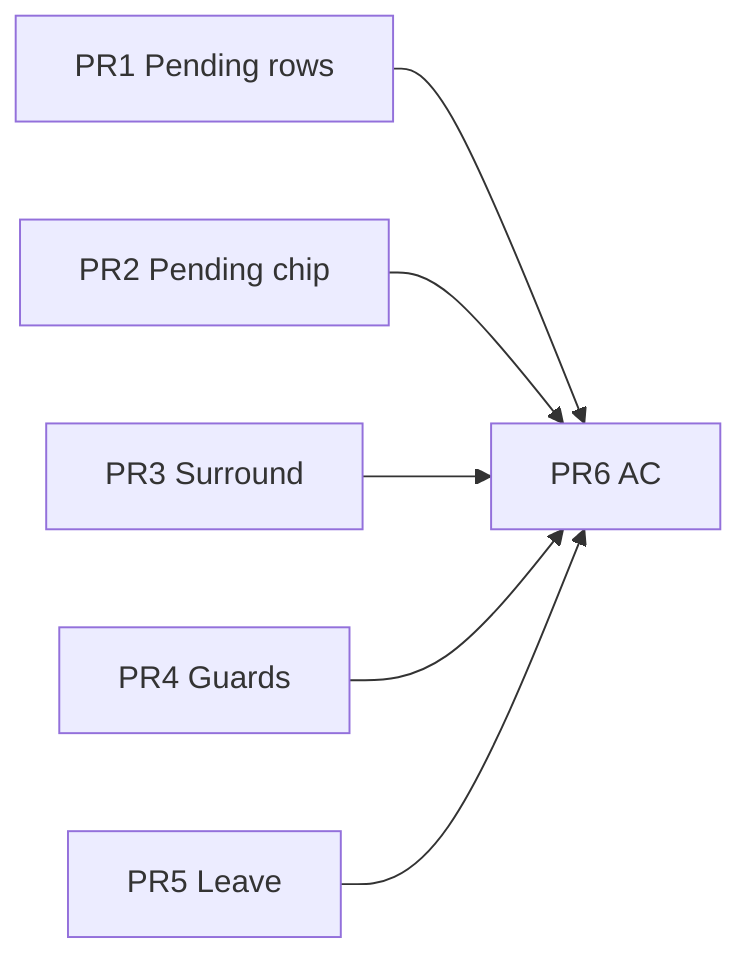

# Trace emphasis — implementation plan

Single plan for **the whole token-hover interaction lifecycle** — enter, pending, commit, Ctrl, pin, leave. Normative target: [token-hover.atlas.supplement.md](../specs/system/token-hover.atlas.supplement.md).

**Status:** 2026-07-12 — PR 1–5 code aligned; PR 6 manual AC open.

---

## Lifecycle gaps → work

| Lifecycle moment | Target | Gap | Status |
| ---------------- | ------ | --- | ------ |
| **Enter / pending** | Surround dims; chip ink stable; focal pending strength | — | **Done** PR 2 |
| **Enter / pending** | Member rows stay dim, not blue | — | **Done** PR 1 |
| **Commit** | Wires draw 240ms; rows blue; lit DOM | Mostly works | — |
| **Ctrl** | `--faint-ctrl` + shimmer stacks on trace | — | **Done** PR 3 |
| **Surround** | Class white; title faint; rows dim | — | **Done** PR 3 |
| **Chips** | Never `--faint` | — | **Done** |
| **Leave** | Surround + lit unwind 120ms; wires **retire** 120ms | — | **Done** PR 5 |
| **Leave** | `graph-trace-leaving` synced with wire retire + lit unwind | — | **Done** PR 5 |
| **Guards** | No chip rules in `trace-syntax.css` | — | **Done** PR 4 |

---

## PR 1 — Pending: row dim only (commit → blue)

| Task | File |
| ---- | ---- |
| Drop `token-chip-pending-trace` from row `:has()` lit selectors | `trace-member.css` |
| Row blue only under `graph-trace-active` + `trace-member-lit` | `class-node.css`, `trace-member.css` |

---

## PR 2 — Pending: chip on strength curve

| Task | File |
| ---- | ---- |
| Pending tier in `TRACE_TUNING` / `traceStrength` | `traceDepth.ts` |
| Set `--trace-strength` in `setPendingTraceHost` | `pendingTraceChip.ts` |
| Pending fill via strength, drop duplicate mixes | `tokens-chips-trace.css` |

---

## PR 3 — Surround dim (methods, classes, Ctrl)

| Task | File |
| ---- | ---- |
| `graph-trace-pending` → `--trace-dim-surface` on non-lit rows | `trace-member.css` |
| Title/caret faint; card not washed | `trace-syntax.css` |
| Ctrl `--faint-ctrl` wins syntax | `trace-ctrl.css` |

---

## PR 4 — Guards

| Task | File |
| ---- | ---- |
| Lint: no `.token-chip` in `trace-syntax.css` | `scripts/lint-trace-css.mjs` |
| Dedupe row-lit `:has()` into `trace-member.css` only | `class-node.css` |

---

## PR 5 — Leave choreography (wire + lit + mood)

**One leave beat** — all on 120ms unless noted.

| Task | File | Status |
| ---- | ---- | ------ |
| `retireWireGroup` when edges clear (fade, cancel WAAPI) | `usePreviewEdgeOverlay.ts`, `wireDomSync.ts` | Done |
| `graph-trace-leaving` during lit unwind | `traceLitApplySession.ts`, `GraphPane.tsx` | Exists — verify sync |
| Spec: leave row in atlas lifecycle table | `token-hover.atlas.supplement.md` | Done |
| No wire opacity flash from `setTraceSessionActive(false)` before retire | `wireDomCreate.ts` | Verify / fix if needed |

---

## PR 6 — Acceptance pass

[interaction-emphasis.acceptance-criteria.md](../specs/system/interaction-emphasis.acceptance-criteria.md) on `fixtures/demo` — full lifecycle: enter → commit → Ctrl → leave (wires fade with surround).

---

## Order

PR 1–3 = enter/commit look right. PR 5 = leave (mostly done). PR 6 = sign-off.

---

## Agent instructions

1. [token-hover.atlas.supplement.md](../specs/system/token-hover.atlas.supplement.md) lifecycle table first  
2. One PR per lifecycle gap  
3. Update AC when verified  
