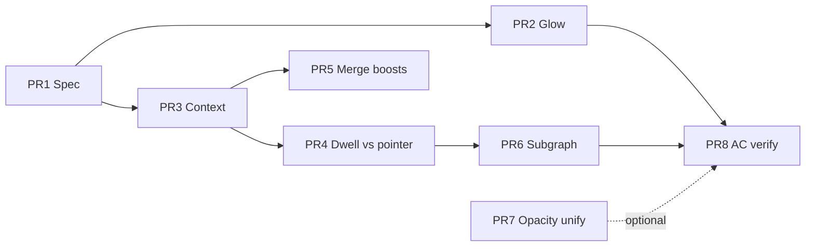

# Trace strength refactor plan

Ordered PRs to align code with the **strength stack** spec
(`preview-edges.trace-strength.supplement.md` § Strength stack,
`interaction-emphasis.md` § Pointer emphasis).

**Status:** Spec + playbook updated 2026-07-12. Code partially implements the model;
these PRs close the remaining gaps.

---

## Current vs target

| Area | Today | Target |
| ---- | ----- | ------ |
| State | Module globals in `wireHoverBoost.ts` + React `hoveredTokenKey` | `TraceStrengthContext` passed to lit + wire engine |
| Dwell vs pointer | Same `hoveredTokenKey` | `traceTokenKey` (session) + `pointerTokenKey` (emphasis) |
| Chip opacity | Inline `style.opacity` in `traceLitApply.ts` | Inline **or** `--trace-strength` — one documented path |
| Wire glow | CSS default `0.12` + inline + `!important` classes | `traceWireOpacity` only; CSS carries hue/dash |
| Wire emphasis | `edgeTouchesHoveredToken` (binary) | Subgraph BFS 1–2 hops from pointer token |
| Boost paths | 3 functions in `traceLitController.ts` | Single `applyPointerBoost(keys[])` |

---

## PR 1 — Spec + playbook (this change)

**Scope:** Docs only.

- [x] Strength stack section in trace-strength supplement
- [x] Pointer emphasis in interaction-emphasis
- [x] `docs/agent-playbook/core/visual-strength-stacks.md`
- [x] This refactor plan

**Risk:** None. **Verify:** `npm run lint:specs`

---

## PR 2 — Glow single authority

**Scope:** `preview-edge.css`, `previewEdgeDom.ts`, `traceDepth.ts`

| Task | File |
| ---- | ---- |
| Remove or neutralize `.preview-edge-glow { opacity: 0.12 }` as default strength | `preview-edge.css` |
| Always set path + glow opacity from `traceWireOpacity` in rAF | `previewEdgeDom.ts` |
| Drop redundant `!important` on emphasis classes where inline wins | `preview-edge.css` |
| Unit test: emphasized glow > baseline glow at depth 1 | `traceDepth.test.ts` |

**Acceptance:** Direct wire hover visibly brighter than trace-only; no glow reset to 0.12.

**Est. impact:** Effectiveness +25%, complexity −15%

---

## PR 3 — `TraceStrengthContext` (replace globals)

**Scope:** `wireHoverBoost.ts` → `traceStrengthContext.ts`, `useTraceLitState.ts`,
`PreviewEdgeOverlay.tsx`, `traceLitApply.ts`

| Task | Detail |
| ---- | ------ |
| Define `TraceStrengthContext` type | `{ sessionActive, pointerTokenKey, pointerWireId }` |
| `getTraceStrength()` for rAF | Replaces individual global getters |
| `subscribeTraceStrength` unchanged API | Listeners on context snapshot |
| Sync from `useTraceLitState` | Single writer from React |
| Delete duplicate `hoveredTokenKey` global | Read context in `previewEdgeDom` |

**Acceptance:** Pin + leave class — opacity unchanged; no desync between chip and wire.

**Est. impact:** Effectiveness +20%, speed +25%, complexity −30%

---

## PR 4 — Split dwell vs pointer token

**Scope:** `GraphInteractionContext.tsx`, `useTraceLitState.ts`, `traceLitController.ts`

| Task | Detail |
| ---- | ------ |
| `traceTokenKey` | Committed trace (dwell/pin) — drives session |
| `pointerTokenKey` | Chip under cursor within trace — drives emphasis only |
| Emphasis active when | `pointerTokenKey != null \|\| pointerWireId != null` |
| Clear pointer on leave | Do **not** clear `traceTokenKey` |

**Acceptance:** Dwell trace without pointer on a chip = pure hop model (no backdrop).

**Est. impact:** Effectiveness +35%, complexity +10% (short term)

---

## PR 5 — Merge boost functions

**Scope:** `traceLitController.ts`

Replace `applyHoverFocusBoost`, `applyHoveredWireEndpointBoost`, `applyWireHoverBoost`
with one `applyPointerBoost(next, state, keys: Set<string>, …)`.

**Acceptance:** Existing `traceLitController.test.ts` pass; no behavior change.

**Est. impact:** Speed +20%, complexity −25%

---

## PR 6 — Wire subgraph emphasis

**Scope:** `wireHoverBoost.ts`, `previewEdgeDom.ts`, `lexicalGraph.ts` or trace edge list

| Task | Detail |
| ---- | ------ |
| `edgesInPointerSubgraph(spec, pointerKey, edges, maxHops=2)` | BFS on active preview edges |
| `emphasized` = wire hovered OR in subgraph | Replaces `edgeTouchesHoveredToken` only |
| Backdrop = emphasis active AND NOT emphasized | Unchanged rule, wider emphasized set |

**Acceptance:** Hover body usage — param→usage wire emphasized; type chain may backdrop
or partial emphasize per hop policy (document in AC).

**Est. impact:** Effectiveness +30%, complexity +15%

---

## PR 7 — Opacity emission unify (optional)

**Scope:** `traceLitApply.ts`, `tokens-chips-trace.css`, theme CSS

Either:

- **A)** Implement `--trace-strength` on lit elements; CSS consumes it; remove inline opacity, **or**
- **B)** Spec amendment: chips use inline opacity only; remove `--trace-depth-opacity` from tokens.md

Recommendation: **B** for minimal churn now; **A** if adding reduced-motion or theme tuning later.

---

## PR 8 — Visual regression AC + manual checklist

Add to trace-strength supplement AC (unchecked until verified):

- [ ] Pin trace, pointer leaves class card — hop-1 wires stay at trace baseline
- [ ] Pointer on token — direct wires full glow; other trace wires backdrop
- [ ] Lit chips do not dim below trace baseline when emphasizing another branch
- [ ] Dwell without pointer on chip — no wire backdrop layer

Manual pass on `fixtures/demo/OrderService` or equivalent class-heavy file.

---

## Dependency graph

---

## Files touched (full refactor)

| File | PRs |
| ---- | --- |
| `client/src/lib/traceDepth.ts` | 2, 6 |
| `client/src/lib/wireHoverBoost.ts` | 3, 4, 6 |
| `client/src/lib/traceLitApply.ts` | 3, 7 |
| `client/src/lib/traceLitController.ts` | 4, 5 |
| `client/src/lib/previewEdgeDom.ts` | 2, 3, 6 |
| `client/src/hooks/useTraceLitState.ts` | 3, 4 |
| `client/src/context/GraphInteractionContext.tsx` | 4 |
| `client/src/components/graph/PreviewEdgeOverlay.tsx` | 3 |
| `client/src/styles/preview-edge.css` | 2 |
| `docs/specs/system/preview-edges.trace-strength.supplement.md` | 1, 8 |
| `docs/specs/system/interaction-emphasis.md` | 1, 8 |
