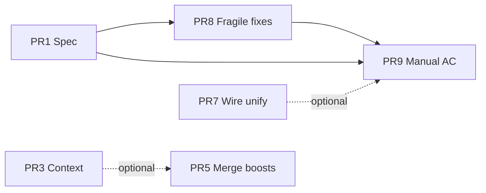

# Trace strength refactor plan

Ordered PRs to align code with the **strength stack** spec
(`preview-edges.trace-strength.supplement.md`,
`interaction-emphasis.md` § Chip hover preview,
`visual-strength-stacks.md`).

**Status:** Spec + playbook synced **2026-07-12 (evening)**. Core model implemented in code:
dual curves (focus vs hover), `--trace-strength` on chips, `traceWireOpacity` on wires,
backdrop/boost layers removed. Remaining work is consolidation + fragile-path fixes.

---

## Completed in code (2026-07-12)

| Change | Files |
| ------ | ----- |
| Dual brightness curves (focus + hover) | `traceDepth.ts` |
| Chips/sockets use `--trace-strength`, not element opacity | `traceLitApply.ts`, `trace-chip-lit.css`, `flow-anchors.css` |
| Wire path + glow from `traceWireOpacity(depth, emphasized)` | `previewEdgeDom.ts` |
| Removed backdrop / pointer-boost / CSS filter emphasis | `wireHoverBoost.ts`, `traceLitController.ts`, CSS |
| Hop-1 snaps (wire 0.8 focus / 1.0 hover; chip 0.55 focus / 1.0 hover) | `traceDepth.ts` |
| Unit tests: hover > focus, wire > glow > chip | `traceDepth.test.ts`, `traceLitController.test.ts` |

---

## Current vs target

| Area | Today | Target |
| ---- | ----- | ------ |
| Curves | Dual curve + hop-1 snaps in `traceDepth.ts` | Single `TRACE_TUNING` object + `traceStrength(situation, surface, d)` |
| Chip emission | `--trace-strength` + `color-mix` | Same (done) — optionally unify wires |
| Wire emission | SVG `opacity` inline | `--trace-strength` or shared helper (optional) |
| State | Module globals in `wireHoverBoost.ts` | `TraceStrengthContext` passed to lit + wire engine |
| Dwell vs pointer | Same `hoveredTokenKey` | `traceTokenKey` (session) + `pointerTokenKey` (emphasis) — optional split |
| Boost paths | 3 functions in `traceLitController.ts` | Single `applyPointerBoost(keys[])` |
| Endpoint sibling CSS | Fixed 50% muted in `tokens-chips-base.css` | Derive from `--trace-strength` |
| `CHIP_HOVER_PREVIEW` | Only at depth 1 in `applyEndpointHost` | Any depth when `hoverPreview` |

---

## PR 1 — Spec + playbook

**Scope:** Docs only.

- [x] Dual-curve strength model in trace-strength supplement
- [x] Pointer emphasis in interaction-emphasis
- [x] `docs/agent-playbook/core/visual-strength-stacks.md` (focus vs hover, emission paths, tuning)
- [x] This refactor plan (status update)

**Verify:** `npm run lint:specs`

---

## PR 2 — Glow single authority

**Scope:** `preview-edge.css`, `previewEdgeDom.ts`

| Task | Status |
| ---- | ------ |
| Glow opacity from `traceWireOpacity` in rAF (not CSS default) | Mostly done |
| Neutralize `.preview-edge-glow { opacity: 0.12 }` as strength default | Open — verify CSS |
| Unit test: emphasized glow > baseline at depth 1 | Done (`traceDepth.test.ts`) |

---

## PR 3 — `TraceStrengthContext` (replace globals)

**Scope:** `wireHoverBoost.ts` → context module, hooks, overlay

| Task | Detail |
| ---- | ------ |
| Define `TraceStrengthContext` | `{ sessionActive, pointerTokenKey, pointerWireId }` |
| Single writer from React | `useTraceLitState` |
| rAF reads context snapshot | `previewEdgeDom`, `traceLitApply` |

**Status:** Open

---

## PR 4 — Split dwell vs pointer token

**Scope:** `GraphInteractionContext.tsx`, `useTraceLitState.ts`

Optional — current `hoveredTokenKey` + `isTraceSessionActive` works if boost order is stable.

**Status:** Open (low priority)

---

## PR 5 — Merge boost functions

**Scope:** `traceLitController.ts`

Replace `applyHoverFocusBoost`, `applyHoveredWireEndpointBoost`, `applyWireHoverBoost`
with one `applyPointerBoost`.

**Status:** Open

---

## PR 6 — Wire subgraph emphasis (optional)

BFS 1–2 hops from pointer token for `emphasized` set. Today: `edgeTouchesHoveredToken` + wire-under-cursor.

**Status:** Open (product decision)

---

## PR 7 — Emission unify (optional)

**Decision (2026-07-12):** chips use **`--trace-strength`** (option A for chips). Wires still SVG opacity.

Optional next step: wires also set `--trace-strength` on a host element, or one `traceStrength()` returns value consumed by both paths.

**Status:** Partial — chips done; wire unify open

---

## PR 8 — Fragile-path fixes

| Task | File |
| ---- | ---- |
| `CHIP_HOVER_PREVIEW` at any depth in `applyEndpointHost` | `traceLitController.ts` |
| Lit non-endpoint chips: `CHIP_ON` or relax CSS selector | `traceLitController.ts`, `trace-chip-lit.css` |
| Endpoint-sibling grey → `--trace-strength` | `tokens-chips-base.css` |
| Consolidate `TRACE_TUNING` object | `traceDepth.ts` |

**Status:** Open

---

## PR 9 — Visual regression AC + manual checklist

Manual pass on multi-hop trace (e.g. `extractFieldValue` / `AddressFieldKind` cascade):

- [ ] Pin trace, pointer leaves card — focus baseline holds
- [ ] Pointer on token — hover curve on chip + touched wires
- [ ] Hop 3 at rest visibly dimmer than hop 1; hop 3 on hover brighter than hop 3 at rest
- [ ] Lit chips full element opacity; only color strength fades

**Status:** Open

---

## Dependency graph

---

## Files touched (full refactor)

| File | PRs |
| ---- | --- |
| `client/src/lib/traceDepth.ts` | 7, 8 |
| `client/src/lib/wireHoverBoost.ts` | 3 |
| `client/src/lib/traceLitApply.ts` | 7 (done) |
| `client/src/lib/traceLitController.ts` | 5, 8 |
| `client/src/lib/previewEdgeDom.ts` | 2, 7 |
| `client/src/hooks/useTraceLitState.ts` | 3, 4 |
| `client/src/styles/preview-edge.css` | 2 |
| `client/src/styles/tokens-chips-base.css` | 8 |
| `docs/specs/system/preview-edges.trace-strength.supplement.md` | 1 |
| `docs/specs/system/interaction-emphasis.md` | 1 |
| `docs/agent-playbook/core/visual-strength-stacks.md` | 1 |
