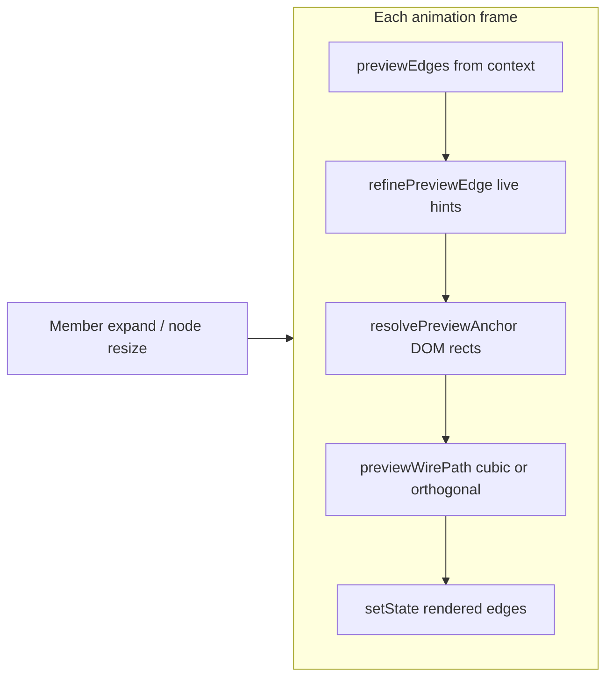
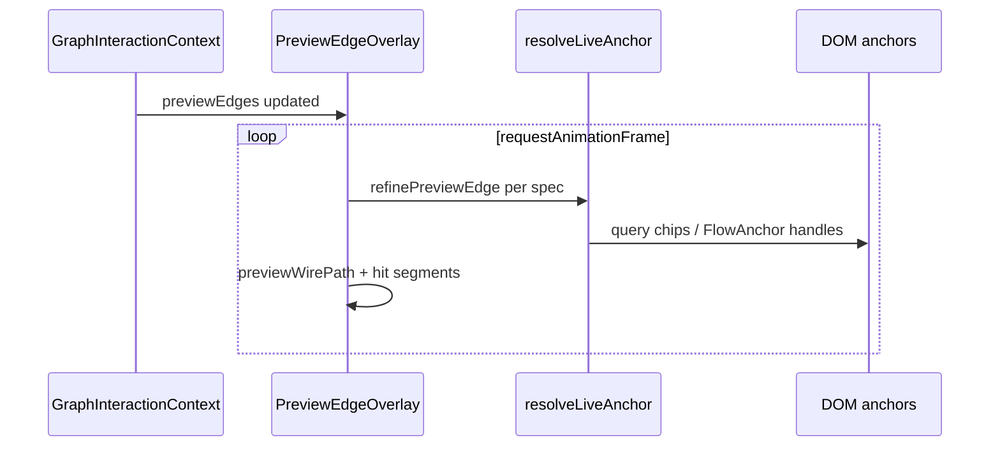

# Preview edge overlay

## What It Is

DOM/SVG layer above the React Flow canvas that measures anchor elements each frame, refines live anchor hints, and draws preview connection paths — the **sole** preview-edge pipeline.

## What It Looks Like

Full-pane SVG with dashed paths, crisp endpoint socket rings, jump tooltip on wire hit-zones. Paths use overlay-local coordinates (client rect minus SVG origin).

| Kind | Path geometry |
| ---- | ------------- |
| Usage, Binding, Transitive, Load | Cubic — or **fan/bus** when 2+ targets cluster (shared trunk + knot + cubic spurs) |
| **Typesetting** | **Rounded orthogonal** Manhattan (`TYPESETTING_CORNER_RADIUS` = 6px) — sig-type → param def; member-scoped lanes |
| Control flow (`branch`) | Sharp orthogonal bus in the **left gutter** — shared trunk, **junction knot**, faint bus guide when lit |

## Where It Lives

- **Component:** `PreviewEdgeOverlay.tsx`
- **Styles:** `preview-wires.css`, `trace-modes.css`, `tokens-chips.css`
- **Parent:** `GraphFlowCanvas` inside graph pane

## Render loop





## Actions

| # | User Action | System Response | Triggers |
| --- | ----------- | --------------- | -------- |
| 1 | Trace active | Measure + draw on spec/transform change; rAF while viewport moves | `previewEdges.length > 0` |
| 2 | Member expands | Live hint upgrades handle → chip | `liveTo` refine |
| 3 | Hovers path hit-zone | Jump tooltip | `JumpTooltip` |
| 4 | Clicks path hit-zone | `pinTrace` + scroll + flash | overlay handler |
| 5 | Trace cleared | Cancel rAF; empty SVG | `previewEdges = []` |

## Component Hierarchy

```text
GraphFlowInner
└── GraphPane (.graph-pane — graph-ctrl-preview | graph-trace-active | graph-trace-pinned)
    ├── ReactFlow
    └── PreviewEdgeOverlay
        ├── <svg> paths + arrow marker
        ├── JumpTooltip
        └── TokenContextBar (sibling, pinned)
```

## Data

| Input | From |
| ----- | ---- |
| `PreviewEdgeSpec[]` | `buildPreviewEdges`, `localDefLinks`, `buildStructuralEdges` |
| `liveFrom` / `liveTo` | `previewEdgeTypes.ts` |
| Anchor geometry | `resolvePreviewAnchor` |
| Stroke | `previewWireStroke` → `--edge-usage` / `--edge-binding` / `--edge-typesetting` / `--edge-control-flow` via `style` |
| Path builder | `wirePaths.ts` → `previewWirePath` |

## Wiring

**Blocker:** Handle ids MUST be per-node (`previewMemberHandle(memberId)`, `previewTargetTop(flowNodeId)`). Shared ids attach wires to the wrong node.

Path coordinates are local to the overlay SVG — not flow-space only.

## Acceptance Criteria

- [ ] No preview edges in React Flow `edges` prop
- [ ] rAF loop runs only while `previewEdges.length > 0`
- [ ] `refinePreviewEdge` called before every `resolvePreviewAnchor`
- [ ] Stroke uses CSS variables, not hex in SVG attributes
- [ ] Node resize / member expand updates wire endpoints same frame
- [ ] Hit-zones ~46px along wire ends for jump interaction
- [ ] Handle socket dots (`isHandleActive`) follow `refinePreviewEdge` — coarse member/top dots hide when a finer line/chip anchor is revealed

## References

- System: [preview-edges.md](../system/preview-edges.md)
- Interactions: [preview-edges.interactions.supplement.md](../system/preview-edges.interactions.supplement.md)
- Accessibility: [../../design/accessibility.md](../../design/accessibility.md)
- Handles: [ctrlPreviewHandles.ts](../../../client/src/lib/ctrlPreviewHandles.ts)
