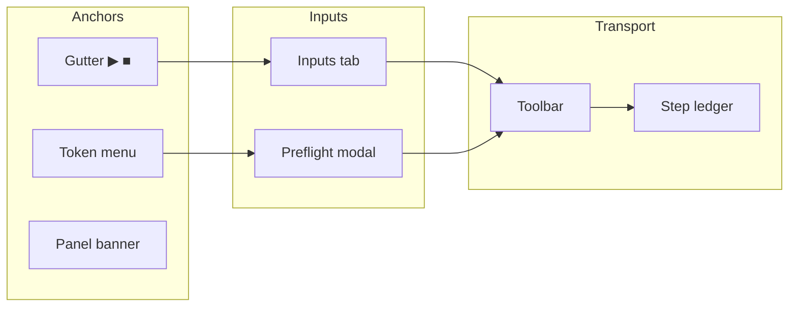
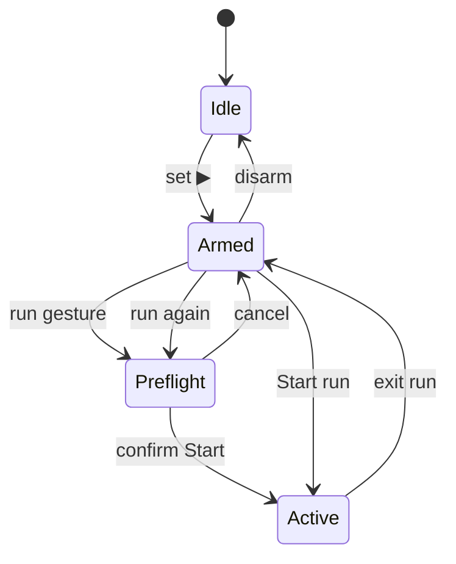

# Execution simulator — interactions (index)

Normative UX contract for simulation modes, entry surfaces, anchors, transport, and clear/deselect. Split like [preview-edges.interactions.supplement.md](preview-edges.interactions.supplement.md).

| Child | Owns |
| ----- | ---- |
| [modes supplement](execution-simulator.modes.supplement.md) | Mode FSM, anchor lifecycle, preflight flow, implicit end |
| [surfaces supplement](execution-simulator.surfaces.supplement.md) | Gutter, token menu, panel, toolbar — gesture matrix |
| [interactions AC](execution-simulator.interactions.acceptance-criteria.md) | Testable checkboxes |
| [vision supplement](execution-simulator.vision.supplement.md) | **S2+** scenario graph, mocks, two-click anchors — product direction |
| [transport-panel supplement](execution-simulator.transport-panel.supplement.md) | **S1** discrete timeline + Start/Δ/End panel layout |

Parent: [execution-simulator.md](execution-simulator.md) · workspace chrome: [execution-simulator.workspace.supplement.md](execution-simulator.workspace.supplement.md).

---

## Mental model

Three layers — do not conflate:

| Layer | Question | Surfaces |
| ----- | -------- | -------- |
| **Anchors** | *Where* does the walk begin and end? | Gutter ▶/■, range shade, panel banner |
| **Inputs** | *What values* at step 0? | Inputs tab, preflight modal |
| **Transport** | *How* does time advance? | Toolbar, ledger row click |

**Armed** — `startAnchor` set, `simActive === false`.  
**Active run** — `simActive === true`; play/pause only moves the program counter.

---

## Mode overview

Detail, anchor rules, and implicit end: [modes supplement](execution-simulator.modes.supplement.md).

---

## Entry surfaces (not interchangeable)

| Surface | Line-level? | Notes |
| ------- | ----------- | ----- |
| **Gutter** | Yes — every body line | Primary anchor control |
| **Token context menu** | No — indexed **chip** only | Right-click token; needs `methodStartLine` |
| **Collapsed member header** | Signature line only | Same menu; start = method signature line |
| **Panel / Paths** | N/A | Inputs, save, run saved setups |

Full gesture table: [surfaces supplement](execution-simulator.surfaces.supplement.md).

---

## Vocabulary

| Term | Meaning |
| ---- | ------- |
| **Pause** | Transport off; stay active at current step |
| **Exit run** | End session; return **armed** (▶/■ kept) |
| **Disarm / Clear setup** | Remove ▶/■; return **idle** |
| **Stop and clear** | Exit run + disarm in one action (when active) |
| **Implicit end** | Last file line of method `code` when ■ unset |

---

## Coexistence with hover trace

During **active run**, `graph-sim-active` applies sim chrome (outline, dimmed context bar). **Hover preview traces are NOT suppressed** — they coexist; only sim value-flow pulses use `setPulseEdges`. Do not call `endHoverPreview` on sim entry.

---

## Implementation map

| Concern | File |
| ------- | ---- |
| Mode + anchors | `SimulationContext.tsx` |
| Effective end / range | `client/src/lib/simTraceBounds.ts` |
| Gutter | `SimGutterControl.tsx` |
| Panel banner / disarm | `SimulationPanel.tsx`, `SimInputsForm.tsx` |
| Saved paths | `simTracePaths.ts` |
| Context menu anchor | `CodeLine.tsx` → `useTokenContextMenu.ts` |

---

## References

- Modes: [execution-simulator.modes.supplement.md](execution-simulator.modes.supplement.md)
- Surfaces: [execution-simulator.surfaces.supplement.md](execution-simulator.surfaces.supplement.md)
- AC: [execution-simulator.interactions.acceptance-criteria.md](execution-simulator.interactions.acceptance-criteria.md)
- Workspace: [execution-simulator.workspace.supplement.md](execution-simulator.workspace.supplement.md)
- Preview trace (orthogonal): [preview-edges.interactions.supplement.md](preview-edges.interactions.supplement.md)
