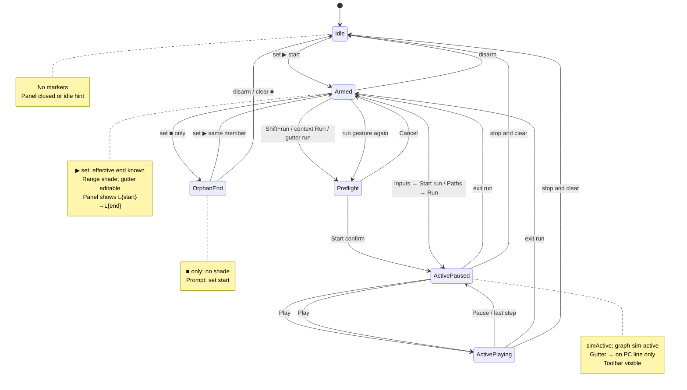
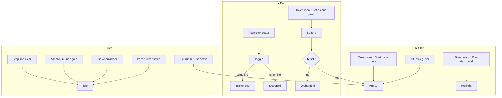
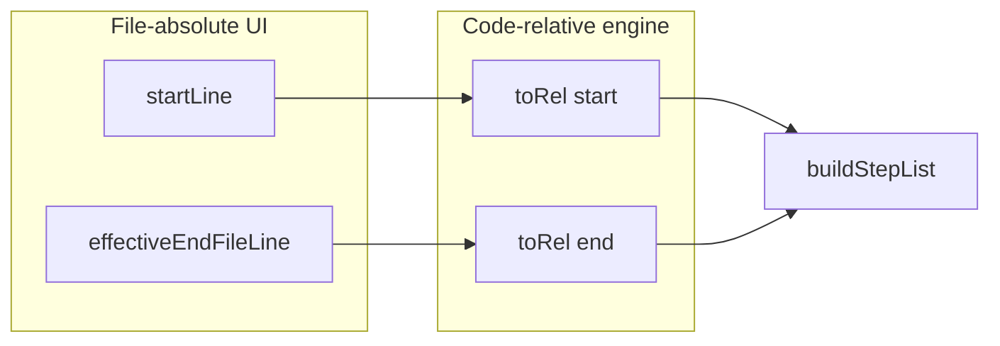
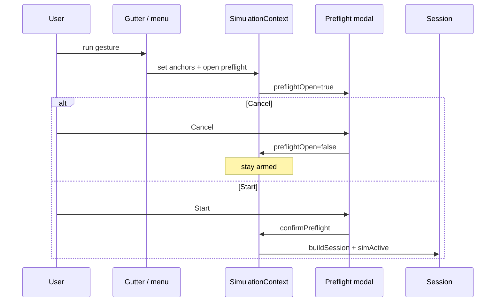
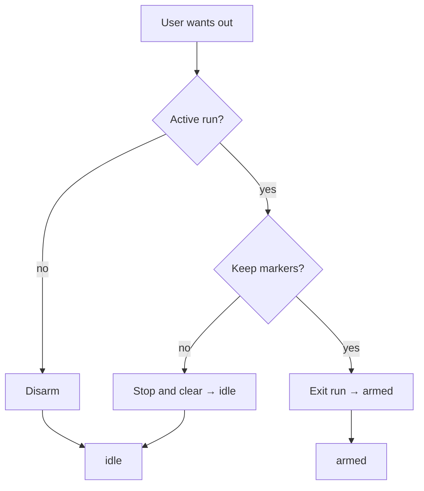

# Execution simulator — modes & anchors

Supplement to [interactions index](execution-simulator.interactions.supplement.md). Owns mode FSM, anchor lifecycle, implicit end, and clear/deselect semantics.

---

## Mode state machine



---

## Anchor lifecycle



| Marker | Set | Move | Clear |
| ------ | --- | ---- | ----- |
| **▶** | Alt+gutter · menu Start trace here | Alt+another line | Disarm · Alt+same ▶ line · Esc (armed) |
| **■** | Plain gutter · menu Set end | Plain+another line | Plain+same ■ line (→ implicit end) |
| **→** | System on active step | Step/scrub/play | Exit run |

**Cross-member rule:** setting ▶ on member A MUST clear ■ if `endAnchor.memberId !== A`.

During **active run**, anchor gestures are disabled. `lineGutterRole` returns **only** `current` (→) — not ▶/■ on other lines.

---

## Implicit end

When ■ is not set on the same member as ▶:

```text
effectiveEndFileLine = methodStartLine + code.split("\n").length - 1
```

| UI element | MUST show |
| ---------- | --------- |
| Panel armed banner | `L{start}→L{effectiveEnd}` + muted `(method end)` when ■ unset |
| Range shade | `startLine … effectiveEndFileLine` inclusive (file-absolute) |
| Paths “Current” | Same range label |
| Gutter | No ■ glyph when implicit |

Engine walk uses the same `effectiveEndFileLine` converted to code-relative in `buildSession`.



Bridge: `methodStartLine` on `SimAnchor`. See [workspace supplement](execution-simulator.workspace.supplement.md) line-base convention.

---

## Preflight flow



**Skip preflight:** Inputs tab **Start run** or Paths **Run** call `activateSession` directly when inputs already on draft.

---

## Exit vs disarm



| Action | `simActive` | `session` | `startAnchor` | `endAnchor` |
| ------ | ----------- | --------- | ------------- | ----------- |
| Exit run | false | null | kept | kept |
| Disarm | false | null | null | null |
| Stop and clear | false | null | null | null |

**Esc:** active → exit run; armed → disarm; idle → no-op.

---

## Orphan end state

`endAnchor` set, `startAnchor` null:

- Show ■ on that line only
- No range shade
- Panel Paths/Inputs: hint “Set a start point (Alt+click gutter)”
- Plain click ■ again clears end → idle

---

## References

- Index: [execution-simulator.interactions.supplement.md](execution-simulator.interactions.supplement.md)
- Surfaces: [execution-simulator.surfaces.supplement.md](execution-simulator.surfaces.supplement.md)
- AC: [execution-simulator.interactions.acceptance-criteria.md](execution-simulator.interactions.acceptance-criteria.md)
