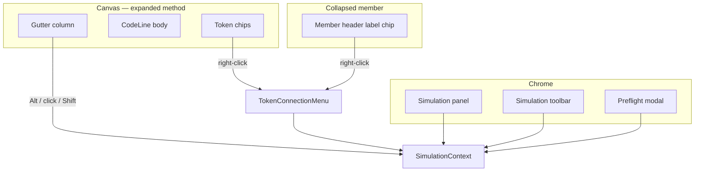
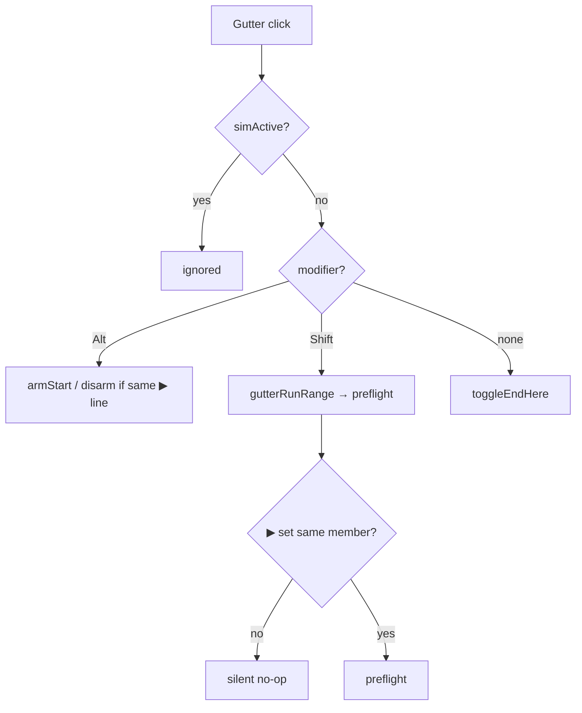
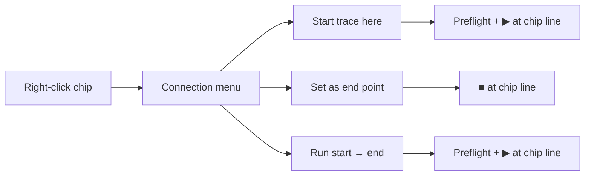
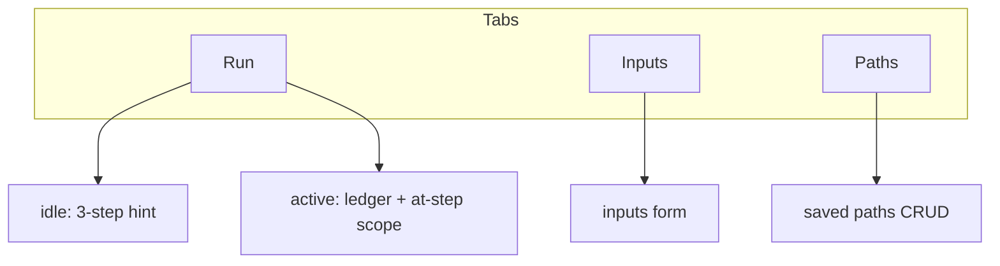
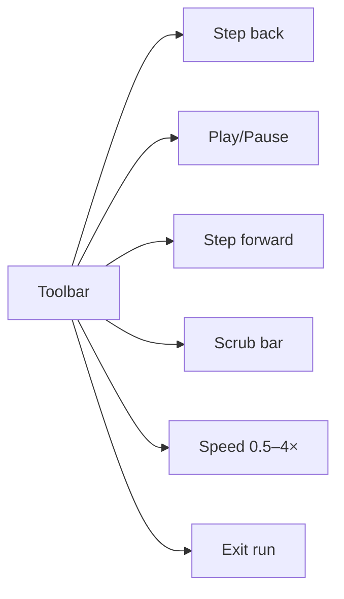

# Execution simulator — surfaces & gestures

Supplement to [interactions index](execution-simulator.interactions.supplement.md). Owns per-surface behavior and the full gesture matrix.

---

## Surface map



---

## Gutter (`SimGutterControl`)

Visible on every **expanded** body line when `methodCode`, `methodName`, `signatureLine`, `methodStartLine` are present.



| Gesture | Effect |
| ------- | ------ |
| **Alt+click** | Set ▶; open panel Inputs. Alt+click same ▶ line → **disarm** |
| **Plain click** | Toggle ■ on line |
| **Shift+click** | Set ■ on line + open preflight (requires ▶ same member) |
| **During active run** | Disabled; show → on PC line only |

| Marker | Glyph | CSS role |
| ------ | ----- | -------- |
| Start | ▶ | `sim-gutter-marker--start` |
| End | ■ | `sim-gutter-marker--end` |
| PC | → | `sim-gutter-marker--current` |
| In range | ○ + wash | `sim-gutter-marker--in-range` |

Tooltip (required): `Click: stop here · Alt+click: start · Shift+click: run range`

---

## Token context menu

Sim actions appear in `TokenConnectionMenu` when `useTokenContextMenu` receives `simulation` + `sourceMemberId`.

**Not line-level** — user must right-click an **indexed token chip** on that line. Lines with only punctuation, braces, or comments have gutter only.



`SimAnchor` from menu MUST include `methodStartLine` (file line of `code[0]`).

### Collapsed member header

Same three menu items on the **method name** definition chip. `editorLine` = signature line (not an arbitrary body line). Expanding the row shows gutter markers.

---

## Simulation panel



### Armed banner (below method name)

When `startAnchor` set and not `simActive`:

```text
Trace: processOrder L42 → L78 (method end)   [Clear setup]
```

When `simActive`, banner shows session range + **[Exit run]** and **[Stop and clear]**.

### Idle Run tab copy

1. Expand a method body  
2. **Alt+click** gutter ▶ start · **click** ■ stop · **Shift+click** run  
3. Set inputs → Start run  

Or right-click a **token** → Start trace here / Set end / Run.

### Panel collapse [×]

Hides panel; anchors unchanged. Reopen via graph **Simulation** toggle.

---

## Simulation toolbar

Only when `simActive && session`.



Play auto-stops at last step (`PLAY_INTERVAL_MS / playbackSpeed`, default 600ms @ 1×).

---

## Step ledger (Run tab)

| Gesture | Effect |
| ------- | ------ |
| Row click | `scrubTo(index)` — sync PC + canvas highlight |
| Chevron | Expand/collapse reads/writes/calculated/notes |
| Auto | Scroll current row into view |

---

## Inputs tab

| Control | When | Effect |
| ------- | ---- | ------ |
| Edit fields | armed or active | Update `preflightInputs` draft |
| Apply | active | Rebuild `session.steps`; clamp `currentIndex` |
| Apply | armed only | No session rebuild |
| Start run | armed | `activateSession` |
| Save path | armed | localStorage + switch Paths tab |

---

## Paths tab

| Control | Effect |
| ------- | ------ |
| Save current | Needs `startAnchor`; stores `methodStartLine` |
| Run | Restore anchors + inputs → active (alert if node missing) |
| Edit | Load draft → Inputs tab |
| Duplicate | Copy with `(copy)` suffix |
| Delete | Remove from storage |

---

## Gesture quick reference

| Intent | Gesture | Precondition | Result |
| ------ | ------- | ------------ | ------ |
| Set **start** | Alt+gutter | expanded, not active | ▶, Inputs tab |
| Clear **start** | Alt+gutter on ▶ line | armed | idle |
| Set **end** | Plain gutter | expanded, not active | ■ toggle |
| Set **end** | Menu → Set end | token chip | ■ |
| **Run** | Shift+gutter | ▶ same member | preflight |
| **Run** | Menu → Run start→end | token chip | preflight |
| **Run** | Inputs Start run | armed | active |
| **Play/Pause** | Toolbar | active | transport |
| **Exit run** | X / Esc | active | armed |
| **Disarm** | Clear setup / Esc | armed | idle |
| **Stop+clear** | Panel button | active | idle |

---

## References

- Modes: [execution-simulator.modes.supplement.md](execution-simulator.modes.supplement.md)
- Index: [execution-simulator.interactions.supplement.md](execution-simulator.interactions.supplement.md)
- AC: [execution-simulator.interactions.acceptance-criteria.md](execution-simulator.interactions.acceptance-criteria.md)
