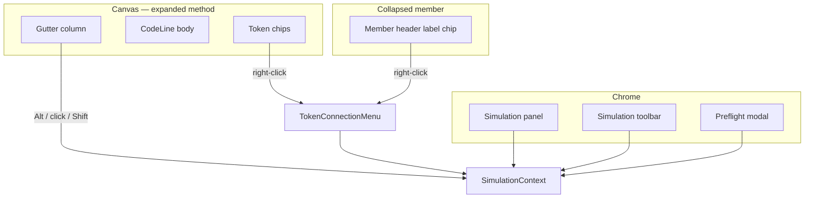
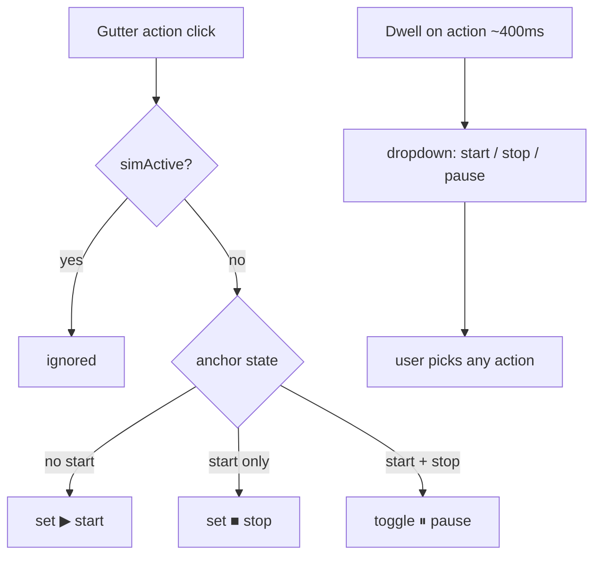
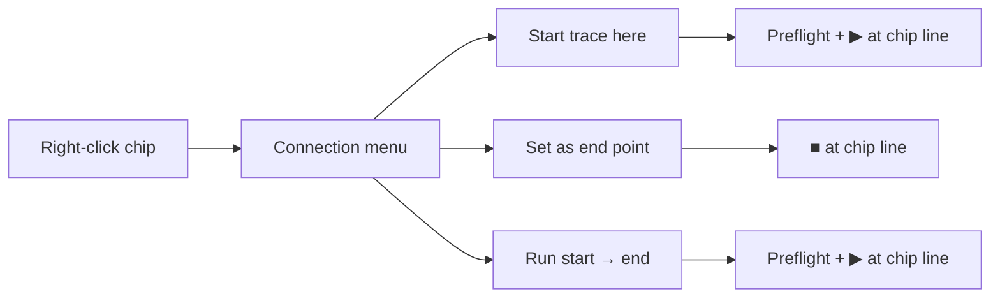
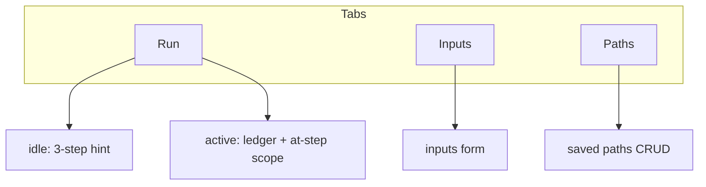
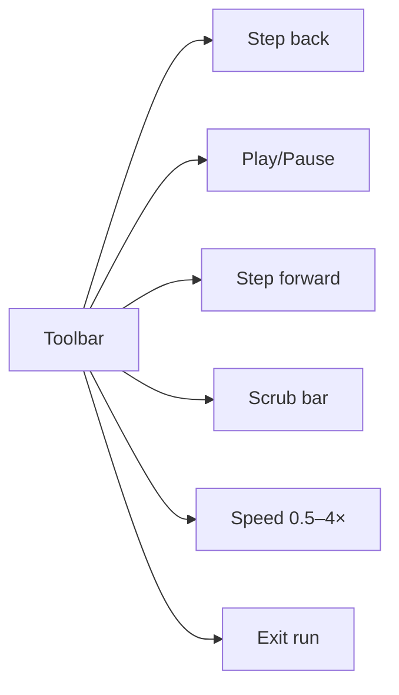

# Execution simulator — surfaces & gestures

Supplement to [interactions index](execution-simulator.interactions.supplement.md). Owns per-surface behavior and the full gesture matrix.

---

## Surface map



---

## Gutter (`SimGutterControl`)

Visible on every **expanded** body line when `methodCode`, `methodName`, `signatureLine`, `methodStartLine` are present.

Each line has a **gutter action** control (left of the line number) with Lucide icons: **Play** = start, **Square** = stop, **Pause** = breakpoint.



| Gesture | Effect |
| ------- | ------ |
| **Click** (smart default) | No start → **start** · start only → **stop** · start + stop → **toggle pause** on that line |
| **Hover dwell** (~400ms) | Dropdown with all three actions; **primary** (same as one-click) listed first |
| **Click existing marker** | Toggle off that marker (start / stop / pause) |
| **During active run** | Disabled; show → on PC line only |

| Marker | Icon | CSS role |
| ------ | ---- | -------- |
| Start | Play | `sim-gutter-marker--start` |
| Stop | Square | `sim-gutter-marker--end` |
| Pause | Pause | `sim-gutter-marker--pause` |
| PC | → | `sim-gutter-marker--current` |
| In range | faint wash | `sim-gutter-marker--in-range` |
| Between start+stop (hover) | Pause hint | `sim-gutter-marker--pause-hint` |

**No modifier keys** (Alt / Shift removed from gutter). Run-from-gutter removed — use Inputs **Start run** or token menu.

Tooltip: `Click: {primary action} · hover for more`

**Panel validation (Inputs tab):** start only → prompt to set stop; stop only → prompt to set start. **Start run** requires explicit start **and** stop on the same member.

---

## Token context menu

Sim actions appear in `TokenConnectionMenu` when `useTokenContextMenu` receives `simulation` + `sourceMemberId`.

**Not line-level** — user must right-click an **indexed token chip** on that line. Lines with only punctuation, braces, or comments have gutter only.



`SimAnchor` from menu MUST include `methodStartLine` (file line of `code[0]`).

### Collapsed member header

Same three menu items on the **method name** definition chip. `editorLine` = signature line (not an arbitrary body line). Expanding the row shows gutter markers.

---

## Simulation panel



### Armed banner (below method name)

When `startAnchor` set and not `simActive`:

```text
Trace: processOrder L42 → L78 (method end)   [Clear setup]
```

When `simActive`, banner shows session range + **[Exit run]** and **[Stop and clear]**.

### Idle Run tab copy

1. Expand a method body  
2. Click gutter action → **start**, then **stop**; add **pauses** between them  
3. Hover gutter action briefly for start / stop / pause menu  
4. Set inputs → Start run (requires both start and stop)  

Or right-click a **token** → Start trace here / Set end / Run.

### Panel open/close

No in-panel close control — the graph header **`SimulationPanelToggle`** is the sole explicit open/close affordance (shows `PanelRightClose` when open, `PanelRightOpen` when closed). Collapsing hides the panel; anchors unchanged. Reopen via the same toggle.

Dragging the panel's left resize handle below the collapse threshold also closes the panel (same pattern as the file explorer sidebar).

---

## Simulation toolbar

Only when `simActive && session`.



Play auto-stops at last step (`PLAY_INTERVAL_MS / playbackSpeed`, default 600ms @ 1×).

---

## Step ledger (Run tab)

| Gesture | Effect |
| ------- | ------ |
| Row click | `scrubTo(index)` — sync PC + canvas highlight |
| Chevron | Expand/collapse reads/writes/calculated/notes |
| Auto | Scroll current row into view |

---

## Inputs tab

| Control | When | Effect |
| ------- | ---- | ------ |
| Edit fields | armed or active | Update `preflightInputs` draft |
| Apply | active | Rebuild `session.steps`; clamp `currentIndex` |
| Apply | armed only | No session rebuild |
| Start run | armed | `activateSession` |
| Save path | armed | localStorage + switch Paths tab |

---

## Paths tab

| Control | Effect |
| ------- | ------ |
| Save current | Needs `startAnchor`; stores `methodStartLine` |
| Run | Restore anchors + inputs → active (alert if node missing) |
| Edit | Load draft → Inputs tab |
| Duplicate | Copy with `(copy)` suffix |
| Delete | Remove from storage |

---

## Gesture quick reference

| Intent | Gesture | Precondition | Result |
| ------ | ------- | ------------ | ------ |
| Set **start** | Gutter click (no start) or menu | expanded, not active | ▶, Inputs tab |
| Clear **start** | Gutter click on ▶ line | armed | removes start |
| Set **stop** | Gutter click (start only) or menu | expanded, not active | ■ |
| Toggle **stop** | Gutter click on ■ line | armed | removes stop |
| Set **pause** | Gutter click (start+stop) or menu | expanded, not active | ⏸ toggle |
| **Run** | Menu → Run start→end | token chip | preflight |
| **Run** | Inputs Start run | armed + explicit stop | active |
| **Play/Pause** | Toolbar | active | transport |
| **Exit run** | X / Esc | active | armed |
| **Disarm** | Clear setup / Esc | armed | idle |
| **Stop+clear** | Panel button | active | idle |

---

## References

- Modes: [execution-simulator.modes.supplement.md](execution-simulator.modes.supplement.md)
- Index: [execution-simulator.interactions.supplement.md](execution-simulator.interactions.supplement.md)
- AC: [execution-simulator.interactions.acceptance-criteria.md](execution-simulator.interactions.acceptance-criteria.md)
