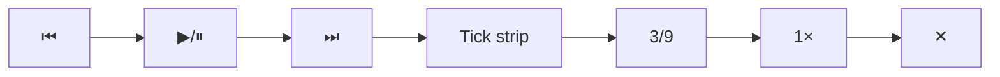
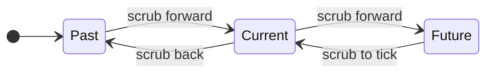
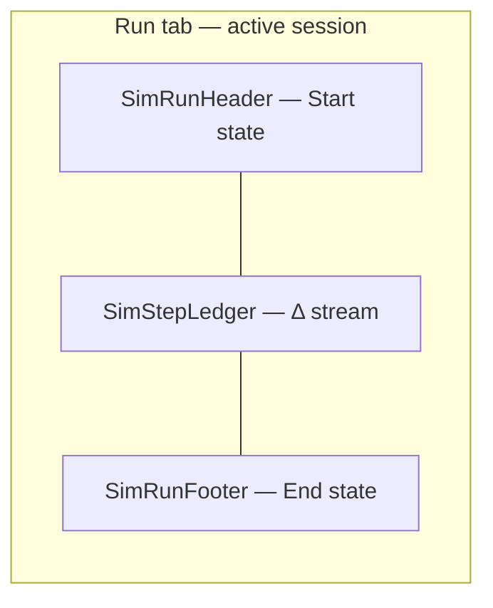

# Execution simulator — transport & Run panel (S1)

**Status:** Approved direction — **pending implementation**. Supersedes continuous scrub bar and flat ledger layout when built. Parent vision: [execution-simulator.vision.supplement.md](execution-simulator.vision.supplement.md).

---

## What it is

Near-term UX increment: **discrete step timeline** in the bottom toolbar and a **three-zone Run panel** (start variables → per-step deltas → end result). Optional **cross-class tick coloring** when a step's flow target differs from the previous step's class.

Does **not** include scenario graph nodes or mocks (S2).

---

## Toolbar — discrete step timeline

### Replace

| Remove | Add |
| ------ | --- |
| `<input type="range">` scrubber | Horizontal **tick strip** — one stop per `session.steps.length` |

### Layout



### Tick strip behavior

Ticks **scale down** as step count grows (3–6px) so long traces stay usable; strip scrolls horizontally.

| Step count | Tick size | Gap |
| ---------- | --------- | --- |
| ≤20 | 6px | 2px |
| ≤40 | 5px | 2px |
| ≤80 | 4px | 1px |
| >80 | 3px | 1px |



| Index vs `currentIndex` | Style | Token |
| ----------------------- | ----- | ----- |
| `< current` | `bg-muted-foreground/40` filled circle | past |
| `=== current` | `bg-brand` + `ring-brand-border` | current |
| `> current` | `border-border` hollow circle | future |
| **Next step crosses class** | ring color = target class chip surface | `sim-tick--cross-class` |
| **`kind === call`** | rounded-sm (diamond-ish) | optional |

**Interaction:** click tick `i` → `scrubTo(i)`; keyboard ←/→ when toolbar focused (SHOULD).

**Play mode:** auto-advance moves current tick; no slider drag.

### File map

| File | Change |
| ---- | ------ |
| `SimulationToolbar.tsx` | Replace range with `SimStepTickStrip` |
| `SimStepTickStrip.tsx` | New — maps steps to ticks |
| `nodes.css` or `simulation.css` | Tick + cross-class tokens |

---

## Run panel — three zones



### Zone 1 — Start state (`SimRunHeader`)

Pinned top of Run tab (not scrollable).

```text
┌ Start ─────────────────────────────┐
│ inputs: amount=99.5, id="o-1"      │
│ scope: order=?, total=0            │
└────────────────────────────────────┘
```

| Field | Source |
| ----- | ------ |
| Inputs | `session.inputs` |
| Initial scope | `steps[0].scopeSnapshot` (pre-step-0 or after step 0 — **pre-first-execution** preferred: inputs merged into scope display) |

### Zone 2 — Step stream

Existing ledger rows; **collapsed default** shows:

| Column | Content |
| ------ | ------- |
| Tick | Step index (matches toolbar) |
| Line | `L{n}` |
| Kind | icon/label |
| **Δ** | Comma-separated `writes` one-liner; if empty, first `calculated` or `reads` summary |
| Class badge | When `step.className` ≠ previous (S1c) — muted chip |

Expand chevron → full detail (reads/writes/calculated/notes) unchanged.

### Zone 3 — End state (`SimRunFooter`)

Pinned bottom; visible when `currentIndex === steps.length - 1` OR run has completed at least once.

```text
┌ Result ────────────────────────────┐
│ return: true                       │
│ scope: total=89.5, charged=true    │
└────────────────────────────────────┘
```

Highlight `kind === return` step values when present.

---

## Cross-class coloring (S1c)

### Detection (single-member session today)

On `call` steps, compare `session.flowNodeId` to `resolveVisibleTarget` graph node:

```typescript
step.crossesClass = calleeGraphNodeId != null 
  && calleeGraphNodeId !== session.flowNodeId;
step.targetClassName = callee?.className;
```

### Visual

| Surface | Effect |
| ------- | ------ |
| Toolbar tick `i+1` (upcoming) | ring `var(--token-surface-class)` or per-node accent |
| Ledger row | small class chip `→ PaymentGateway` |
| Canvas | existing edge pulse + **destination node brief glow** (existing pulse) |

---

## Acceptance criteria

- [ ] Toolbar shows one tick per step; no range slider
- [ ] Click tick scrubs; current tick matches `currentIndex`
- [ ] Run tab shows Start state block above ledger when session active
- [ ] Collapsed ledger rows show Δ writes one-liner
- [ ] End state block visible on last step
- [ ] Given ■ on different member than ▶ without scenario, when arming completes, then show reachability warning (no silent invalid range)

---

## References

- Vision: [execution-simulator.vision.supplement.md](execution-simulator.vision.supplement.md)
- Current toolbar: `SimulationToolbar.tsx`
- Step detail data: `buildStepDetail.ts`
