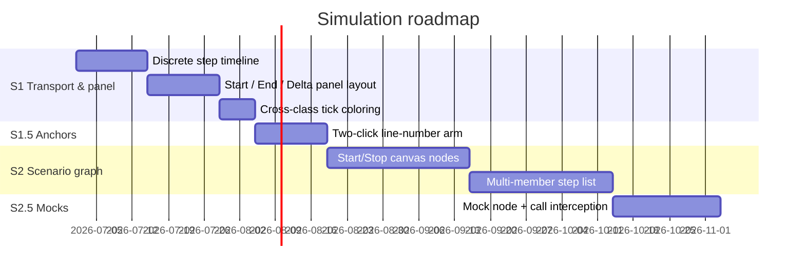
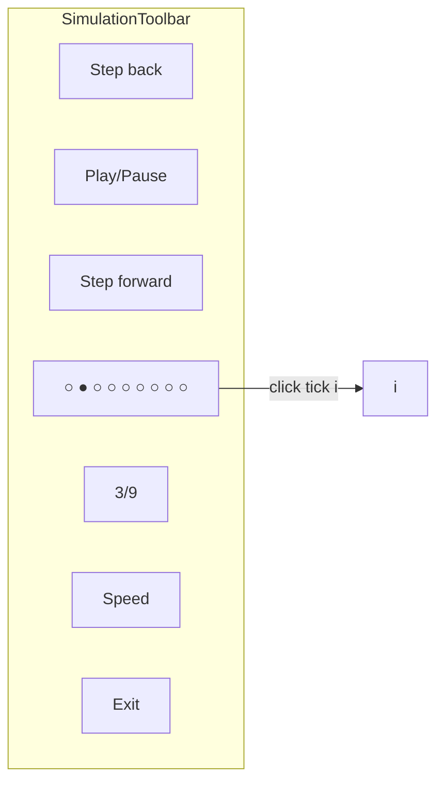
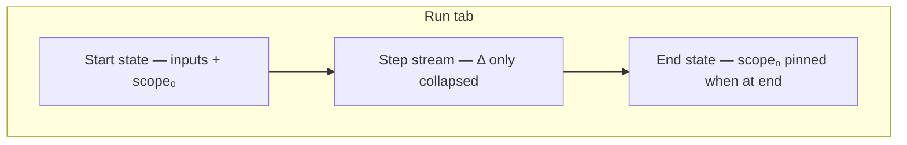
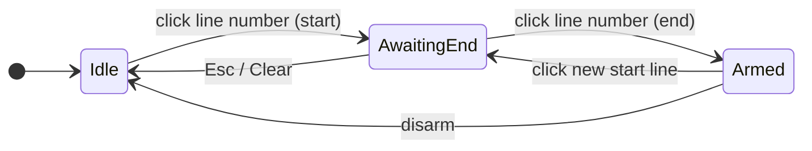
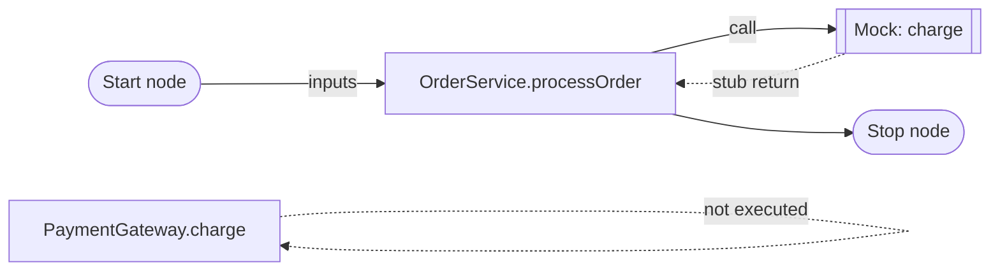
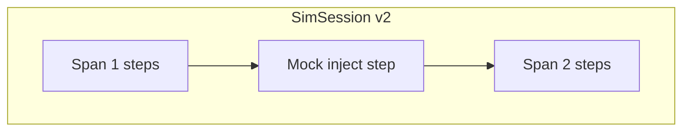
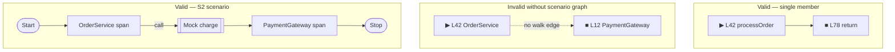

# Execution simulator — vision (scenario graph & mocks)

**Status:** Product vision — **not normative for current MVP**. Documents UX/engineering direction for multi-class scenarios, mock isolation, and revised anchor + transport chrome. Current shipped behavior: [interactions index](execution-simulator.interactions.supplement.md).

**Audience:** product, UX, engineering — decision record before Phase S2+.

---

## What you described (problem statement)

Today the simulator is a **single-method static walk**: gutter anchors, continuous scrub bar, ledger with expandable detail. That breaks down when:

1. **Transport** — a slider implies continuous time; execution is **discrete stops** (one statement each).
2. **Scope** — start/end are **lines in one body**, not **entry/exit of a business process** across classes.
3. **Isolation** — stepping into a real callee pulls in the full graph; you want **mock responses** to test one class alone.
4. **Anchors** — Alt+click / plain-click modifiers are expert-only; **click line number → click line number** matches mental model.

The north-star: a **scenario** on the ego-graph — BPMN-like **Start**, **Stop**, **Call**, and **Mock** nodes — with the Run panel showing **inputs → per-step deltas → result**.

---

## UX ↔ engineering discussion

### UX designer

| Topic | Position |
| ----- | -------- |
| **Discrete timeline** | Replace the range slider with **one tick per step** (like VS Code breakpoint gutter + Chrome Performance **filmstrip**). Current step = brand fill; past = muted; future = hollow. Click tick = scrub. Cross-class step = tick uses **class hue** (reuse `--token-surface-class` / node accent), not brand. |
| **Panel layout** | Run tab becomes three blocks: **Start state** (pinned top) → **Step stream** (scroll) → **End state** (pinned bottom when run completed or end anchor reached). Each step row shows **Δ variables only** collapsed; expand for reads/calculated. |
| **Line-number anchors** | **Arm mode:** first click on line number sets Start (▶), second sets End (■). Third click on Start resets arm sequence. No Alt key. Gutter icon column becomes **read-only indicators** during arm. |
| **Multi-class** | Start/Stop are **canvas nodes**, not gutter glyphs. User drags **Start** onto a method entry (or class), **Stop** onto exit. Walk path can cross edges; scenario serializes to `SimScenario` (replaces flat `SimTracePath` for v2). |
| **Mocks** | Right-click call → **Create mock response**. Spawns a **Mock** node wired between caller and would-be callee. Mock node holds return value (and later throw/branch). Static walk uses mock instead of descending. |
| **Debugger idioms** | Keep **Step over / into / out** in toolbar (deferred AC). Add **Run to cursor** on line number (sets temp end). Do **not** clone full VS Code Variables tree — stay statement-centric. |

### Engineer

| Topic | Position |
| ----- | -------- |
| **Discrete timeline** | Low risk. `SimulationToolbar`: render `steps.map` as `role="tablist"` ticks; reuse `scrubTo`. Cross-class: extend `SimStep` with `flowNodeId`, `memberId`, `className?` per step (today session is single-member). |
| **Panel Δ** | `detail.writes` already exists; collapsed row shows `writes.map` one-liner. Start state = `scopeAtStep` at index 0; end state = last step snapshot. Small UI change in `SimStepLedger` + header/footer components. |
| **Two-click line anchors** | Replace modifier gutter in **S1.5** (breaking UX). `armPhase: 'idle' \| 'needEnd'` in context. Clicks on `.code-line-gutter` (line number), not separate button — merges number + marker column. |
| **Scenario graph** | **S2 — large.** New node types on React Flow layer (or overlay lane): `SimStartNode`, `SimStopNode`, `SimMockNode`. Edges follow ego-graph **composition** edges for call path. Engine becomes **graph walk**, not single `buildStepList`. |
| **Mocks** | **S2.5** with static walk: mock node stores `{ calleeId, returnDisplay }`; at `call` step, if outgoing edge to Mock, skip `resolveVisibleTarget`, inject return into scope. Full behavior needs Option B/C engine. |
| **Multi-class steps** | Requires **step-into** + session stack or pre-expanded **scenario path** (ordered list of member spans). Static walk alone cannot cross real async/DI without stubs. |

### Agreed phasing



**S1** does not block current MVP. **S2+** amends engine spec ([engine options supplement](execution-simulator.engine-options.supplement.md)).

---

## S1 — Discrete transport & variable panel

### Toolbar: step ticks (not slider)



| Tick state | Visual |
| ---------- | ------ |
| Past | Filled muted dot |
| Current | Brand-filled dot + ring |
| Future | Hollow dot |
| **Cross-class next** | Dot ring uses **target class token color** |
| Call step | Diamond tick (optional S1c) |

**Reference:** Chrome DevTools Performance **filmstrip**; VS Code **timeline** breakpoints; trace-oriented tools (Krometrail) emphasize **per-stop snapshots** not scrubber continuity.

### Run panel layout



| Block | Content | When visible |
| ----- | ------- | ------------ |
| **Start state** | `session.inputs` + `steps[0].scopeSnapshot` before step | Always when active |
| **Step stream** | One row per step; collapsed = `writes` summary | Always when active |
| **End state** | `steps[last].scopeSnapshot` + return highlight | `currentIndex === last` or run finished |

Collapsed step example:

```text
● 3  L43  assign   discount ← 0.1     Δ discount: 0 → 0.1
```

Cross-class step example (S1c):

```text
◆ 4  PaymentGateway.charge   [class: PaymentGateway]   → mock or node B
```

---

## S1.5 — Two-click line-number anchors

Replaces modifier gutter (see [surfaces supplement](execution-simulator.surfaces.supplement.md) — mark current gestures **legacy** after S1.5).



| Click target | Phase | Effect |
| ------------ | ----- | ------ |
| **Line number** (`.code-line-gutter`) | Idle | ▶ on line; phase = awaiting end |
| Line number | Awaiting end, **same member** | ■ on line; armed |
| Line number | Awaiting end, **other member** | Reachability warning (see vision supplement); no silent arm |
| Line number | Armed, on ▶ | disarm |
| Line number | Armed, on ■ | clear end (implicit end) |

Gutter **icon column** shows ▶/■/→ but clicks go through **line number** hit target (larger, familiar from IDEs).

---

## S2 — Scenario graph (BPMN-like)

### Concept

A **scenario** is a subgraph of the ego-canvas annotated with simulation nodes:



| Node type | Role |
| --------- | ---- |
| **Start** | Declares **scenario inputs** (params + `this` fields). Anchors trace entry. |
| **Stop** | Declares **expected outputs** (optional assertions later). Anchors exit. |
| **Method span** | Existing class node + member row range (today's ▶–■). |
| **Mock** | Intercepts a call edge; supplies return/throw without executing callee body. |
| **Call bridge** | (auto) Edge pulse target when stepping into on-canvas callee without mock. |

### Data sketch

```typescript
type SimScenario = {
  id: string;
  label: string;
  startNodeId: string;       // SimStartNode
  stopNodeId: string;        // SimStopNode
  spans: SimMemberSpan[];    // ordered member walks
  mocks: SimMockBinding[];
  inputs: Record<string, string>;
};

type SimMemberSpan = {
  flowNodeId: string;
  memberId: string;
  startLine: number;
  endLine: number;
};

type SimMockBinding = {
  id: string;
  callerMemberId: string;
  callLine: number;
  calleeToken: string;
  returnValue: string;
  position: { x: number; y: number }; // overlay node
};
```

### Multi-class step index

Session becomes **ordered steps across spans**:



Each `SimStep` gains: `flowNodeId`, `memberId`, `className`, `spanIndex`, `crossesClass?: boolean`.

---

## S2.5 — Mock response nodes

### Creation flow

```mermaid
sequenceDiagram
  participant U as User
  participant CM as Context menu
  participant C as Canvas
  participant E as Static walk

  U->>CM: Right-click call token
  CM->>C: Create mock response
  C->>C: Place Mock node near call wire
  U->>C: Edit return value on Mock node
  U->>E: Run scenario
  E->>E: At call step, resolve Mock edge first
  E->>E: Inject return; skip callee span
```

| Mock capability | Static walk (A) | Real exec (B/C) |
| --------------- | --------------- | ---------------- |
| Fixed return string | ✓ | ✓ |
| Throw | display only | real |
| Branch on args | ✗ | ✓ |
| Spy call count | ✗ | ✓ |

---

## Debugger landscape (2025–2026)

| Tool | Pattern | Relevant to us |
| ---- | ------- | -------------- |
| **VS Code** | Breakpoints on gutter; discrete step commands; Variables / Call Stack side bars | Step commands, gutter familiarity — not full variable tree |
| **Chrome DevTools** | Filmstrip, Performance timeline, step icons | **Discrete ticks** over slider |
| **Trace-first tools** | Execution history as primary artifact (arxiv 2604.09301) | Aligns with **step stream + Δ** panel |
| **Krometrail / DAP** | Compact per-stop viewport: source frame + locals + stack depth cap | **Start/Δ/End** blocks; keep payloads small |

**We should not:** clone VS Code's full debugger shell.  
**We should:** stay **graph-centric** — scenario lives on the ego-canvas; panel is the **trace transcript**.

---

## Open product decisions

| # | Question | Options | UX lean | Eng lean |
| --- | -------- | ------- | ------- | -------- |
| D1 | Scenario nodes live where? | **A)** Overlay on ego-canvas · **B)** Separate scenario lane · **C)** Panel-only list | A — mocks visible in context | A — reuse React Flow; z-index discipline |
| D2 | Two-click anchors replace modifiers? | **A)** Replace · **B)** Simple/Expert toggle | A | A with migration note |
| D3 | Off-canvas callee at call step | **A)** Pause + Load · **B)** Auto Mock suggestion · **C)** Block run | B | B + A fallback |
| D4 | Mock node default | **A)** Literal return only · **B)** Wizard (args → return) | B later | A for S2.5 |
| D5 | End state assertions | **A)** Display only · **B)** Pass/fail badge | B later | A now |

### Decision record (2026-07-11)

| ID | Decision | Notes |
| ---- | -------- | ----- |
| D1 | **A — canvas overlay** | Start / Stop / Mock nodes sit on the ego-graph as a simulation overlay layer |
| D3 | **B — suggest Mock** | Off-canvas callee → offer **Create mock response**; Load remains fallback |
| D2 | **A — two-click line numbers** (pending S1.5) | Replace Alt/click modifiers; see **cross-class caveat** below |

### Cross-class start/end — reachability (D2 caveat)

**Line-number anchors only work within one expanded method body.** If the user sets ▶ in `OrderService` and ■ in `PaymentGateway` using two-click line numbers, the static walk **cannot** connect them — those spans are disconnected unless a **scenario path** links them.



| User action | System response |
| ----------- | --------------- |
| ■ on **same member** as ▶ | Armed range; shade Lstart…Lend |
| ■ on **different member** without scenario | **Warn:** “End is in another class — not reachable in a single-method walk.” Offer: **Add to scenario** (create Stop node on that member) or **Clear end** |
| Start + Stop **canvas nodes** on different classes | Valid — engine walks **scenario edges**, not gutter lines alone |
| Mock between caller and off-canvas callee | Call step resolves to Mock; callee body skipped |

**UX copy (arm phase):** when second click lands on a different `memberId`:

```text
⚠ PaymentGateway L12 isn’t reachable from OrderService L42 in a single walk.
[ Create scenario Stop here ]  [ Use as mock target only ]  [ Cancel ]
```

**Engine rule:** single-member `SimSession` MUST reject or clamp end anchor to same `memberId` at `buildSession` time unless a `SimScenario` links spans (S2).

---

## Child specs (after decisions)

| Spec | Owns |
| ---- | ---- |
| [transport-panel supplement](execution-simulator.transport-panel.supplement.md) | S1 discrete timeline + panel layout (normative when approved) |
| This doc | S2 scenario graph + mocks |
| [interactions index](execution-simulator.interactions.supplement.md) | Current MVP (until S1.5 supersedes anchors) |

---

## References

- Current MVP: [execution-simulator.md](execution-simulator.md)
- Engine: [execution-simulator.engine-options.supplement.md](execution-simulator.engine-options.supplement.md)
- Krometrail viewport pattern: [UX.md](https://github.com/nklisch/krometrail/blob/main/docs/UX.md)
- Trace-oriented debugging: [Tracers for debugging (2026)](https://arxiv.org/pdf/2604.09301)
