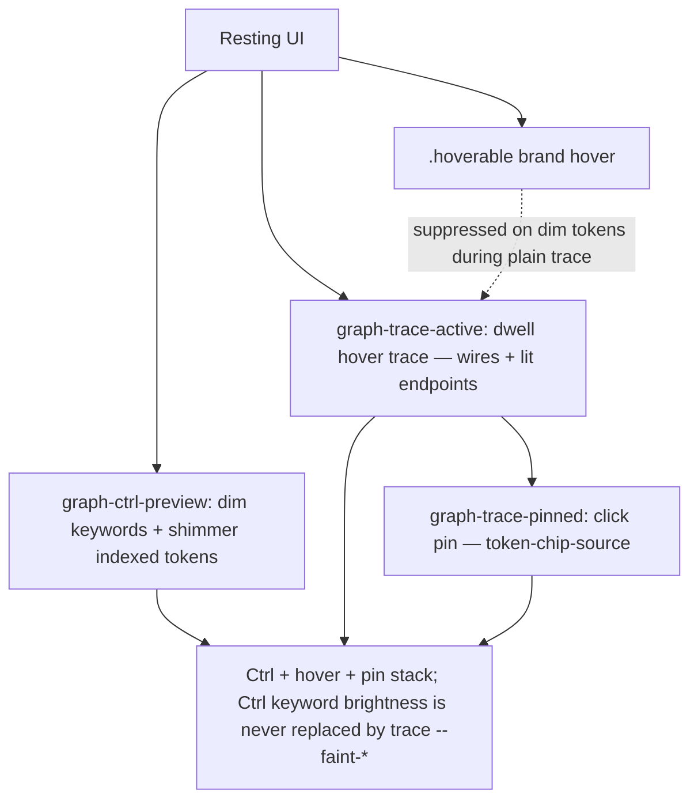

# Interaction emphasis

## What It Is

Cross-app contract for pointer hover on clickable surfaces: **brand gold** in both themes for **app chrome** (`.hoverable`, row expand, explorer). **Indexed token chips** keep semantic kind color as the through-line — hover and trace deepen the same symbol identity (fill wash), never swap to gold. Preview-trace mode adds dim/lit rules on non-hovered chips.

## What It Looks Like

Idle controls use muted or card foreground. Hover adds gold ink, gold-tinted surface, and gold border via `.hoverable`. During **trace**, dim indexed tokens stay `--faint` on pass-over; only **lit** endpoints get semantic color + crisp socket ring. **Pinned** trace keeps the pin lit; hovering another indexed token still runs the normal dwell preview (chip-on + wires) without changing the pin until click.

## Where It Lives

- **CSS:** `client/src/index.css` (`.hoverable`), `styles/trace-modes.css`, `styles/tokens-chips.css`
- **JS:** `client/src/lib/controlTokens.ts`
- **Canvas classes:** `graph-ctrl-preview`, `graph-trace-active`, `graph-trace-pinned`, `graph-trace-warm` on `.graph-pane` (graph mood root)

## Emphasis stack

Modes are **independent** and **combinable** — not a single gesture. Priority when multiple are active: **Ctrl → hover (dwell trace) → focused (pin)**.



- **Ctrl** (hold): `graph-ctrl-preview` — syntax to `--faint-ctrl`, shimmer on indexed chips. Does not start a trace.
- **Hover** (dwell on chip, with or without Ctrl): `graph-trace-active` — wires, `token-chip-lit` / `token-chip-on` / `token-chip-hover-preview`. Ctrl only shortens dwell; releasing Ctrl does not clear an active hover trace.
- **Pointer emphasis** (within an active trace): optional second layer when the cursor rests on a specific chip or wire — emphasized branch pops (full wire glow, `token-chip-hover-preview` on pointer endpoint); other trace wires recede (backdrop). **Does not** clear or weaken the committed trace when the pointer leaves a card. See [trace-strength supplement](preview-edges.trace-strength.supplement.md) § Strength stack.
- **Focused** (click pin): `graph-trace-pinned` + `token-chip-source` — anchor trace; foreign hover still runs dwell preview on other tokens.

## Actions

| # | User Action | System Response | Triggers |
| --- | ----------- | --------------- | -------- |
| 1 | Hovers `.hoverable` control | Brand surface + border + ink (including `.control-row-text-*` children) | CSS `:hover` |
| 2 | Hovers explorer row | `variant="explorer*"` on `InteractiveListRow` | prop + `.list-row-explorer` |
| 3 | Ctrl held on graph | Dim syntax/keywords; shimmer indexed chips | `graph-ctrl-preview` |
| 4 | Active trace | Dim non-lit; lit = semantic color | `graph-trace-active` |
| 5 | Pinned trace | Pin stays lit; other tokens preview on dwell; click replaces pin; Shift+click accumulates | `graph-trace-pinned` + `mergeTraceLit` |
| 6 | Member row header hover | Brand bg **hover only** (not `aria-expanded`) | `.member-row-header.hoverable` |

## Trace vs brand (normative)

| Surface | Trace active, not lit | Trace lit endpoint | Pinned + foreign token |
| ------- | --------------------- | ------------------ | ---------------------- |
| Token chip text | `--faint` | semantic `--token-edge-*` | semantic `--token-edge-*` on hover |
| Token background | transparent | `token-chip-on` semantic fill, **no border** | same semantic fill on hover |
| Local-def sibling endpoint | — | `token-chip-endpoint-sibling` grey chip-on + grey socket (same geometry as focus) | — |
| Provenance hop ≥ 2 endpoint (sig-type, param def when usage is focus) | — | `token-chip-endpoint-sibling` + grey socket | — |
| Node card header | card white | card white | card white |
| Member row (lit) | `--member-row-trace-lit-bg` + inset function-blue border | `trace-member-lit` | per trace lit set |
| Member row (dim, trace on) | `bg-muted` at rest; trace dims non-lit rows | no lit class | non-lit rows while trace active |
| FlowAnchor socket | hidden | semantic fill + crisp ring | hidden unless endpoint |

Ctrl always wins back shimmer: holding Ctrl shimmers every indexed token regardless of trace/pin state; only a *plain* (no-Ctrl) hover or pin suppresses shimmer (`trace-modes.css`, scoped via `.graph-pane:not(.graph-ctrl-preview) .graph-trace-active`).

## Pointer emphasis within trace (normative)

When a trace session is active (`graph-trace-active` or pinned), pointer position can add a **second** strength layer on top of hop decay. Full wire/chip tables: [preview-edges.trace-strength.supplement.md](preview-edges.trace-strength.supplement.md) § Strength stack. Portable pattern: [visual-strength-stacks.md](../../agent-playbook/core/visual-strength-stacks.md).

| # | Condition | Chips | Wires |
| --- | --------- | ----- | ----- |
| 1 | Trace session, pointer not on chip/wire | Lit = semantic + hop opacity; non-lit = `--faint` | Hop decay via `traceWireOpacity` baseline |
| 2 | Pointer on chip (emphasis) | Pointer chip = `token-chip-hover-preview`; **other lit chips = trace baseline** | Touching wires = emphasis glow; others = backdrop |
| 3 | Pointer on wire hit-zone | Endpoint chips boosted | That wire = emphasis; siblings = backdrop |
| 4 | Pointer leaves class card | **No change** to session strength | Same as row 1–3 by pointer state |

**Chip hover fill:** `token-chip-hover-preview` uses a **stronger** semantic wash than `token-chip-on` (pointer pop during emphasis). `token-chip-on` remains the committed trace fill.

**Dim rule unchanged:** non-lit tokens dim via `--faint` ink only — no container opacity wash on code lines.

**Planned refactor:** split `traceTokenKey` (session) from `pointerTokenKey` (emphasis) — [trace-strength-refactor-plan.md](../../project/trace-strength-refactor-plan.md) PR 4.

**`graph-trace-warm`:** set on `.graph-pane` while `isWarm` is true (pointer has committed at least one dwell trace this session). Tier B snaps ink/fill inside cards (`transition-duration: 0s`), but endpoint **socket dots** may use a short Tier-A transition while warm so sockets ease in when hopping token→token (`preview-wires.css` `.graph-trace-warm .flow-anchor-on`). Disabled under `prefers-reduced-motion`.

## Member container & signature fills (normative)

Canvas mode classes on `.graph-pane`: `graph-ctrl-preview`, `graph-trace-active`, `graph-trace-pinned`. Imperative trace classes on DOM: `trace-member-lit`, `trace-member-owner-lit`, `trace-lit-line`, `token-chip-lit`, `token-chip-on`, `token-chip-source`, `token-chip-hover-preview`.

| # | Mode | Member row container | Signature pills (param/return) | Member body (expanded code) | Lit token in row |
| --- | ---- | -------------------- | ------------------------------ | --------------------------- | ---------------- |
| 1 | **Idle** | all rows: `bg-muted` (blue-grey) | param pills: `--member-sig-bg-in`; return: neutral | transparent | semantic ink |
| 2 | **Row header hover** | `--brand-surface` bg + `--brand-border` border; title + caret → `--brand` | unchanged | `--muted-foreground` on code (`--surface-neutral-strong` fill) | unchanged |
| 3 | **Label hover / trace on title** | `--member-row-trace-lit-bg` + `--member-row-trace-lit-border` on `.member-row` | unchanged | — | semantic ink + `--token-surface-*` fill (same as `token-chip-on`) |
| 4 | **Ctrl held** (`graph-ctrl-preview`) | `--trace-dim-surface` on non-lit rows; lit rows unchanged | param/return pills → `--trace-dim-surface`; indexed types keep semantic ink | syntax → `--faint-ctrl` | shimmer glint on indexed chips |
| 5 | **Trace active, row not lit** | `--trace-dim-surface` on non-lit rows | bg transparent; text → `--faint` | syntax → per-token `--faint-*` mixes (greyish, hue hint) | non-lit chips → `--faint` |
| 5b | **Trace active, owner row** (hovering sig param/type in that row) | same row bg may be owner-lit | non-lit sig fragments → `--faint` | — | **member row label** (function name) → `--faint` unless `token-chip-lit` |
| 6 | **Trace active, row lit** (`trace-member-lit`) | `--member-row-trace-lit-bg` + inset function-blue border | pill bg transparent; lit signature chips → same `token-chip-lit` + `token-chip-on` as body | lit lines → `trace-lit-line`; syntax → `--muted-foreground` (no saturated primitives) | `token-chip-lit` + `token-chip-on` fill |
| 7 | **Trace active, owner row** (`trace-member-owner-lit`) | same as lit row 6 | same as lit | same as lit | same as lit |
| 8 | **Pinned** (`graph-trace-pinned`) | pinned trace stays lit (row 6/7); foreign hover → ephemeral preview | pinned source keeps semantic ink on hover | — | pin source: `token-chip-source`; foreign preview: same semantic fill as `token-chip-on` |
| 9 | **Ctrl + trace** | Ctrl shimmer wins on indexed chips; row fills unchanged from 5–7 | indexed sig types stay semantic under Ctrl | non-lit syntax stays `--faint-ctrl` (ctrl wins over trace `--faint-*`) | shimmer + lit semantic ink; hover/pin stack on top |

**Cascade rule** (from [token-interactions.md](token-interactions.md)): tracing a **function** endpoint spreads `trace-member-lit` to that member's whole body; class/type/variable endpoints do not spread body fill.

**Regression guard:** member rows use `bg-muted` at rest — never `--primary` or `color-mix` into `--card` for method fills (oklch hue snaps red). Param pills use `--member-sig-bg-in` mixed into `--background`. Member header uses `.hoverable` for brand chrome on `:hover` only. **Token chips never use brand gold** — hover fill matches `token-chip-on` semantic wash. Signature **indexed** param/type symbols use the same `TokenChip` shell as body tokens; TS primitives (`string`, `void`, …) stay plain type ink — not chips. **Non-chip signature text** (param names without a local def, union fragments, inline `e.g.` descriptions) and **`.code-comment`** in member bodies **MUST** dim to `--faint` under `graph-trace-active` even when their parent `.member-sig-value` is faint — child spans with semantic type ink need explicit trace selectors. Ctrl shimmer applies only to interactive indexed chips (`.cursor-pointer`), never primitives or syntax.

## Component Hierarchy

```text
index.css (.hoverable)
├── controlTokens.ts
├── tokens-chips.css (chip ink / chip-on)
├── trace-modes.css (trace / ctrl / pinned)
├── preview-wires.css (sockets, wires)
└── GraphFlowCanvas (mode classes)
```

## File Map

| File | Purpose |
| ---- | ------- |
| `index.css` | Global `.hoverable`; header no trace tint |
| `controlTokens.ts` | Tailwind bundles — sync with CSS |
| `tokens-chips.css` | Resting ink, chip-on, pinned lock |
| `trace-modes.css` | Dim, lit, Ctrl shimmer |
| `preview-wires.css` | Sockets, preview wires |
| `client/src/lib/traceLitApply.ts` | Chip/socket inline opacity during trace |
| `client/src/lib/wireHoverBoost.ts` | Session + pointer strength (rAF) |

## Acceptance Criteria

- [ ] New clickables use `.hoverable` or `controlTokens` — not `hover:bg-primary`
- [ ] JS/SVG colors via CSS variables in `style`
- [ ] Trace dim is color-only — no container opacity / bg wash on code
- [ ] Pin or dwell trace: strength unchanged when pointer leaves class card
- [ ] Pointer emphasis: lit endpoints stay at trace baseline; only pointer target gets hover-preview pop
- [ ] Pointer on wire: emphasized wire visibly stronger than non-touching trace wires
- [ ] Pinned trace: non-lit tokens stay dim until dwell; hover preview does not change pin
- [ ] Ctrl held during any trace/pin still shimmers every indexed token (Ctrl always wins over trace)
- [ ] Brand hover on member header is `:hover` only, not expanded state
- [ ] `.hoverable:hover` promotes `.control-row-text-*` labels to `--brand` (`tone="passive"` opts out)
- [ ] Token chip hover and `token-chip-on` use the same semantic fill — no brand gold, no border/box-shadow on the chip shell
- [ ] `controlTokens.ts` and `index.css` stay in sync

## References

- Preview trace: [preview-edges.interactions.supplement.md](preview-edges.interactions.supplement.md)
- Trace strength stack: [preview-edges.trace-strength.supplement.md](preview-edges.trace-strength.supplement.md)
- Refactor plan: [trace-strength-refactor-plan.md](../../project/trace-strength-refactor-plan.md)
- Design: [docs/design/state-visuals.md](../../design/state-visuals.md)
- Tokens: [docs/design/tokens.md](../../design/tokens.md)
