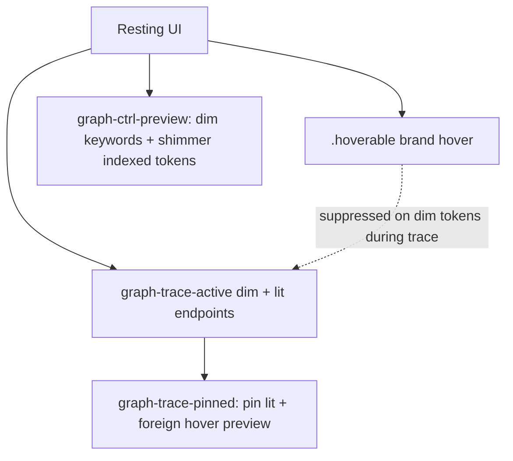

# Interaction emphasis

## What It Is

Cross-app contract for pointer hover on clickable surfaces: **brand gold** in both themes, shared between CSS and `controlTokens.ts`. Preview-trace mode adds dim/lit rules that override pass-over hover on non-lit tokens.

## What It Looks Like

Idle controls use muted or card foreground. Hover adds gold ink, gold-tinted surface, and gold border via `.hoverable`. During **trace**, dim indexed tokens stay `--faint` on pass-over; only **lit** endpoints get semantic color + socket glow. **Pinned** trace keeps the pin lit; hovering another indexed token still runs the normal dwell preview (chip-on + wires) without changing the pin until click.

## Where It Lives

- **CSS:** `client/src/index.css` (`.hoverable`), `connectors.css` (trace modes)
- **JS:** `client/src/lib/controlTokens.ts`
- **Canvas classes:** `graph-ctrl-preview`, `graph-trace-active`, `graph-trace-pinned` on `.graph-pane` (graph mood root)

## Emphasis stack



## Actions

| # | User Action | System Response | Triggers |
| --- | ----------- | --------------- | -------- |
| 1 | Hovers `.hoverable` control | Brand surface + border + ink | CSS `:hover` |
| 2 | Hovers explorer row | `INTERACTIVE_ROW` | class on row |
| 3 | Ctrl held on graph | Dim syntax/keywords; shimmer indexed chips | `graph-ctrl-preview` |
| 4 | Active trace | Dim non-lit; lit = semantic color | `graph-trace-active` |
| 5 | Pinned trace | Pin stays lit; other tokens preview on dwell; click replaces pin; Shift+click accumulates *(planned)* | `graph-trace-pinned` + merged trace lit |
| 6 | Member row header hover | Brand bg **hover only** (not `aria-expanded`) | `INTERACTIVE_SURFACE` |

## Trace vs brand (normative)

| Surface | Trace active, not lit | Trace lit endpoint | Pinned + foreign token |
| ------- | --------------------- | ------------------ | ---------------------- |
| Token chip text | `--faint` | semantic `--token-edge-*` | `--faint`, no hover lift |
| Token background | transparent | `token-chip-on` tint, **no inset border** | transparent |
| Node card header | card white | card white | card white |
| Member row (lit) | subtle function tint | `trace-member-lit` | per trace lit set |
| FlowAnchor socket | hidden | soft glow `currentColor` | hidden unless endpoint |

Ctrl always wins back shimmer: holding Ctrl shimmers every indexed token regardless of trace/pin state; only a *plain* (no-Ctrl) hover or pin suppresses shimmer (`connectors.css`, scoped via `.graph-pane:not(.graph-ctrl-preview) .graph-trace-active`).

## Component Hierarchy

```text
index.css (.hoverable)
├── controlTokens.ts
├── connectors.css (trace / ctrl / pinned)
└── GraphFlowCanvas (mode classes)
```

## File Map

| File | Purpose |
| ---- | ------- |
| `index.css` | Global `.hoverable`; header no trace tint |
| `controlTokens.ts` | Tailwind bundles — sync with CSS |
| `connectors.css` | Dim, lit, sockets, pinned lock |

## Acceptance Criteria

- [ ] New clickables use `.hoverable` or `controlTokens` — not `hover:bg-primary`
- [ ] JS/SVG colors via CSS variables in `style`
- [ ] Trace dim is color-only — no container opacity / bg wash on code
- [ ] Pinned trace: non-lit tokens stay dim until dwell; hover preview does not change pin
- [ ] Ctrl held during any trace/pin still shimmers every indexed token (Ctrl always wins over trace)
- [ ] Brand hover on member header is `:hover` only, not expanded state
- [ ] `controlTokens.ts` and `index.css` stay in sync

## References

- Preview trace: [preview-edges.interactions.supplement.md](preview-edges.interactions.supplement.md)
- Design: [docs/design/state-visuals.md](../../design/state-visuals.md)
- Tokens: [docs/design/tokens.md](../../design/tokens.md)
