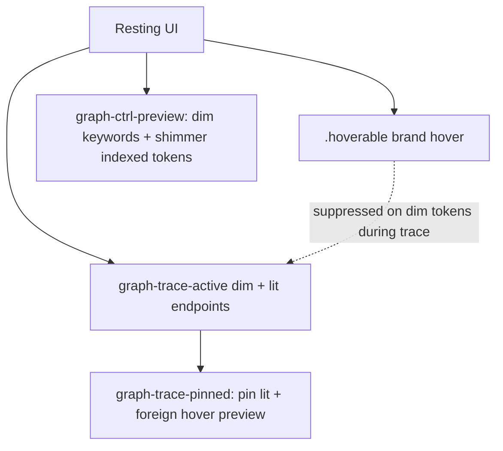

# Interaction emphasis

## What It Is

Cross-app contract for pointer hover on clickable surfaces: **brand gold** in both themes, shared between CSS and `controlTokens.ts`. Preview-trace mode adds dim/lit rules that override pass-over hover on non-lit tokens.

## What It Looks Like

Idle controls use muted or card foreground. Hover adds gold ink, gold-tinted surface, and gold border via `.hoverable`. During **trace**, dim indexed tokens stay `--faint` on pass-over; only **lit** endpoints get semantic color + socket glow. **Pinned** trace keeps the pin lit; hovering another indexed token still runs the normal dwell preview (chip-on + wires) without changing the pin until click.

## Where It Lives

- **CSS:** `client/src/index.css` (`.hoverable`), `styles/trace-modes.css`, `styles/tokens-chips.css`
- **JS:** `client/src/lib/controlTokens.ts`
- **Canvas classes:** `graph-ctrl-preview`, `graph-trace-active`, `graph-trace-pinned` on `.graph-pane` (graph mood root)

## Emphasis stack



## Actions

| # | User Action | System Response | Triggers |
| --- | ----------- | --------------- | -------- |
| 1 | Hovers `.hoverable` control | Brand surface + border + ink | CSS `:hover` |
| 2 | Hovers explorer row | `INTERACTIVE_ROW` | class on row |
| 3 | Ctrl held on graph | Dim syntax/keywords; shimmer indexed chips | `graph-ctrl-preview` |
| 4 | Active trace | Dim non-lit; lit = semantic color | `graph-trace-active` |
| 5 | Pinned trace | Pin stays lit; other tokens preview on dwell; click replaces pin; Shift+click accumulates *(planned)* | `graph-trace-pinned` + merged trace lit |
| 6 | Member row header hover | Brand bg **hover only** (not `aria-expanded`) | `INTERACTIVE_SURFACE` |

## Trace vs brand (normative)

| Surface | Trace active, not lit | Trace lit endpoint | Pinned + foreign token |
| ------- | --------------------- | ------------------ | ---------------------- |
| Token chip text | `--faint` | semantic `--token-edge-*` | `--faint`, no hover lift |
| Token background | transparent | `token-chip-on` tint, **no inset border** | transparent |
| Node card header | card white | card white | card white |
| Member row (lit) | `--member-row-trace-lit-bg` + inset function-blue border | `trace-member-lit` | per trace lit set |
| Member row (dim, trace on) | `bg-muted` at rest; trace dims non-lit rows | no lit class | non-lit rows while trace active |
| FlowAnchor socket | hidden | soft glow `currentColor` | hidden unless endpoint |

Ctrl always wins back shimmer: holding Ctrl shimmers every indexed token regardless of trace/pin state; only a *plain* (no-Ctrl) hover or pin suppresses shimmer (`trace-modes.css`, scoped via `.graph-pane:not(.graph-ctrl-preview) .graph-trace-active`).

## Member container & signature fills (normative)

Canvas mode classes on `.graph-pane`: `graph-ctrl-preview`, `graph-trace-active`, `graph-trace-pinned`. Imperative trace classes on DOM: `trace-member-lit`, `trace-member-owner-lit`, `trace-lit-line`, `token-chip-lit`, `token-chip-on`, `token-chip-source`, `token-chip-hover-preview`.

| # | Mode | Member row container | Signature pills (param/return) | Member body (expanded code) | Lit token in row |
| --- | ---- | -------------------- | ------------------------------ | --------------------------- | ---------------- |
| 1 | **Idle** | all rows: `bg-muted` (blue-grey) | param pills: `--member-sig-bg-in`; return: neutral | transparent | semantic ink |
| 2 | **Row header hover** | `--brand-surface` bg + `--brand-border` border; title + caret → `--brand` | unchanged | `--muted-foreground` on code (`--surface-neutral-strong` fill) | unchanged |
| 3 | **Label/chip hover** (not header chrome) | unchanged unless pointer is on header | unchanged | — | brand gold ink on hovered chip/label |
| 4 | **Ctrl held** (`graph-ctrl-preview`) | trace dim mix (`foreground` 3% → `card`); lit rows unchanged | param/return pills → same neutral dim mix; indexed types keep semantic ink | syntax → `--faint-ctrl` | shimmer glint on indexed chips |
| 5 | **Trace active, row not lit** | trace dim mix on non-lit rows | bg transparent; text → `--faint` | text → `--faint` | non-lit chips → `--faint` |
| 6 | **Trace active, row lit** (`trace-member-lit`) | `--member-row-trace-lit-bg` + inset function-blue border | pill bg transparent; lit signature chips → same `token-chip-lit` + `token-chip-on` as body | lit lines → `trace-lit-line` | `token-chip-lit` + `token-chip-on` fill |
| 7 | **Trace active, owner row** (`trace-member-owner-lit`) | same as lit row 6 | same as lit | same as lit | same as lit |
| 8 | **Pinned** (`graph-trace-pinned`) | pinned trace stays lit (row 6/7); foreign hover → ephemeral preview | pinned source keeps semantic ink on hover | — | pin source: `token-chip-source`; foreign preview: `--brand-surface` fill |
| 9 | **Ctrl + trace** | Ctrl shimmer wins on indexed chips; row fills unchanged from 5–7 | indexed sig types stay semantic under Ctrl | `--faint` body text | shimmer + lit semantic ink |

**Cascade rule** (from [token-interactions.md](token-interactions.md)): tracing a **function** endpoint spreads `trace-member-lit` to that member's whole body; class/type/variable endpoints do not spread body fill.

**Regression guard:** member rows use `bg-muted` at rest — never `--primary` or `color-mix` into `--card` for method fills (oklch hue snaps red). Param pills use `--member-sig-bg-in` mixed into `--background`. Member header uses `.hoverable` for brand chrome on `:hover` only. Signature **indexed** param/type symbols use the same `TokenChip` shell as body tokens; TS primitives (`string`, `void`, …) stay plain type ink — not chips. Ctrl shimmer applies only to interactive indexed chips (`.cursor-pointer`), never primitives or syntax.

## Component Hierarchy

```text
index.css (.hoverable)
├── controlTokens.ts
├── tokens-chips.css (chip ink / chip-on)
├── trace-modes.css (trace / ctrl / pinned)
├── preview-wires.css (sockets, wires)
└── GraphFlowCanvas (mode classes)
```

## File Map

| File | Purpose |
| ---- | ------- |
| `index.css` | Global `.hoverable`; header no trace tint |
| `controlTokens.ts` | Tailwind bundles — sync with CSS |
| `tokens-chips.css` | Resting ink, chip-on, pinned lock |
| `trace-modes.css` | Dim, lit, Ctrl shimmer |
| `preview-wires.css` | Sockets, preview wires |

## Acceptance Criteria

- [ ] New clickables use `.hoverable` or `controlTokens` — not `hover:bg-primary`
- [ ] JS/SVG colors via CSS variables in `style`
- [ ] Trace dim is color-only — no container opacity / bg wash on code
- [ ] Pinned trace: non-lit tokens stay dim until dwell; hover preview does not change pin
- [ ] Ctrl held during any trace/pin still shimmers every indexed token (Ctrl always wins over trace)
- [ ] Brand hover on member header is `:hover` only, not expanded state
- [ ] `controlTokens.ts` and `index.css` stay in sync

## References

- Preview trace: [preview-edges.interactions.supplement.md](preview-edges.interactions.supplement.md)
- Design: [docs/design/state-visuals.md](../../design/state-visuals.md)
- Tokens: [docs/design/tokens.md](../../design/tokens.md)
