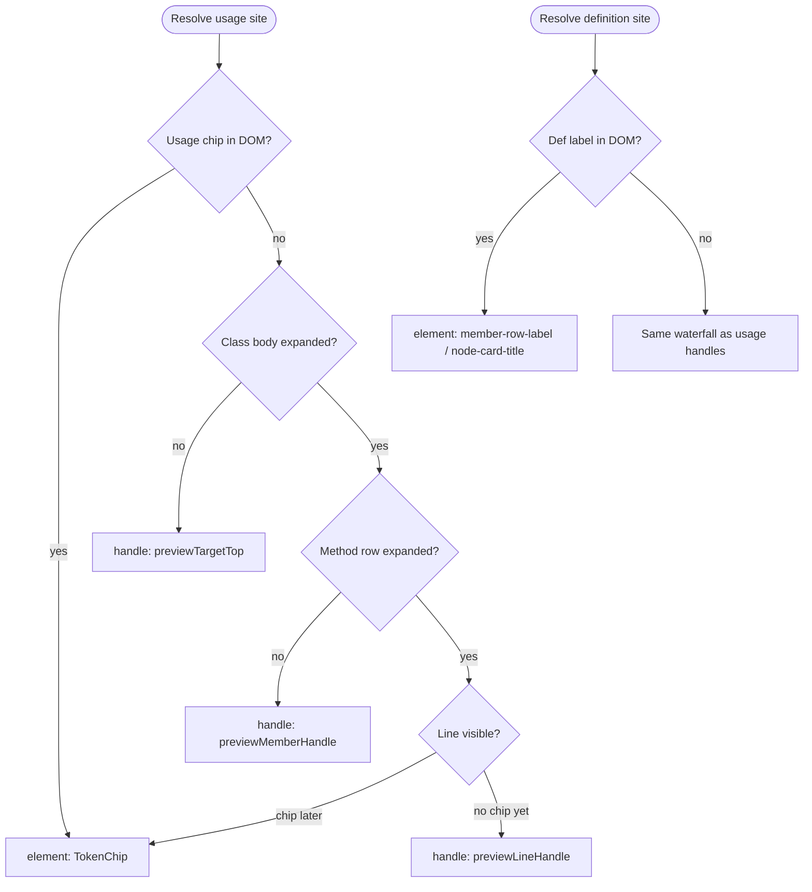
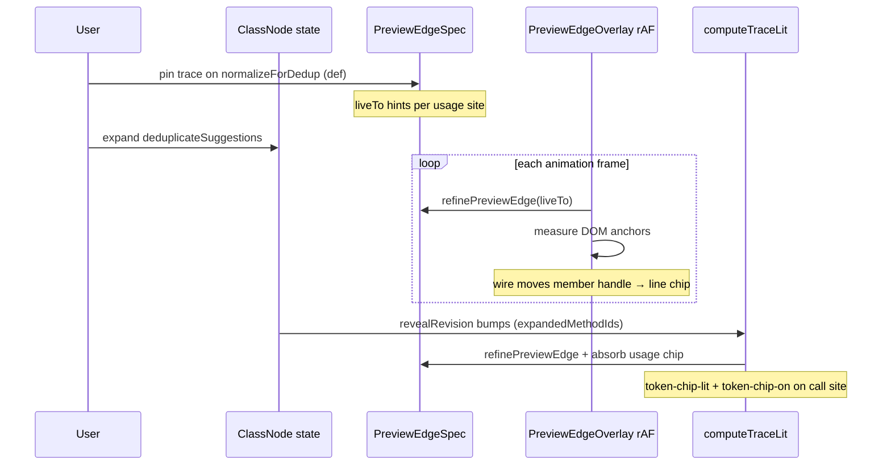
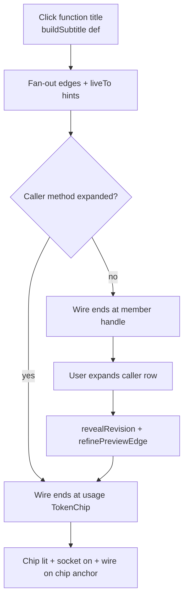

# Preview edges — anchoring supplement

Normative detail for **where a wire's endpoint attaches in the DOM** and how it
stays correct as the DOM changes underneath it: the anchor resolution
waterfall, live retargeting on expand/collapse, and the wire engine's
re-measure triggers. Parent: [preview-edges.md](preview-edges.md). Split from
[interactions supplement](preview-edges.interactions.supplement.md) 2026-07-17.

---

## Anchor resolution waterfall

Finest revealed level wins. Re-evaluated every frame while trace is active (`liveFrom` / `liveTo` on `PreviewEdgeSpec`).

Handle ids are **per-node** (`previewLineHandle(memberId, line)`, `previewTargetTop(flowNodeId)`). Never use a shared handle id across nodes.

---

## Live wire retargeting on expand/collapse

**Normative:** When a pinned/hovering **definition fan-out** wire retargets to a usage chip (member body was collapsed at pin time, expanded after), the call-site `TokenChip` MUST receive `token-chip-lit` and `token-chip-on` — not only a line-handle socket.

`computeTraceLit` MUST use the same `refinePreviewEdge` path as the overlay and MUST
re-run on **both** triggers:

1. `revealRevision` — React expand/collapse state (`expandedMethodIds`).
2. `registryRevision` — the element registry's rAF-coalesced change signal
   (`subscribeRegistry` / `useElementRegistryRevision`).

Both are required. `revealRevision` bumps **during render**, before the newly revealed
token chips mount and register, so on its own `computeTraceLit` resolves against the
*pre-commit* DOM and lights nothing — the wire self-heals only because the overlay
re-resolves every rAF, but lit has no such loop. `registryRevision` fires **after** the
chips mount and register, driving the recompute that actually finds them. Removing the
registry dependency reintroduces the "wire retargets but keywords don't light" bug.

### Def title → open callee (acceptance path)

Implementation: `client/src/lib/computeTraceLit.ts` (lit sets), `client/src/lib/traceLitController.ts` (imperative DOM classes), `client/src/lib/elementRegistry.ts` (`subscribeRegistry` post-mount signal), `GraphInteractionContext` `revealRevision` + `registryRevision` deps.

---

## Wire engine — re-measure triggers (normative)

`wireEngine.ts` is **not** a per-frame loop. It idles until a signal starts it, runs an
rAF measure loop while activity continues, then **auto-stops `SETTLE_MS` (100ms) after
the last signal** with one final tick. Wires therefore track motion smoothly but cost
nothing at rest. This same loop also advances any wire's head/tail signal window while
it's actually in transit (growing or consuming) — a settled, fully-arrived wire is CSS-driven
and does not need a tick; see [signal-window supplement](preview-edges.signal-window.supplement.md).
Every source of geometry change MUST reach it, or wires go stale:

| Trigger | Path | Covers |
| ------- | ---- | ------ |
| Preview/structural specs change | overlay effect → `engine.tickOnce()` | new/removed wires (`beginTrace`) |
| Viewport pan/zoom | `onMove` / `onMoveEnd` → `notifyWireTransform` | canvas transform |
| Node drag / resize | `onNodesChange` (`position`/`dimensions`) → `notifyWireTransform` | moving or resizing a card |
| Reveal (expand/collapse) | `revealRevision` → lit recompute → lit effect → `notifyWireTransform`; also emits a `dimensions` change | anchor host moves as the card grows |
| Trace-host mount/unmount | `registryRevision` → lit recompute → lit effect → `notifyWireTransform` | chip appears/disappears |

**Regression guard:** a node is `nodesDraggable`, so `onNodesChange` MUST notify the wire
engine on `position`/`dimensions` changes — otherwise wires freeze mid-drag and stay stale
after drop (only viewport moves would recover them).
