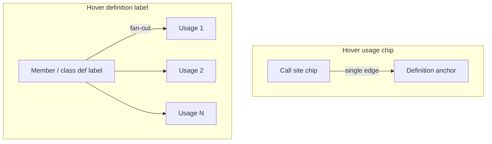
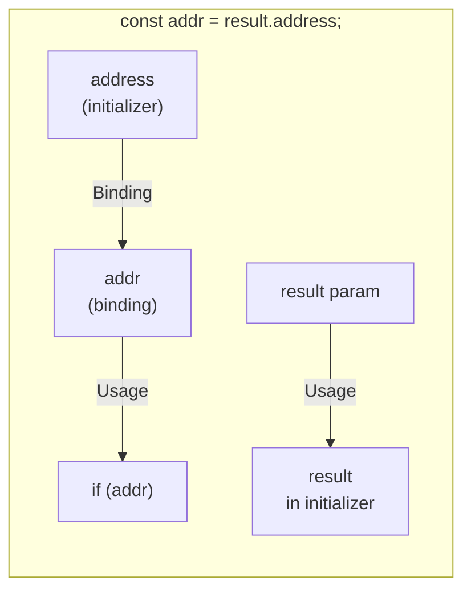
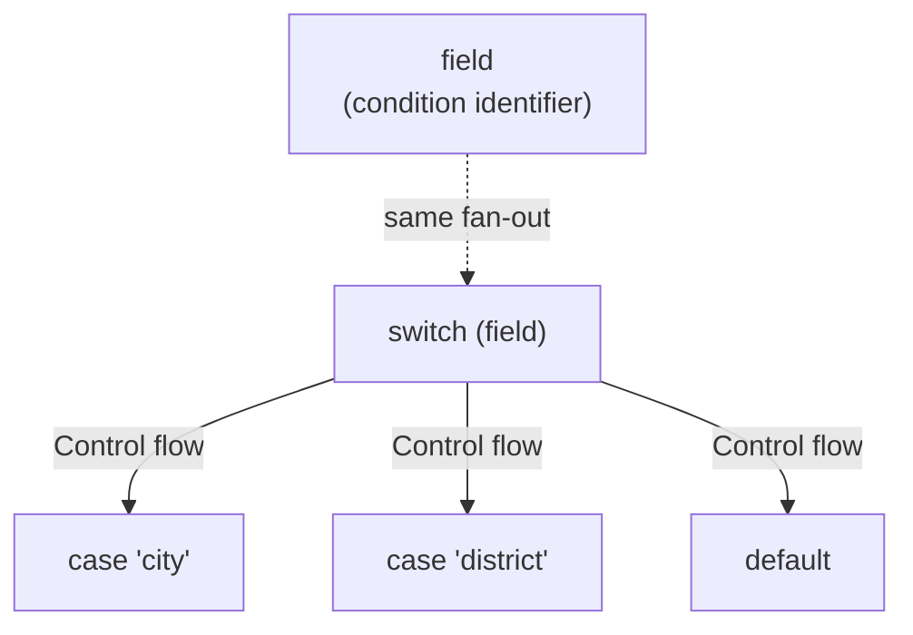
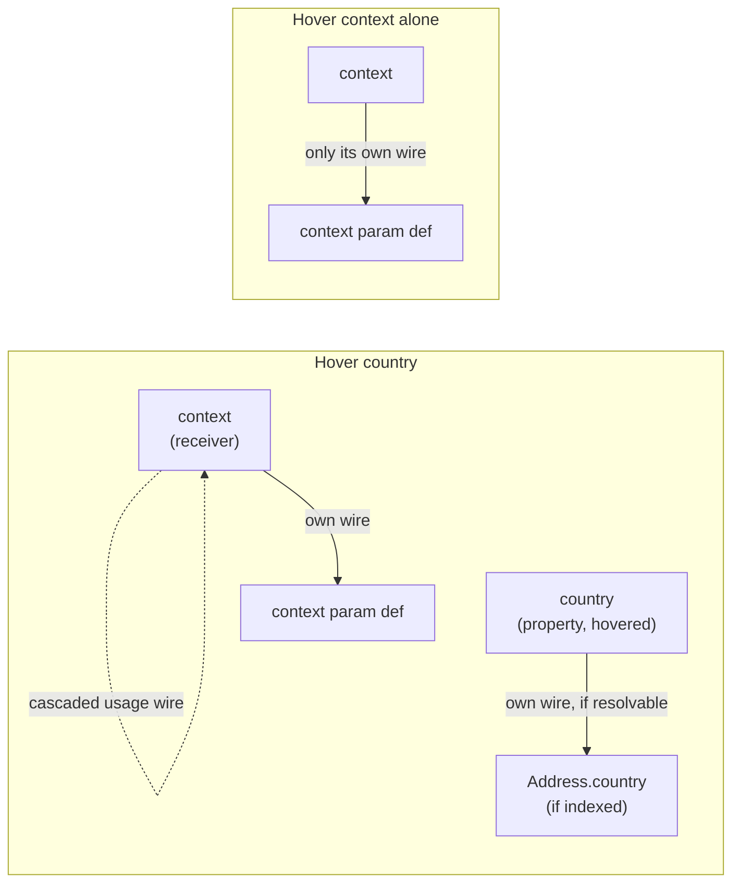

# Preview edges — fan-out supplement

Normative detail for **which edges get built and in what direction** for each
hover target: definition/usage direction, local lexical trace (binding),
control-flow branches, and member-access cascades. Parent:
[preview-edges.md](preview-edges.md). Split from
[interactions supplement](preview-edges.interactions.supplement.md)
2026-07-17 — that file kept growing past the point where "interactions" meant
one cohesive thing; this half is specifically edge-building rules.

---

## Edge direction and fan-out

Direction is **always definition → usage**, regardless of which end the user hovers.

| Hover target | Edge builder | Count |
| ------------ | ------------ | ----- |
| Usage in `CodeLine` | `buildUsagePreviewEdge` | 1 |
| Member row / class title def | `buildDefinitionPreviewEdges` | All usages in ego-graph |
| Local param / local var | `buildLocalPreviewEdges` | In-body usages only |
| Local/param binding + initializer | `buildBindingPreviewEdges` | 1 binding wire (init → binding) when decl has identifier RHS |
| `switch`/`if` keyword or condition identifier | `buildControlFlowPreviewEdges` | Fan-out: 1 wire per branch (`case`/`default`/`else`/`else if`) |
| Single `case`/`default`/`else`/`else if` branch | `buildControlFlowPreviewEdges` | 1 wire back to the `switch`/`if` keyword |
| Indexed type in signature tag | `buildSignatureTypeUsageEdges` | 1 (graph def → `sig-type` chip, or Load stub via index) |
| Param name in signature tag | `buildParamDefPreviewEdges` | In-body usages of that param |
| Property in a `a.b.c` chain | `buildReceiverCascadeEdges` (merged with the property's own edges, if any) | Own edge (0 or 1) + 1 per resolvable receiver leftward in the chain |
| Body usage of param with indexed type (e.g. `field` typed `AddressFieldKind`) | `buildLocalPreviewEdges` + `buildParamTypeCascadeEdges` | Hop 1 Usage: param def → usage; hop 2 **Typesetting**: sig-type → param def; hop 3 Usage: type def → sig-type (or Load stub) — see [trace-strength supplement](preview-edges.trace-strength.supplement.md) |
| Param def in signature (fan-out) | `buildParamDefPreviewEdges` + type cascade | Hop 1: def → each usage; hop 2/3: type chain behind param |

**Graph-aware fan-out:** `resolveDefinitionUsageSites` scans `graphData` + live `ClassNodeData` for `\btoken\b` matches, not only visible DOM chips. Signature line of the source member is skipped.

**Sig-type usages in the fan-out:** the body-line scan misses type/class usages that render as `…::sig-type::<token>` chips (return/param annotations). `resolveDefinitionUsageSites` MUST also enumerate those from the DOM and set `liveTo.traceKey` to the sig-type key so `computeTraceLit` lights the chip (`token-chip-lit`/`-on`), honouring the reveal waterfall (collapsed → container, expanded → chip).

**Fan-out line-base:** scans of `method.code` in `resolveDefinitionUsageSites` and `usageSiteIndex` are snippet-relative, but chip keys and preview handles are **file-absolute** — convert via `fileLineFromSnippetIndex(method.startLine, i)` or usage chips never match and stay unlit when expanded.

**DOM fan-out:** Member signature tokens (`isDefinitionSignatureLine`) carry `data-symbol-role="definition"` in `CodeLine` so they are not counted as usage anchors when tracing from the member-row label.

**Same-class usage → def:** `resolveVisibleTarget` MUST NOT skip `flowNodeId === sourceFlowId`. The live wire anchor for a member definition is resolved by `memberDefAnchor.ts`: prefer the **signature-line body chip** when the row is expanded and the user hovered/pinned that chip; fall back to **`.member-row-label`** when the body is collapsed; on re-expand, return to the body chip when `preferBody` is set (locked while pinned).

**Member row label display:** `.member-row-label` shows the raw symbol name (`traceName`), matching the signature-line chip — not camelCase-split display text.

**Member def siblings:** The row title and signature-line name chip share one definition. They **light together** (`trace-lit`) but never receive a preview wire between them — only real usages (call sites, etc.) get edges.

**No self-loop wires:** Preview edges never draw from a chip back to itself. Off-canvas call sites appear in the **connection menu** (load list) only — not as a circular wire on the definition chip.

---

## Local lexical trace (usage + binding)

Params and locals use a client-side lexical index (`localSymbolLinks.ts`) built into a **`LexicalGraph`** adjacency structure (`lexicalGraph.ts`) per expanded member row. Relative walks (forward from a def, backward from a usage) use a single `walkLexical*` BFS; `lexicalWalkPreviewEdges.ts` maps hops to `PreviewEdgeSpec`. Two preview kinds apply:

| Relationship | Kind | Direction | Builder |
| ------------ | ---- | --------- | ------- |
| Binding def → later reference | Usage | def → usage | `buildLocalPreviewEdges` |
| Initializer expr → bound name | **Binding** | initializer → binding | `buildBindingPreviewEdges` |
| Param def → reference in body | Usage | def → usage | `buildParamDefPreviewEdges` / local |
| Sig-type chip → param def slot | **Typesetting** | type annotation → param | `buildParamTypeCascadeEdges` (hop 2) |

**Normative — binding vs usage vs typesetting:** Usage answers "where is this name referenced later?" Binding answers "where does this binding get its value on the declaring line?" Typesetting answers "which type annotates this param slot?" — static typing, not runtime value flow. Each MUST have its own `ConnectionKind` and legend toggle.

**Initializer resolution:** For `const|let <name> = <expr>;` on a single line, the binding source anchor is the **rightmost identifier token** in `<expr>`. Property reads (`result.address`) anchor on the property identifier (`address`); the receiver (`result`) keeps its own usage wire to the param def when hovered independently.

**Compound trace on binding hover:** Hovering the binding site MUST emit both usage fan-out (if any) and the binding wire (when RHS has an identifier anchor).

---

## Control-flow fan-out (switch/case, if/else)

A separate client-side index (`controlFlowLinks.ts`) tracks `switch`/`case`/`default` and `if`/`else if`/`else` structure per method body via line/brace-depth scanning (no full AST — same pragmatic style as `localSymbolLinks.ts`).

**Compound trace on condition hover:** Hovering the discriminant/condition identifier (e.g. `field`) MUST emit both its normal usage wire(s) (`buildLocalPreviewEdges`) and the control-flow fan-out (`buildControlFlowPreviewEdges`) — merged in `CodeLine.firePreview`, same pattern as the binding merge above.

**Normative — control flow vs usage/binding:** Control flow answers "which branch does this decision lead to?" It is a distinct kind (`branch`) from Usage (def → later reference) and Binding (value → name); it MUST NOT share a legend toggle with either.

**Direction:** always condition/keyword → branch, never branch → condition, even when the wire was summoned by hovering a single branch (only the *set* of drawn wires is filtered, not the direction).

**Known v1 limitations:** ternary (`cond ? a : b`) is not indexed; a `switch`/`if` header whose discriminant/condition is on a different line than the keyword is not indexed (single-line headers only).

---

## Member-access cascade (property chains)

A property reached through a chain (`country` in `context.country`) is meaningful only together with the path used to reach it. Hovering the tail property therefore cascades **leftward** to its receiver(s); hovering a receiver on its own never cascades forward.

**Tokenization:** `country` is interactive (rendered as a `TokenChip`, not plain text) whenever it is itself indexed/local **or** at least one receiver in its `a.b.c` chain resolves (`memberAccessReceiverIndices` + `isLinkableIdentifier` in `CodeLine.tsx`). This lets a property whose own type isn't in the symbol index still be hovered meaningfully — hovering it draws the receiver's wire even when the property itself has no definition to link to.

**Cascade direction is one-way:** `memberAccessReceiverIndices(tokens, i)` walks left from the hovered token through consecutive `identifier "." identifier` pairs; it never looks right. Hovering `context` in `context.country` MUST NOT light up or wire `country` — only hovering `country` cascades back to `context`.

**Compound trace on property hover:** `buildReceiverCascadeEdges` resolves each receiver exactly as if it had been hovered on its own — local/param fan-out first (`buildLocalPreviewEdges`), then indexed usage (`resolveVisibleTarget`, graph-mode only; no Load-stub menu is triggered for a cascaded receiver, to avoid a second `TokenConnectionMenu` fighting the primary hover's). These are merged into the property's own edge list before the single `beginTrace` call, same pattern as the binding and control-flow merges above. For a longer chain (`a.b.c`), every receiver leftward (`b`, then `a`) is included, not just the immediate one.

**Normative — not a new kind:** the cascaded wires are whatever kind the receiver would draw on its own (almost always Usage); this is an interaction pattern, not a new `ConnectionKind`. It reuses the Usage legend toggle.
