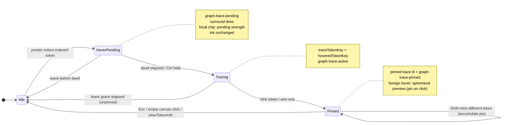
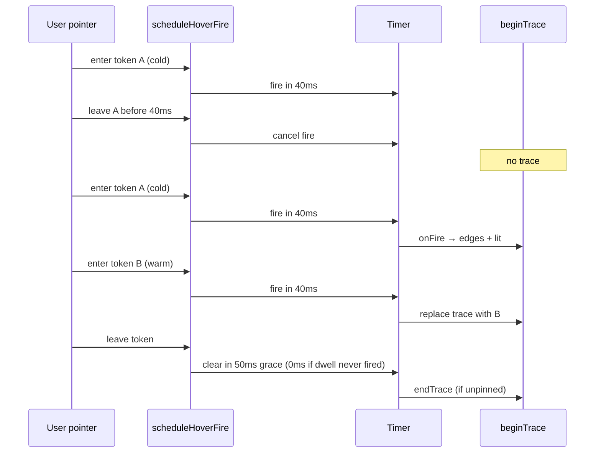

# Preview edges — interactions supplement

Normative detail for the **core trace lifecycle**: the state machine, hover
dwell timing, the visual commit timeline, and leave/retire behavior. Parent:
[preview-edges.md](preview-edges.md).

**Split 2026-07-17:** this file used to also own edge-building rules, anchor
tracking, and input-mode/visual-state detail — it grew past the point where
"interactions" meant one cohesive thing. Those moved to dedicated siblings:

- **Which edges get built, in what direction** (definition/usage direction,
  local lexical trace, control-flow fan-out, member-access cascade):
  [fan-out supplement](preview-edges.fanout.supplement.md)
- **Where a wire attaches and how it stays correct** (anchor resolution
  waterfall, live retargeting, wire engine re-measure triggers):
  [anchoring supplement](preview-edges.anchoring.supplement.md)
- **Input modifiers and visual states** (legend filters, modifier stack, pin
  lock, CSS root classes, trace hosts, off-graph handling):
  [modes supplement](preview-edges.modes.supplement.md)
- **A single wire's grow/consume transit animation:**
  [signal-window supplement](preview-edges.signal-window.supplement.md)

This file keeps only what's genuinely about the *lifecycle* — state
transitions and timing — the throughline the other four build on.

---

## Trace state machine



**Atomic commit:** `beginTrace(tokenKey, edges)` sets `hoveredTokenKey` + `previewEdges` in one call so lit paint and wires appear together (no staggered shadow). **Dim/lit is keyed on `hoveredTokenKey`, not on `edges.length`** — signature type hovers MUST call `beginTrace` even when the only resolvable target is an index Load stub. **Wire glow is not independent:** halo opacity is owned by `playWireReveal` — path draws source→target; dashed glow appears after draw; neither may appear before draw arms.

**Signature type trace keys:** `{flowNodeId}::{memberId}::sig-type::{symbolName}` — parsed by `liveToFromUsageEl` without a line number; anchor resolves via `getByTraceKey` on the `MemberSignatureTypeLabel` chip.

**Effective trace lit:** `mergeTraceLit(pinned, hover)` when both differ; `pinnedPreviewEdges` restore on hover leave.

---

## Hover intent timing

Constants: `client/src/lib/hoverIntent.ts`



| Constant | Value | Effect |
| -------- | ----- | ------ |
| `FIRE_COLD_MS` | 40 | First hover dwell |
| `FIRE_WARM_MS` | 40 | Adjacent token while warm |
| `LEAVE_GRACE_MS` | 50 | Anti-flicker between neighbors (skipped when dwell never committed) |
| Ctrl held | 0 | Instant fire via `fireDelayMs` |
| Keyboard focus | 0 | Instant fire via `scheduleHoverFire({ instant: true })` |
| Dwell never committed | 0 leave grace | `leaveGraceMs(false)` — instant clear on pointer leave |
| Wire reveal (cold) | 40ms dwell + 420ms transit + hop stagger | Head/tail signal window on **path** definition→usage; hop-1 first, +420ms per hop, +14ms fan-out tie; marching once arrived — full model: [signal-window supplement](preview-edges.signal-window.supplement.md) |
| Load stub wire | after `data-load-stub-ready` | Stub must finish fixed layout before wire geometry/reveal — no corner anchor |
| Surround motion | `--motion-trace` (120ms) | Member rows, syntax, chips, sockets, wire opacity — one importance clock ([tokens.md](../../design/tokens.md)) |

**Leave-clear commit rule:** after `LEAVE_GRACE_MS`, clear runs when the leaving
token is still the latest entry in `hoverClearRef` — **not** when it matches
`hoveredTokenKey`. This prevents a stuck trace when the user leaves token B before
B's dwell fires while token A's trace is still active (A's clear was cancelled on
entering B). Hover `TokenConnectionMenu` cancels the grace timer on `mouseenter`;
leaving the menu re-schedules clear via `scheduleHoverLeaveGrace`.

---

## Visual commit timeline (normative)

Single reference for **what changes when** during a cold hover (no Ctrl, unpinned). Motion uses `--motion-trace` (120ms) unless noted. Parent visual contract: [interaction-emphasis.md](interaction-emphasis.md). Tokens: [state-visuals.md](../../design/state-visuals.md).

```mermaid
sequenceDiagram
  participant P as Pointer
  participant Pane as graph-pane classes
  participant Chip as Hovered chip
  participant Surround as Rows / syntax / body
  participant Lit as computeTraceLit DOM
  participant Wire as playWireReveal

  P->>Chip: enter (0ms)
  Chip->>Chip: token-chip-pending-trace (strength only; ink unchanged)
  Pane->>Pane: graph-trace-pending
  Surround->>Surround: faint-* + trace-dim-surface (ease 120ms)

  Note over Pane: dwell 40ms — gates commit, not chip ink

  P->>Pane: beginTrace
  Pane->>Pane: graph-trace-active (+ warm after first commit)
  Chip->>Chip: pending strength → focus curve + token-chip-lit / token-chip-on
  Lit->>Surround: trace-member-lit, trace-lit-line, sockets
  Wire->>Wire: hop-ordered signal window 420ms (+420ms/hop, +14ms fan tie)

  P->>Pane: leave (trace had fired)
  Note over Pane: grace 50ms → clear
```

| Phase | Pane class | Focal chip | Other indexed chips | Member rows | Body / syntax | Wires / glow |
| ----- | ---------- | ---------- | ------------------- | ----------- | ------------- | ------------ |
| **Idle** | — | resting ink | resting ink | `bg-muted` | full color | hidden |
| **Pending dwell** (0–40ms) | `graph-trace-pending` | pending `--trace-strength` + semantic ink | resting ink | dim surface | `--faint-*` eases in | hidden |
| **Tracing** (after dwell) | `graph-trace-active` `graph-trace-warm`* | lit: focus curve + fill | resting ink (not faint) | lit row + dim others | lit lines + faint syntax | Signal window grows, 420ms transit ([detail](preview-edges.signal-window.supplement.md)) |
| **Ctrl held** | `graph-ctrl-preview` (+ trace if active) | shimmer on indexed | shimmer | dim surface | `--faint-ctrl` (wins over trace faint) | dwell 0ms |
| **Pinned** | `graph-trace-pinned` | `token-chip-source` on pin | resting ink | per merged lit | per merged lit | pinned edges persist |
| **Foreign hover while pinned** | trace + pin | ephemeral preview on other token | resting ink | ephemeral lit rows | ephemeral lit | preview wires |

\*`graph-trace-warm` — set after the first committed dwell this session; shortens socket transition only ([interaction-emphasis.md](interaction-emphasis.md)).

**Ownership rules (no staggered pops):**

- **Surround dim** starts at pending (`graph-trace-pending`), not only at `beginTrace`.
- **Chip ink** never drops to `--faint` during pending or active trace — pending is `--trace-strength` on the focal chip only; commit promotes strength and lit classes.
- **Row promotion** (`trace-member-lit`) applies on trace commit only — not during pending dwell.
- **Leave** — `onVisualLeave` runs **immediately** on pointer out (CSS eases back via `--motion-trace`); `LEAVE_GRACE_MS` only defers host `onClear` / ref cleanup for neighbor anti-flicker.

## Leave (unpinned)

| Surface | Behavior | Code |
| ------- | -------- | ---- |
| Surround | Eases back on `--motion-trace` | `graph-trace-leaving` → idle |
| Lit DOM | `unwindTraceLit` then `clearTraceLit` @ 120ms | `traceLitApplySession.ts` |
| Wires | `retireWireGroup` starts the **consume sweep** — `tail` advances 0→1 at the same rate `head` used to grow; wire removed only once `tail` reaches `head` at the target. **Not** an opacity fade. Full model: [signal-window supplement](preview-edges.signal-window.supplement.md) | `usePreviewEdgeOverlay.ts`, `wireDomSync.ts`, `wireReveal.ts` |
| Refs / state | `LEAVE_GRACE_MS` 50ms then `endTrace` | `hoverIntent.ts` |

Surround and lit DOM share the **120ms** importance clock; **wires do not** —
the consume sweep's duration is `wireRevealMs` (420ms), the same transit time
`head` used to grow, not the surround's motion clock. A wire never
`remove()`s instantly and never fades — it disappears exactly when its
trailing edge reaches the target, matching how it appeared.
- **Lit sets** (`trace-member-lit`, `trace-lit-line`, sockets) apply on trace commit via `applyTraceLit` (`useLayoutEffect`).
- **Wire path** grows via the signal-window model in `playWireReveal`/`wireEngine.ts`; **glow** (dashed) appears once arrived; opacity/geometry locked until stub ready (`data-load-stub-ready`) for load edges.
- **Importance easing** — color, background, border, box-shadow on trace surfaces: `--motion-trace`. Wire signal window: `wireRevealMs` (420ms), independent — see [signal-window supplement](preview-edges.signal-window.supplement.md).

---

## File map (interaction layer)

| File | Role |
| ---- | ---- |
| `GraphInteractionContext.tsx` | State, timers, pin, beginTrace/endTrace |
| `useTokenTrace.ts` | Per-host hover + pin hooks |
| `hoverIntent.ts` | Dwell constants |
| `buildPreviewEdges.ts` | Edge specs + live hints |
| `localDefLinks.ts` | Def fan-out + usage site pairs (`linksForElement`) |
| `buildDefinitionPreviewEdges.ts` | Definition fan-out + off-canvas Load stubs |
| `bindingPreviewEdges.ts` | Initializer → binding wires |
| `controlFlowPreviewEdges.ts` | Branch fan-out / back-wire |
| `resolveVisibleTarget.ts` | Usage → def target |
| `resolveLiveAnchor.ts` | Per-frame anchor refine |
| `computeTraceLit.ts` | Lit / endpoint sets |
| `preview-wires.css` | Wires, sockets |
| `trace-modes.css` | Trace dim |

File maps for fan-out builders, anchor tracking, and mode/legend files: see the
respective split-out supplements linked at the top of this file.
