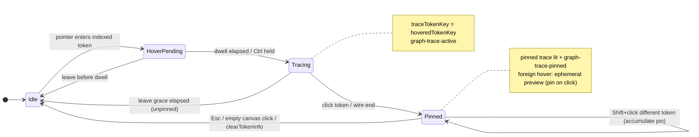
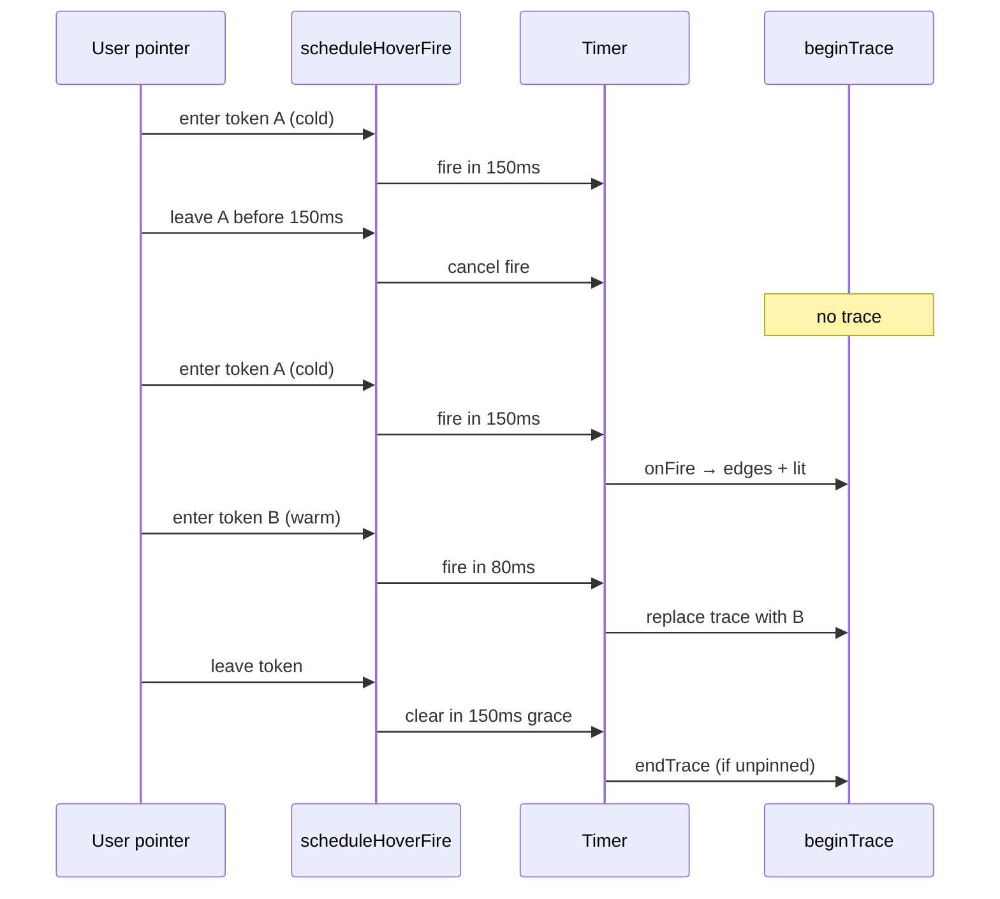
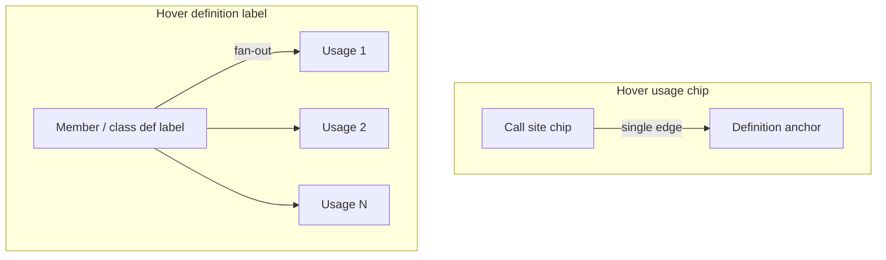
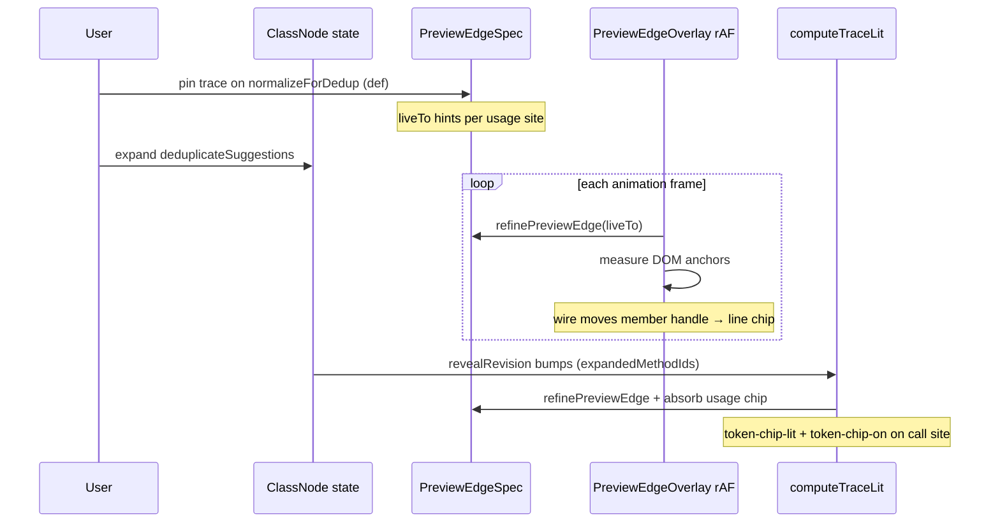
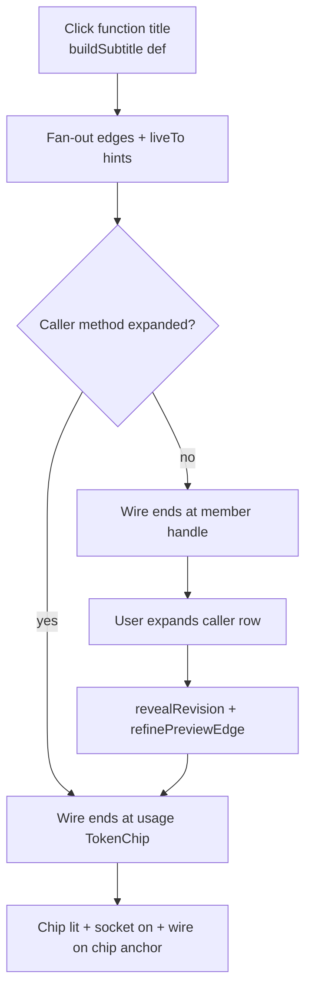
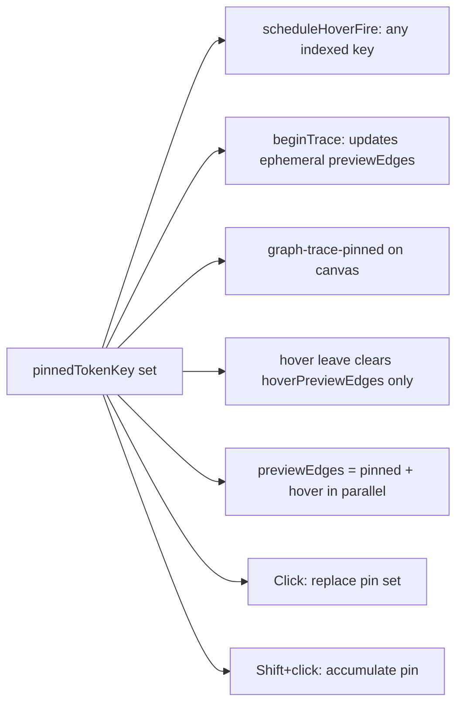
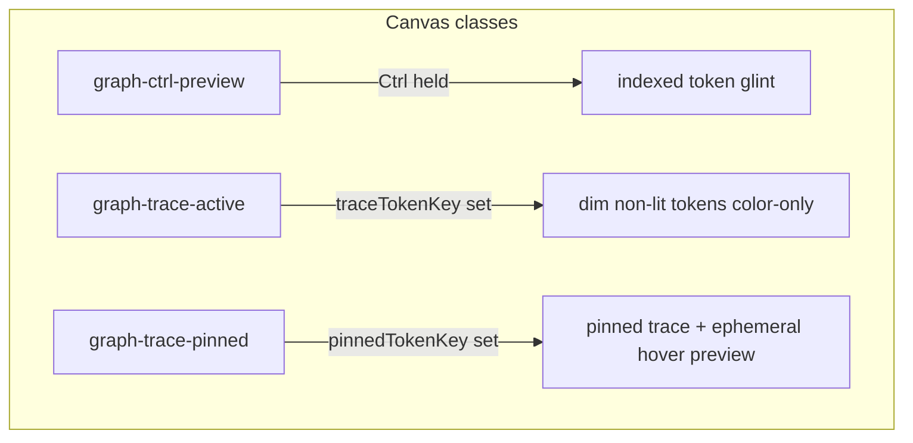
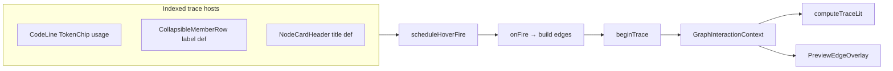
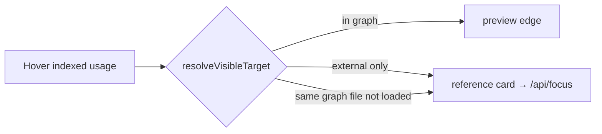

# Preview edges — interactions supplement

Normative detail for token trace, anchor resolution, pin lock, and live wire retargeting. Parent: [preview-edges.md](preview-edges.md).

---

## Trace state machine

**Atomic commit:** `beginTrace(tokenKey, edges)` sets `hoveredTokenKey` + `previewEdges` in one call so lit paint and wires appear together (no staggered shadow).

**Effective trace lit:** `mergeTraceLit(pinned, hover)` when both differ; `pinnedPreviewEdges` restore on hover leave.

---

## Hover intent timing

Constants: `client/src/lib/hoverIntent.ts`

| Constant | Value | Effect |
| -------- | ----- | ------ |
| `FIRE_COLD_MS` | 150 | First hover dwell |
| `FIRE_WARM_MS` | 80 | Adjacent token while warm |
| `LEAVE_GRACE_MS` | 150 | Anti-flicker between neighbors |
| Ctrl held | 0 | Instant fire via `fireDelayMs` |

---

## Edge direction and fan-out

Direction is **always definition → usage**, regardless of which end the user hovers.

| Hover target | Edge builder | Count |
| ------------ | ------------ | ----- |
| Usage in `CodeLine` | `buildUsagePreviewEdge` | 1 |
| Member row / class title def | `buildDefinitionPreviewEdges` | All usages in ego-graph |
| Local param / local var | `buildLocalPreviewEdges` | In-body only |

**Graph-aware fan-out:** `resolveDefinitionUsageSites` scans `graphData` + live `ClassNodeData` for `\btoken\b` matches, not only visible DOM chips. Signature line of the source member is skipped.

**DOM fan-out:** Member signature tokens (`isDefinitionSignatureLine`) carry `data-symbol-role="definition"` in `CodeLine` so they are not counted as usage anchors when tracing from the member-row label.

**Same-class usage → def:** `resolveVisibleTarget` MUST NOT skip `flowNodeId === sourceFlowId`; wire lands on `.member-row-label` element when present.

---

## Anchor resolution waterfall

Finest revealed level wins. Re-evaluated every frame while trace is active (`liveFrom` / `liveTo` on `PreviewEdgeSpec`).

Handle ids are **per-node** (`previewLineHandle(memberId, line)`, `previewTargetTop(flowNodeId)`). Never use a shared handle id across nodes.

---

## Live wire retargeting on expand/collapse

**Normative:** When a pinned/hovering **definition fan-out** wire retargets to a usage chip (member body was collapsed at pin time, expanded after), the call-site `TokenChip` MUST receive `token-chip-lit` and `token-chip-on` — not only a line-handle socket.

`computeTraceLit` MUST use the same `refinePreviewEdge` path as the overlay and MUST re-run when `revealRevision` changes (member/class expand state).

### Def title → open callee (acceptance path)

Implementation: `client/src/lib/computeTraceLit.ts` (lit sets), `client/src/lib/traceLitController.ts` (imperative DOM classes), `GraphInteractionContext` `revealRevision` dep.

---

## Modifier stack (normative)

| Input | Effect |
| ----- | ------ |
| Hover | Dwell → preview edges (cold/warm timing) |
| Ctrl | Instant preview; dim syntax/keywords; shimmer indexed tokens |
| Click token / wire | Pin one trace (**replaces** existing pins) |
| Shift+click token | **Accumulate** pin — add trace; merged lit + wires *(planned)* |
| Esc / empty canvas | Clear all pins |
| Expand class/member header during pin | Pin + wires **stay**; anchors retarget via `revealRevision` |

---

## Pin lock

While `pinnedTokenKey` is set, the **pinned trace stays lit** (context bar, pinned endpoints, pinned wires after hover ends). **Foreign token hover** still runs the normal dwell → `beginTrace` preview (chip-on, wires, lit chain) but does **not** change the pin until the user **clicks** the new token.

| Action | Unpinned trace | Pinned trace |
| ------ | -------------- | ------------ |
| Hover other token | Switch after dwell | **Ephemeral preview** (pin unchanged) |
| Leave hovered token | endTrace | Clear hover edges only; pinned wires stay |
| Pass-over CSS on dim tokens | Stays `--faint` | Stays `--faint` until dwell fires |
| Expand member | Live retarget wires | Live retarget wires |
| Click other token | Pin | **Replace** pin set (single trace) |
| Shift+click other token | Pin | **Accumulate** — add trace; prior pins stay lit *(planned)* |
| Empty canvas / Esc | endTrace | clearTokenInfo (all pins) |

**Effective trace lit:** `mergeTraceLit(computeTraceLit(pinned…), computeTraceLit(hover…))` when hover key differs from pin. **`previewEdges`** exposed to the overlay is `pinnedPreviewEdges + hoverPreviewEdges` in parallel while both are active.

---

## Visual modes (CSS root classes)

Applied on graph pane wrapper (`GraphFlowCanvas`):

| Mode | Lit tokens | Dim tokens | Node header |
| ---- | ---------- | ---------- | ----------- |
| Idle | semantic colors | normal | card background |
| Trace active | semantic + endpoints `token-chip-on` | `--faint` text, **no bg wash** | **no tint** (stays white/card) |
| Ctrl + trace | shimmer stays on for every indexed token (Ctrl always wins) | faint + shimmer | no tint |
| Pinned | pinned trace lit + optional hover preview | faint until dwell (or immediately if Ctrl held) | no tint |

**Active chips (`token-chip-on`):** inset `0.5px` ring at ~76% semantic `currentColor`; pinned source (`token-chip-source`) keeps semantic ink on hover/focus while a foreign hover preview runs; ephemeral preview endpoints use brand inset ring.

**Sockets (`FlowAnchor`):** bloom on endpoints only (`token-chip-on`); soft glow via `currentColor` + tight box-shadow (not oversized blur).

---

## Trace hosts (where hover starts)

**Click pin** opens docked `TokenContextBar` (not a floating popover). Plain click replaces the pin set with one trace; **Shift+click** adds a trace to the accumulated set without clearing earlier pins *(planned — see SPEC-DRIFT)*. Wire click pins trace + scroll + flash. Ctrl does not pin — it only accelerates hover reveal and dims syntax (`graph-ctrl-preview`).

---

## Out of graph

---

## File map (interaction layer)

| File | Role |
| ---- | ---- |
| `GraphInteractionContext.tsx` | State, timers, pin, beginTrace/endTrace |
| `useTokenTrace.ts` | Per-host hover + pin hooks |
| `hoverIntent.ts` | Dwell constants |
| `buildPreviewEdges.ts` | Edge specs + live hints |
| `linksForElement.ts` | Def fan-out + usage sites |
| `resolveVisibleTarget.ts` | Usage → def target |
| `resolveLiveAnchor.ts` | Per-frame anchor refine |
| `computeTraceLit.ts` | Lit / endpoint sets |
| `preview-wires.css` | Wires, sockets |
| `trace-modes.css` | Trace dim |
