# Preview edges — interactions supplement

Normative detail for token trace, anchor resolution, pin lock, and live wire retargeting. Parent: [preview-edges.md](preview-edges.md).

---

## Trace state machine

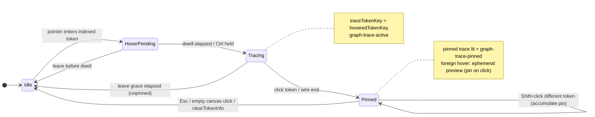

**Atomic commit:** `beginTrace(tokenKey, edges)` sets `hoveredTokenKey` + `previewEdges` in one call so lit paint and wires appear together (no staggered shadow). **Dim/lit is keyed on `hoveredTokenKey`, not on `edges.length`** — signature type hovers MUST call `beginTrace` even when the only resolvable target is an index Load stub.

**Signature type trace keys:** `{flowNodeId}::{memberId}::sig-type::{symbolName}` — parsed by `liveToFromUsageEl` without a line number; anchor resolves via `getByTraceKey` on the `MemberSignatureTypeLabel` chip.

**Effective trace lit:** `mergeTraceLit(pinned, hover)` when both differ; `pinnedPreviewEdges` restore on hover leave.

---

## Hover intent timing

Constants: `client/src/lib/hoverIntent.ts`

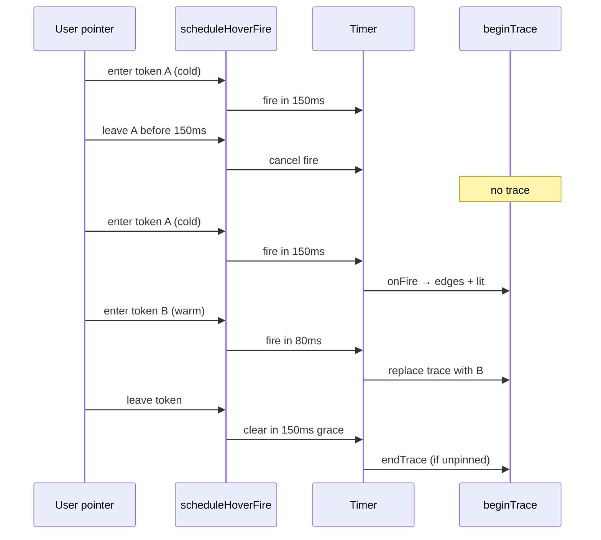

| Constant | Value | Effect |
| -------- | ----- | ------ |
| `FIRE_COLD_MS` | 150 | First hover dwell |
| `FIRE_WARM_MS` | 80 | Adjacent token while warm |
| `LEAVE_GRACE_MS` | 150 | Anti-flicker between neighbors |
| Ctrl held | 0 | Instant fire via `fireDelayMs` |
| Keyboard focus | 0 | Instant fire via `scheduleHoverFire({ instant: true })` |

**Leave-clear commit rule:** after `LEAVE_GRACE_MS`, clear runs when the leaving
token is still the latest entry in `hoverClearRef` — **not** when it matches
`hoveredTokenKey`. This prevents a stuck trace when the user leaves token B before
B's dwell fires while token A's trace is still active (A's clear was cancelled on
entering B). Hover `TokenConnectionMenu` cancels the grace timer on `mouseenter`;
leaving the menu re-schedules clear via `scheduleHoverLeaveGrace`.

---

## Edge direction and fan-out

Direction is **always definition → usage**, regardless of which end the user hovers.

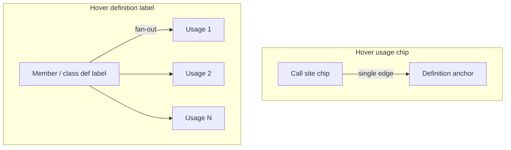

| Hover target | Edge builder | Count |
| ------------ | ------------ | ----- |
| Usage in `CodeLine` | `buildUsagePreviewEdge` | 1 |
| Member row / class title def | `buildDefinitionPreviewEdges` | All usages in ego-graph |
| Local param / local var | `buildLocalPreviewEdges` | In-body usages only |
| Local/param binding + initializer | `buildBindingPreviewEdges` | 1 binding wire (init → binding) when decl has identifier RHS |
| `switch`/`if` keyword or condition identifier | `buildControlFlowPreviewEdges` | Fan-out: 1 wire per branch (`case`/`default`/`else`/`else if`) |
| Single `case`/`default`/`else`/`else if` branch | `buildControlFlowPreviewEdges` | 1 wire back to the `switch`/`if` keyword |
| Indexed type in signature tag | `buildSignatureTypeUsageEdges` | 1 (graph def → `sig-type` chip, or Load stub via index) |
| Param name in signature tag | `buildParamDefPreviewEdges` | In-body usages of that param |
| Property in a `a.b.c` chain | `buildReceiverCascadeEdges` (merged with the property's own edges, if any) | Own edge (0 or 1) + 1 per resolvable receiver leftward in the chain |
| Body usage of param with indexed type (e.g. `field` typed `AddressFieldKind`) | `buildLocalPreviewEdges` + `buildParamTypeCascadeEdges` | Tier 1: param def → usage; tier 2: sig-type → param def; tier 3: type def → sig-type (or Load stub) — see [trace-strength supplement](preview-edges.trace-strength.supplement.md) |
| Param def in signature (fan-out) | `buildParamDefPreviewEdges` + type cascade | Tier 1: def → each usage; tier 2/3: type chain behind param |

**Graph-aware fan-out:** `resolveDefinitionUsageSites` scans `graphData` + live `ClassNodeData` for `\btoken\b` matches, not only visible DOM chips. Signature line of the source member is skipped.

**Sig-type usages in the fan-out:** the body-line scan misses type/class usages that render as `…::sig-type::<token>` chips (return/param annotations). `resolveDefinitionUsageSites` MUST also enumerate those from the DOM and set `liveTo.traceKey` to the sig-type key so `computeTraceLit` lights the chip (`token-chip-lit`/`-on`), honouring the reveal waterfall (collapsed → container, expanded → chip).

**Fan-out line-base:** scans of `method.code` in `resolveDefinitionUsageSites` and `usageSiteIndex` are snippet-relative, but chip keys and preview handles are **file-absolute** — convert via `fileLineFromSnippetIndex(method.startLine, i)` or usage chips never match and stay unlit when expanded.

**DOM fan-out:** Member signature tokens (`isDefinitionSignatureLine`) carry `data-symbol-role="definition"` in `CodeLine` so they are not counted as usage anchors when tracing from the member-row label.

**Same-class usage → def:** `resolveVisibleTarget` MUST NOT skip `flowNodeId === sourceFlowId`. The live wire anchor for a member definition is resolved by `memberDefAnchor.ts`: prefer the **signature-line body chip** when the row is expanded and the user hovered/pinned that chip; fall back to **`.member-row-label`** when the body is collapsed; on re-expand, return to the body chip when `preferBody` is set (locked while pinned).

**Member row label display:** `.member-row-label` shows the raw symbol name (`traceName`), matching the signature-line chip — not camelCase-split display text.

**Member def siblings:** The row title and signature-line name chip share one definition. They **light together** (`trace-lit`) but never receive a preview wire between them — only real usages (call sites, etc.) get edges.

**No self-loop wires:** Preview edges never draw from a chip back to itself. Off-canvas call sites appear in the **connection menu** (load list) only — not as a circular wire on the definition chip.

---

## Local lexical trace (usage + binding)

Params and locals use a client-side lexical index (`localSymbolLinks.ts`). Two preview kinds apply:

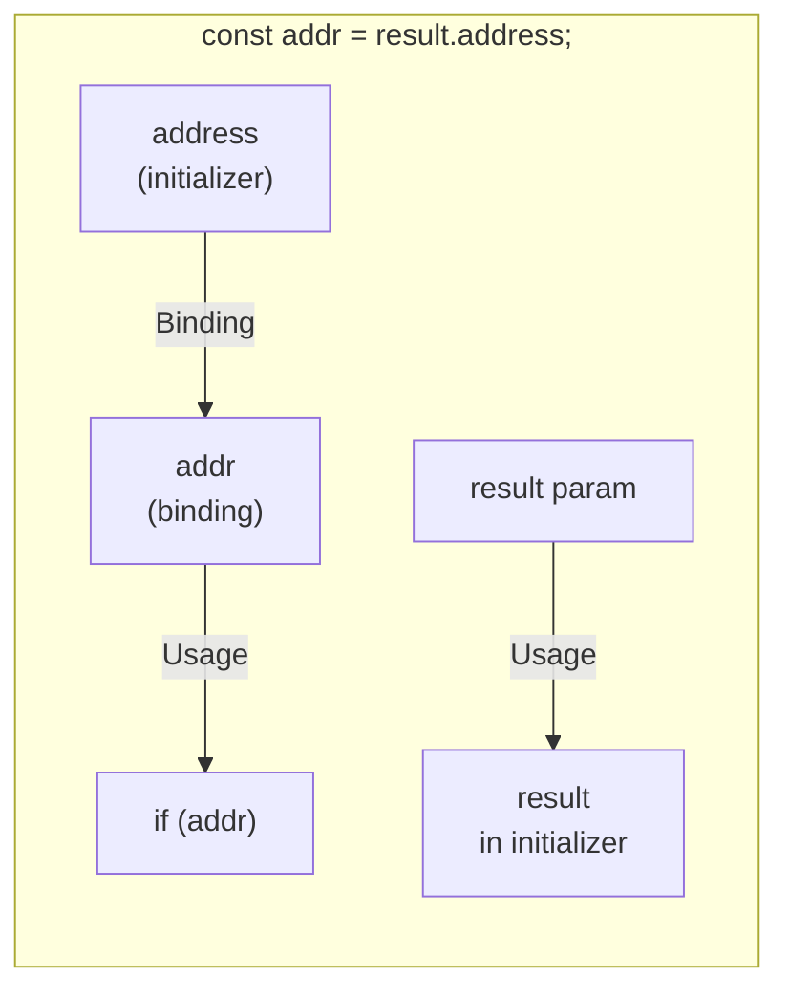

| Relationship | Kind | Direction | Builder |
| ------------ | ---- | --------- | ------- |
| Binding def → later reference | Usage | def → usage | `buildLocalPreviewEdges` |
| Initializer expr → bound name | **Binding** | initializer → binding | `buildBindingPreviewEdges` |
| Param def → reference in body | Usage | def → usage | `buildParamDefPreviewEdges` / local |

**Normative — binding vs usage:** Usage answers "where is this name referenced later?" Binding answers "where does this binding get its value on the declaring line?" They MUST NOT share one kind or one legend toggle.

**Initializer resolution:** For `const|let <name> = <expr>;` on a single line, the binding source anchor is the **rightmost identifier token** in `<expr>`. Property reads (`result.address`) anchor on the property identifier (`address`); the receiver (`result`) keeps its own usage wire to the param def when hovered independently.

**Compound trace on binding hover:** Hovering the binding site MUST emit both usage fan-out (if any) and the binding wire (when RHS has an identifier anchor).

---

## Control-flow fan-out (switch/case, if/else)

A separate client-side index (`controlFlowLinks.ts`) tracks `switch`/`case`/`default` and `if`/`else if`/`else` structure per method body via line/brace-depth scanning (no full AST — same pragmatic style as `localSymbolLinks.ts`).

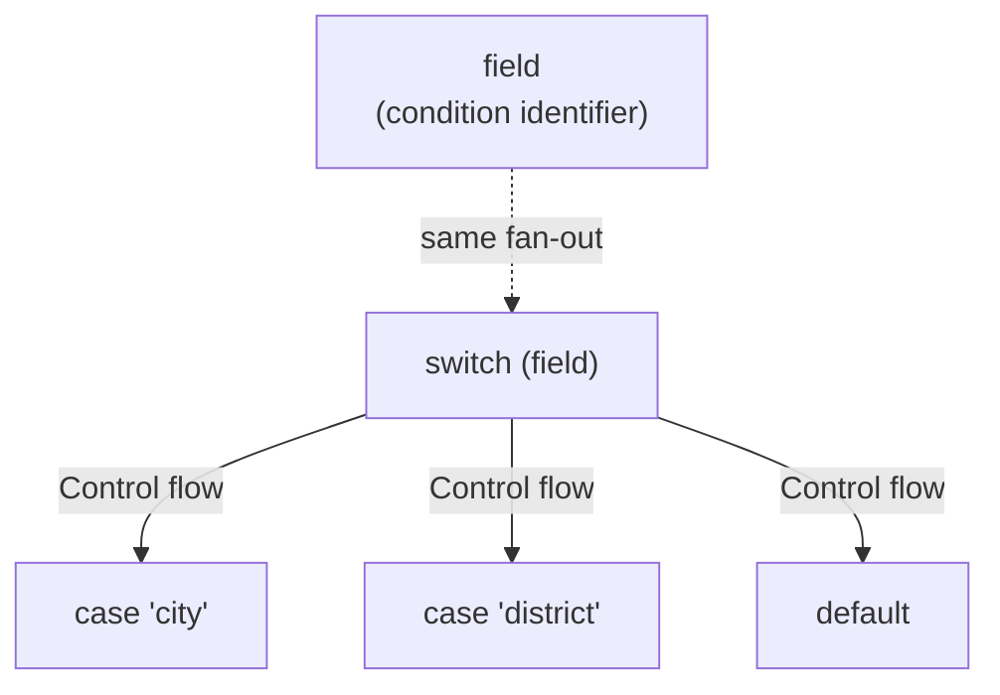

**Compound trace on condition hover:** Hovering the discriminant/condition identifier (e.g. `field`) MUST emit both its normal usage wire(s) (`buildLocalPreviewEdges`) and the control-flow fan-out (`buildControlFlowPreviewEdges`) — merged in `CodeLine.firePreview`, same pattern as the binding merge above.

**Normative — control flow vs usage/binding:** Control flow answers "which branch does this decision lead to?" It is a distinct kind (`branch`) from Usage (def → later reference) and Binding (value → name); it MUST NOT share a legend toggle with either.

**Direction:** always condition/keyword → branch, never branch → condition, even when the wire was summoned by hovering a single branch (only the *set* of drawn wires is filtered, not the direction).

**Known v1 limitations:** ternary (`cond ? a : b`) is not indexed; a `switch`/`if` header whose discriminant/condition is on a different line than the keyword is not indexed (single-line headers only).

---

## Member-access cascade (property chains)

A property reached through a chain (`country` in `context.country`) is meaningful only together with the path used to reach it. Hovering the tail property therefore cascades **leftward** to its receiver(s); hovering a receiver on its own never cascades forward.

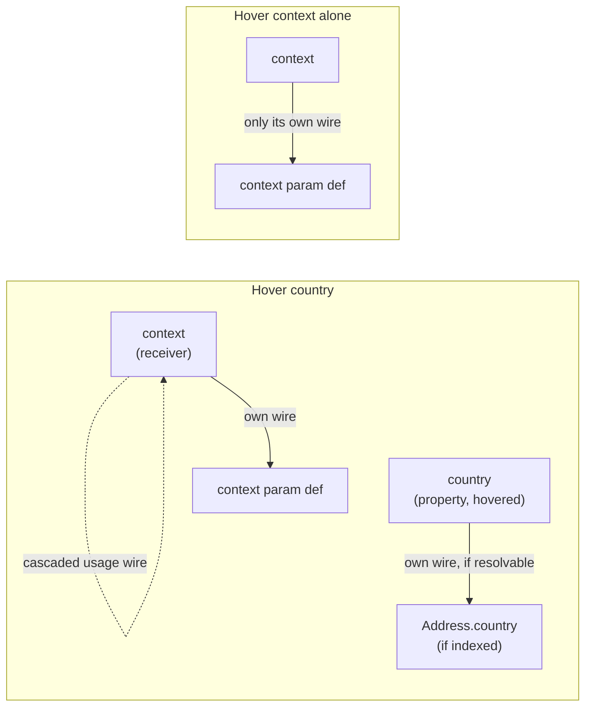

**Tokenization:** `country` is interactive (rendered as a `TokenChip`, not plain text) whenever it is itself indexed/local **or** at least one receiver in its `a.b.c` chain resolves (`memberAccessReceiverIndices` + `isLinkableIdentifier` in `CodeLine.tsx`). This lets a property whose own type isn't in the symbol index still be hovered meaningfully — hovering it draws the receiver's wire even when the property itself has no definition to link to.

**Cascade direction is one-way:** `memberAccessReceiverIndices(tokens, i)` walks left from the hovered token through consecutive `identifier "." identifier` pairs; it never looks right. Hovering `context` in `context.country` MUST NOT light up or wire `country` — only hovering `country` cascades back to `context`.

**Compound trace on property hover:** `buildReceiverCascadeEdges` resolves each receiver exactly as if it had been hovered on its own — local/param fan-out first (`buildLocalPreviewEdges`), then indexed usage (`resolveVisibleTarget`, graph-mode only; no Load-stub menu is triggered for a cascaded receiver, to avoid a second `TokenConnectionMenu` fighting the primary hover's). These are merged into the property's own edge list before the single `beginTrace` call, same pattern as the binding and control-flow merges above. For a longer chain (`a.b.c`), every receiver leftward (`b`, then `a`) is included, not just the immediate one.

**Normative — not a new kind:** the cascaded wires are whatever kind the receiver would draw on its own (almost always Usage); this is an interaction pattern, not a new `ConnectionKind`. It reuses the Usage legend toggle.

---

## Legend kind filters (normative)

Each `ConnectionLegend` row toggles exactly one `ConnectionKind` in `visibleEdgeKinds`.

| Legend label | Affects | Does **not** affect |
| ------------ | ------- | ------------------- |
| Usage | Indexed + local def→usage preview, transitive decay wires | Binding, control flow, structural |
| Binding | Initializer→binding preview wires | Usage fan-out, control flow, structural |
| Control flow | `switch`/`if` branch fan-out wires | Usage, Binding, structural |
| Inheritance | Persistent `extends` structural wires | Preview wires of any kind |
| Implementation | Persistent `implements` structural wires | Preview wires |
| Composition | Persistent `composition` structural wires | Preview wires |
| Module import | Persistent `imports` structural wires (toggle-gated) | Preview wires |

**Common confusion:** Usage preview wires are always **function blue** (`--edge-usage`), regardless of whether you trace a class, param, or type token — they are **not** Inheritance (solid lila, class-header to class-header). Toggling Inheritance off MUST leave usage wires visible unless Usage is also off. Implementation: `structuralTypesForVisibleKinds` for structural only; preview gating checks `usage`, `binding`, and `branch` separately.

Default on: usage, binding, control flow, inheritance, implementation, composition. Default off: module import.

---

## Anchor resolution waterfall

Finest revealed level wins. Re-evaluated every frame while trace is active (`liveFrom` / `liveTo` on `PreviewEdgeSpec`).

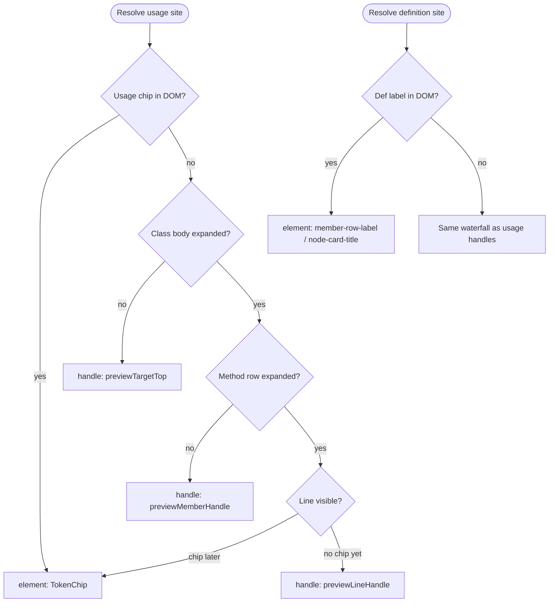

Handle ids are **per-node** (`previewLineHandle(memberId, line)`, `previewTargetTop(flowNodeId)`). Never use a shared handle id across nodes.

---

## Live wire retargeting on expand/collapse

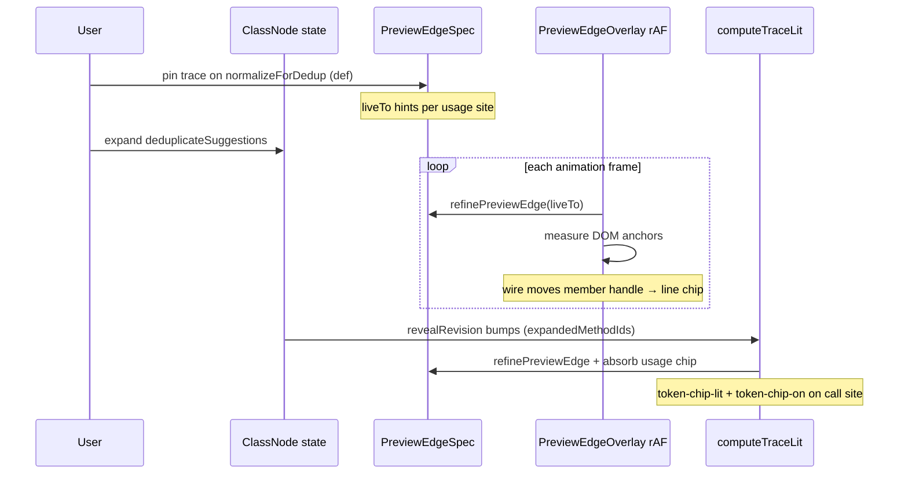

**Normative:** When a pinned/hovering **definition fan-out** wire retargets to a usage chip (member body was collapsed at pin time, expanded after), the call-site `TokenChip` MUST receive `token-chip-lit` and `token-chip-on` — not only a line-handle socket.

`computeTraceLit` MUST use the same `refinePreviewEdge` path as the overlay and MUST
re-run on **both** triggers:

1. `revealRevision` — React expand/collapse state (`expandedMethodIds`).
2. `registryRevision` — the element registry's rAF-coalesced change signal
   (`subscribeRegistry` / `useElementRegistryRevision`).

Both are required. `revealRevision` bumps **during render**, before the newly revealed
token chips mount and register, so on its own `computeTraceLit` resolves against the
*pre-commit* DOM and lights nothing — the wire self-heals only because the overlay
re-resolves every rAF, but lit has no such loop. `registryRevision` fires **after** the
chips mount and register, driving the recompute that actually finds them. Removing the
registry dependency reintroduces the "wire retargets but keywords don't light" bug.

### Def title → open callee (acceptance path)

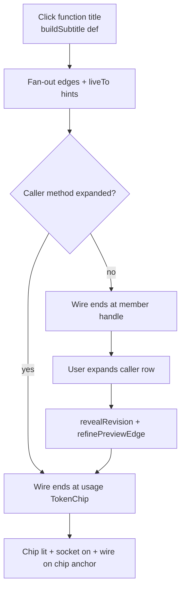

Implementation: `client/src/lib/computeTraceLit.ts` (lit sets), `client/src/lib/traceLitController.ts` (imperative DOM classes), `client/src/lib/elementRegistry.ts` (`subscribeRegistry` post-mount signal), `GraphInteractionContext` `revealRevision` + `registryRevision` deps.

---

## Wire engine — re-measure triggers (normative)

`wireEngine.ts` is **not** a per-frame loop. It idles until a signal starts it, runs an
rAF measure loop while activity continues, then **auto-stops `SETTLE_MS` (100ms) after
the last signal** with one final tick. Wires therefore track motion smoothly but cost
nothing at rest. Every source of geometry change MUST reach it, or wires go stale:

| Trigger | Path | Covers |
| ------- | ---- | ------ |
| Preview/structural specs change | overlay effect → `engine.tickOnce()` | new/removed wires (`beginTrace`) |
| Viewport pan/zoom | `onMove` / `onMoveEnd` → `notifyWireTransform` | canvas transform |
| Node drag / resize | `onNodesChange` (`position`/`dimensions`) → `notifyWireTransform` | moving or resizing a card |
| Reveal (expand/collapse) | `revealRevision` → lit recompute → lit effect → `notifyWireTransform`; also emits a `dimensions` change | anchor host moves as the card grows |
| Trace-host mount/unmount | `registryRevision` → lit recompute → lit effect → `notifyWireTransform` | chip appears/disappears |

**Regression guard:** a node is `nodesDraggable`, so `onNodesChange` MUST notify the wire
engine on `position`/`dimensions` changes — otherwise wires freeze mid-drag and stay stale
after drop (only viewport moves would recover them).

---

## Modifier stack (normative)

| Input | Effect |
| ----- | ------ |
| Hover | Dwell → preview edges (cold/warm timing) |
| Ctrl | Instant preview; dim syntax/keywords; shimmer indexed tokens |
| Click token / wire | Pin one trace (**replaces** existing pins) |
| Shift+click token | **Accumulate** pin — add trace; merged lit + wires; toggle off if already pinned |
| Esc / empty canvas | Clear all pins |
| Expand class/member header during pin | Pin + wires **stay**; anchors retarget via `revealRevision` |

---

## Pin lock

While `pinnedTraces.length > 0`, the **pinned trace(s) stay lit** (context bar, pinned endpoints, pinned wires after hover ends). **Foreign token hover** still runs the normal dwell → `beginTrace` preview (chip-on, wires, lit chain) but does **not** change the pin until the user **clicks** the new token.

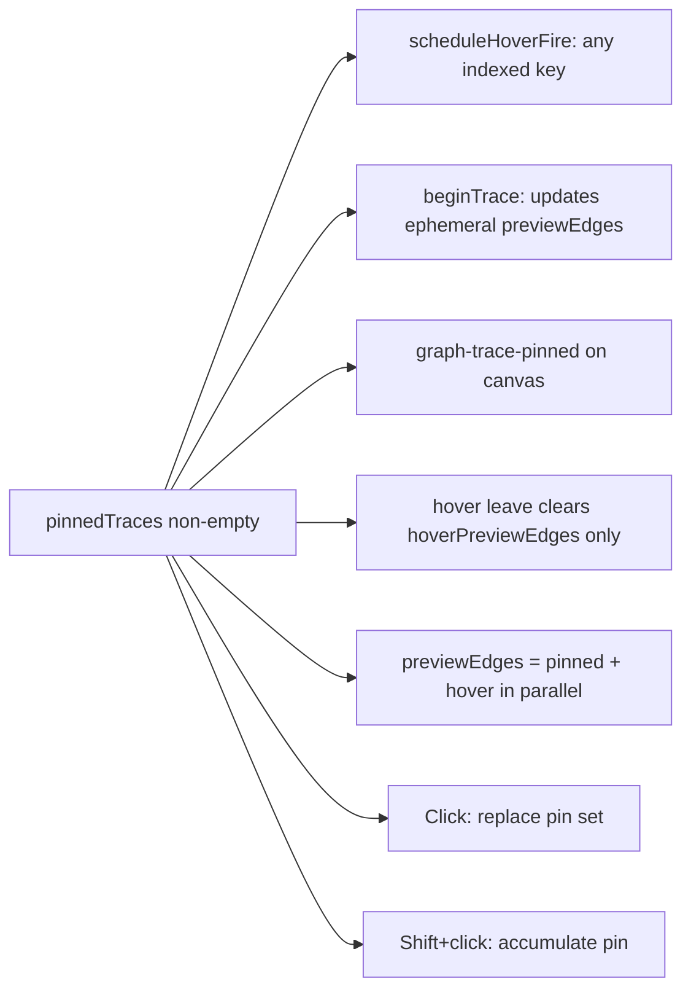

| Action | Unpinned trace | Pinned trace |
| ------ | -------------- | ------------ |
| Hover other token | Switch after dwell | **Ephemeral preview** (pin unchanged) |
| Leave hovered token | endTrace | Clear hover edges only; pinned wires stay |
| Pass-over CSS on dim tokens | Stays `--faint` | Stays `--faint` until dwell fires |
| Expand member | Live retarget wires | Live retarget wires |
| Click other token | Pin | **Replace** pin set (single trace) |
| Shift+click other token | Pin | **Accumulate** — add trace; prior pins stay lit; toggle off if duplicate |
| Empty canvas / Esc | endTrace | clearTokenInfo (all pins) |

**Effective trace lit:** `mergeTraceLit(computeTraceLit(pinned…), computeTraceLit(hover…))` when hover key differs from pin. **`previewEdges`** exposed to the overlay is `pinnedPreviewEdges + hoverPreviewEdges` in parallel while both are active.

---

## Visual modes (CSS root classes)

Applied on graph pane wrapper (`GraphFlowCanvas`):

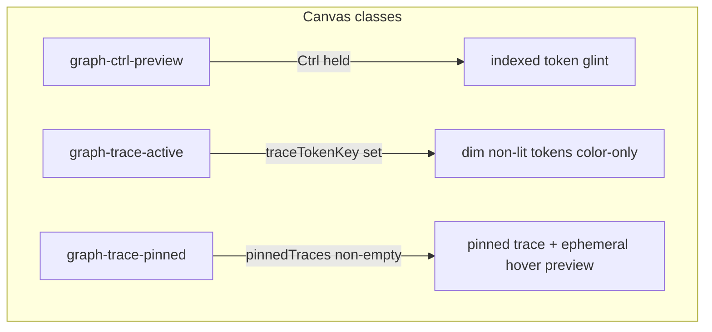

| Mode | Lit tokens | Dim tokens | Node header |
| ---- | ---------- | ---------- | ----------- |
| Idle | semantic colors | normal | card background |
| Trace active | semantic + endpoints `token-chip-on` | `--faint` text, **no bg wash** | **no tint** (stays white/card) |
| Ctrl + trace | shimmer stays on for every indexed token (Ctrl always wins) | faint + shimmer | no tint |
| Pinned | pinned trace lit + optional hover preview | faint until dwell (or immediately if Ctrl held) | no tint |

**Active chips (`token-chip-on`):** semantic tint fill (`--token-surface-*` — `color-mix(in srgb, …)` of `--token-edge-*` into white / `--background`), **no inset ring**; idle `:hover` and `:focus-visible` on `.cursor-pointer` chips use the same fill (object identity across the gesture). Pinned source (`token-chip-source`) keeps semantic ink on hover/focus while a foreign hover preview runs; ephemeral preview endpoints use the same semantic fill, not brand.

**Local-def siblings** (signature param chip + in-body param def sharing one `localDefId`): every sibling in the trace gets `token-chip-on` + a socket; only the hovered/pinned host keeps full semantic ink/fill. Others get `token-chip-endpoint-sibling` — same chip-on shell and dot ring, desaturated via `--muted-foreground` / `--muted` mixes.

**Sockets (`FlowAnchor`):** pop on endpoints only (`token-chip-on`); crisp semantic ring via `currentColor` — no brightness bloom or blur. Sibling endpoints use `flow-anchor-endpoint-sibling` (grey dot, same ring geometry).

---

## Trace hosts (where hover starts)

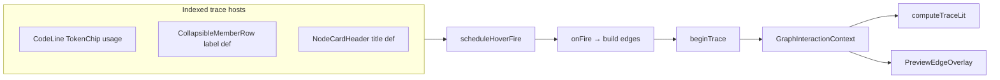

**Click pin** opens docked `TokenContextBar` (not a floating popover). Plain click replaces the pin set with one trace; **Shift+click** adds a trace to the accumulated set without clearing earlier pins (Shift+click an already-pinned token toggles it off). Wire click pins trace + scroll + flash. Ctrl does not pin — it only accelerates hover reveal and dims syntax (`graph-ctrl-preview`).

---

## Out of graph

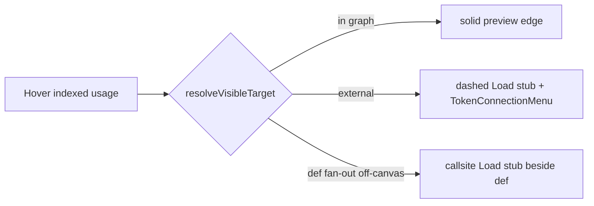

Off-graph targets draw a **dashed Load stub** (locality signal) and open **TokenConnectionMenu** for the load/jump action. The floating Load pill was removed; the menu is the sole load **action** surface.

---

## File map (interaction layer)

| File | Role |
| ---- | ---- |
| `GraphInteractionContext.tsx` | State, timers, pin, beginTrace/endTrace |
| `useTokenTrace.ts` | Per-host hover + pin hooks |
| `hoverIntent.ts` | Dwell constants |
| `buildPreviewEdges.ts` | Edge specs + live hints |
| `localDefLinks.ts` | Def fan-out + usage site pairs (`linksForElement`) |
| `buildDefinitionPreviewEdges.ts` | Definition fan-out + off-canvas Load stubs |
| `bindingPreviewEdges.ts` | Initializer → binding wires |
| `controlFlowPreviewEdges.ts` | Branch fan-out / back-wire |
| `resolveVisibleTarget.ts` | Usage → def target |
| `resolveLiveAnchor.ts` | Per-frame anchor refine |
| `computeTraceLit.ts` | Lit / endpoint sets |
| `preview-wires.css` | Wires, sockets |
| `trace-modes.css` | Trace dim |
