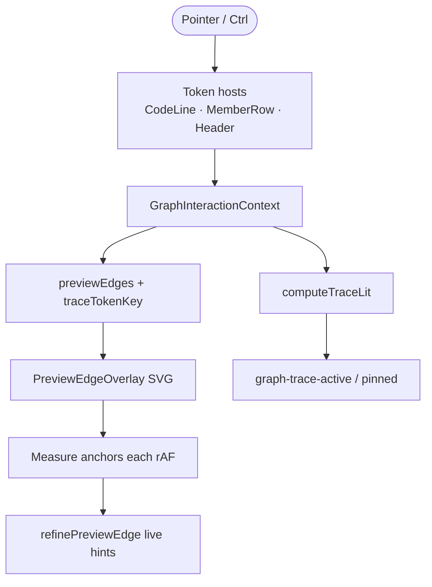
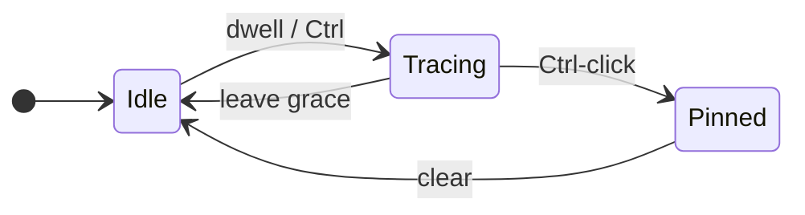

# Preview edges

## What It Is

On-demand dashed SVG connections between indexed symbols. Summoned by hovering token chips, member rows, or class headers; Ctrl accelerates reveal; Ctrl-click pins trace + context bar.

**Full interaction detail (mermaid):** [preview-edges.interactions.supplement.md](preview-edges.interactions.supplement.md)

## What It Looks Like

Semantic-color dashed curves (function blue, class gold, …) with animated dash flow toward the arrowhead. Endpoint sockets bloom (`--spring`). Trace mode dims non-lit code via **color only** (`--faint`) — no gray background wash. Node header stays card-white during trace. Ctrl-held reveal adds indexed token shimmer (`graph-ctrl-preview`).

## Where It Lives

- **Orchestration:** `GraphInteractionContext`, `useTokenTrace`
- **Rendering:** `PreviewEdgeOverlay`, `connectors.css`
- **Anchors:** `ctrlPreviewHandles.ts`, `resolvePreviewAnchor.ts`, `resolveLiveAnchor.ts`

## Actions

| # | User Action | System Response | Triggers |
| --- | ----------- | --------------- | -------- |
| 1 | Hovers indexed token (cold) | Preview after 240ms | `FIRE_COLD_MS` |
| 2 | Switches token while warm | Re-fire after 80ms | `FIRE_WARM_MS` |
| 3 | Leaves token (unpinned) | Clear after 150ms grace | `LEAVE_GRACE_MS` |
| 4 | Holds Ctrl | Instant fire + `graph-ctrl-preview` | `fireDelayMs(..., ctrl)=0` |
| 5 | Ctrl-click token | Pin trace + `TokenContextBar` | `pinTrace`, `graph-trace-pinned` |
| 6 | Empty canvas / Esc | Clear pin + trace | `clearTokenInfo` |
| 7 | Hovers wire hit-zone | Jump tooltip at cursor | `JumpTooltip` |
| 8 | Clicks wire hit-zone | Pin target + scroll + flash | overlay handler |
| 9 | Expands/collapses member | Wires retarget live | `liveFrom` / `liveTo` |
| 10 | Hovers other token while pinned | **No op** | pin guards + CSS |

Normative edge rules (direction, fan-out, anchors, pin lock, live refine): [interactions supplement](preview-edges.interactions.supplement.md).

## Component Hierarchy



```text
GraphFlowInner
├── GraphInteractionProvider
│   └── useTokenTrace (CodeLine / member row / header)
└── PreviewEdgeOverlay (SVG, rAF measure + refine)
    ├── JumpTooltip
    └── TokenContextBar (pinned)
```

## State

| State | Default | Effect |
| ----- | ------- | ------ |
| `hoveredTokenKey` | null | Ephemeral hover trace |
| `pinnedTokenKey` | null | Locked trace; blocks foreign hover |
| `traceTokenKey` | derived | `pinned ?? hovered` → lit computation |
| `previewEdges` | `[]` | Overlay path specs |
| `isWarm` | false | 80ms vs 240ms dwell |
| `tokenInfo` | null | Pinned `TokenContextBar` payload |



## File Map

| File | Purpose |
| ---- | ------- |
| `hoverIntent.ts` | Dwell constants |
| `GraphInteractionContext.tsx` | Trace + pin orchestration |
| `PreviewEdgeOverlay.tsx` | SVG + live refine loop |
| `resolveLiveAnchor.ts` | Per-frame anchor upgrade |
| `linksForElement.ts` | Def fan-out sites |
| `connectors.css` | Trace dim, sockets, wires |

## Acceptance Criteria

- [ ] Cold hover fires only after 240ms; pass-over does not flash edges
- [ ] Ctrl fires immediately; release returns to plain-hover rules
- [ ] Leave grace 150ms prevents flicker between adjacent tokens
- [ ] Edge direction definition → usage for usage hover and def fan-out
- [ ] Collapsed target → class/member handle; expanded method → line chip
- [ ] Expand/collapse retargets wires without re-hover
- [ ] Def fan-out + expand callee: usage TokenChip gets lit/on (not wire-only)
- [ ] Same-node usage connects to member def label
- [ ] Pinned: foreign hover does not add edges or brand highlight
- [ ] Node header background unchanged during trace
- [ ] Preview edges only in overlay — not React Flow edges

## Child specs

- **Interactions (mermaid):** [preview-edges.interactions.supplement.md](preview-edges.interactions.supplement.md)
- Philosophy: [preview-edges.philosophy.supplement.md](preview-edges.philosophy.supplement.md)
- Overlay component: [../component/preview-edge-overlay.md](../component/preview-edge-overlay.md)
- Prototype: [docs/prototypes/connectors-proto.html](../../prototypes/connectors-proto.html)
