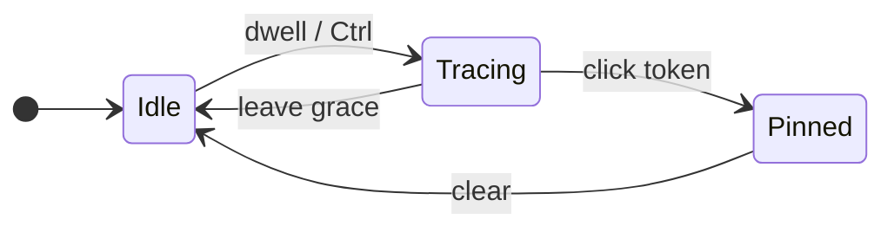

# Preview edges

## What It Is

On-demand dashed SVG connections between indexed symbols. Summoned by hovering token chips, member rows, or class headers; Ctrl accelerates reveal and dims syntax; click pins trace + context bar.

**Full interaction detail (mermaid):** [preview-edges.interactions.supplement.md](preview-edges.interactions.supplement.md)

## What It Looks Like

Function-blue dashed curves (`--edge-usage`) with animated dash flow toward the open arrowhead. Endpoint sockets pop in (`--spring`) with a crisp semantic ring colored by token kind — no brightness bloom. Trace mode dims non-lit code via **color only** (`--faint`) — no gray background wash. Node header stays card-white during trace. Ctrl-held reveal adds indexed token shimmer (`graph-ctrl-preview`).

## Where It Lives

- **Orchestration:** `GraphInteractionContext`, `useTokenTrace`
- **Rendering:** `PreviewEdgeOverlay`, `styles/preview-wires.css`, `styles/trace-modes.css`
- **Anchors:** `ctrlPreviewHandles.ts`, `resolvePreviewAnchor.ts`, `resolveLiveAnchor.ts`

## Actions

| # | User Action | System Response | Triggers |
| --- | ----------- | --------------- | -------- |
| 1 | Hovers indexed token (cold) | Preview after 150ms | `FIRE_COLD_MS` |
| 2 | Switches token while warm | Re-fire after 80ms | `FIRE_WARM_MS` |
| 3 | Leaves token (unpinned) | Clear after 150ms grace | `LEAVE_GRACE_MS` |
| 4 | Holds Ctrl | Instant fire + `graph-ctrl-preview` (dims keywords, shimmers indexed tokens) | `fireDelayMs(..., ctrl)=0` |
| 5 | Clicks token | Pin trace (replaces pin set) + `TokenContextBar` | `pinTrace`, `graph-trace-pinned` |
| 5b | Shift+clicks token | Add pin to accumulated set (keep prior pins lit); toggle off if already pinned | `pinnedTraces` + `mergePinnedEdges` |
| 6 | Empty canvas / Esc | Clear pin + trace | `clearTokenInfo` |
| 7 | Hovers wire hit-zone | Jump tooltip at cursor | `JumpTooltip` |
| 8 | Clicks wire hit-zone | Pin target + scroll + flash | overlay handler |
| 9 | Expands/collapses member | Wires retarget live | `liveFrom` / `liveTo` |
| 10 | Hovers other token while pinned | Ephemeral preview; pin unchanged until click | `hoverPreviewEdges` + `mergeTraceLit` |

Normative edge rules (direction, fan-out, anchors, pin lock, live refine): [interactions supplement](preview-edges.interactions.supplement.md).

## Component Hierarchy


```text
GraphFlowInner
├── GraphInteractionProvider
│   └── useTokenTrace (CodeLine / member row / header)
└── PreviewEdgeOverlay (SVG, rAF measure + refine)
    ├── JumpTooltip
    └── TokenContextBar (pinned)
```

## State

| State | Default | Effect |
| ----- | ------- | ------ |
| `hoveredTokenKey` | null | Ephemeral hover trace |
| `pinnedTraces` | `[]` | Locked traces; plain click replaces set; Shift+click accumulates |
| `traceTokenKey` | derived | active pin or hovered key → lit computation |
| `previewEdges` | `[]` | Overlay path specs |
| `isWarm` | false | 80ms vs 150ms dwell |
| `tokenInfo` | null | Pinned `TokenContextBar` payload |



## File Map

| File | Purpose |
| ---- | ------- |
| `hoverIntent.ts` | Dwell constants |
| `usageSiteIndex.ts` | Precomputed def fan-out lookup |
| `previewEdgeDom.ts` | Imperative SVG wire sync (no rAF setState) |
| `JumpTooltipContext.tsx` | Isolated jump tooltip state |
| `GraphInteractionContext.tsx` | Trace + pin orchestration |
| `PreviewEdgeOverlay.tsx` | SVG + live refine loop |
| `resolveLiveAnchor.ts` | Per-frame anchor upgrade |
| `localDefLinks.ts` | Def fan-out + usage site pairs (`linksForElement`) |
| `buildDefinitionPreviewEdges.ts` | Definition fan-out + off-canvas Load stubs |
| `paramTypeCascadeEdges.ts` | Param usage/def → sig-type provenance chain (tier 2/3) |
| `bindingPreviewEdges.ts` / `controlFlowPreviewEdges.ts` | Binding and branch wires |
| `preview-wires.css` | Wires, sockets |
| `trace-modes.css` | Trace dim |
| `tokens-chips.css` | Chip ink |

## Acceptance Criteria

Per-kind detail: [connection-taxonomy.acceptance-criteria.md](connection-taxonomy.acceptance-criteria.md) §1 Usage.

- [x] Cold hover fires only after 150ms; pass-over does not flash edges
- [x] Ctrl fires immediately; release returns to plain-hover rules
- [x] Leave grace 150ms prevents flicker between adjacent tokens
- [x] Edge direction definition → usage for usage hover and def fan-out
- [x] Collapsed target → class/member handle; expanded method → line chip
- [x] Expand/collapse retargets wires without re-hover
- [x] Def fan-out + expand callee: usage TokenChip gets lit/on (not wire-only)
- [x] Same-node usage connects to member def label
- [x] Pinned: foreign hover adds ephemeral edges/lit; pin unchanged until click
- [x] Shift+click accumulates pins; breadcrumb chips when N>1
- [x] Node header background unchanged during trace
- [x] Preview edges only in overlay — not React Flow edges

## Child specs

- **Interactions (mermaid):** [preview-edges.interactions.supplement.md](preview-edges.interactions.supplement.md)
- **Trace strength / provenance cascade:** [preview-edges.trace-strength.supplement.md](preview-edges.trace-strength.supplement.md)
- Philosophy: [preview-edges.philosophy.supplement.md](preview-edges.philosophy.supplement.md)
- Overlay component: [../component/preview-edge-overlay.md](../component/preview-edge-overlay.md)
- Prototype: [docs/prototypes/connectors-proto.html](../../prototypes/connectors-proto.html)
