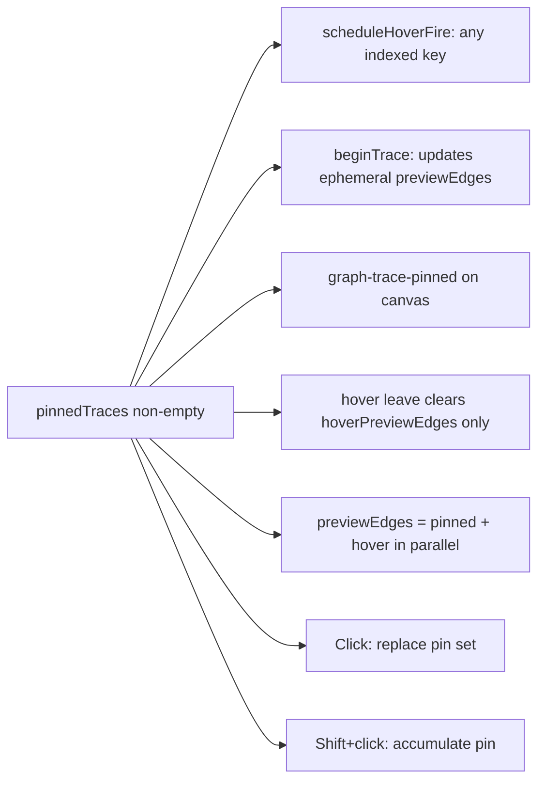
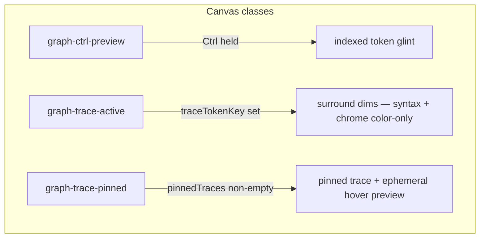
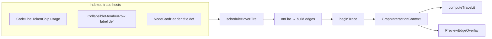
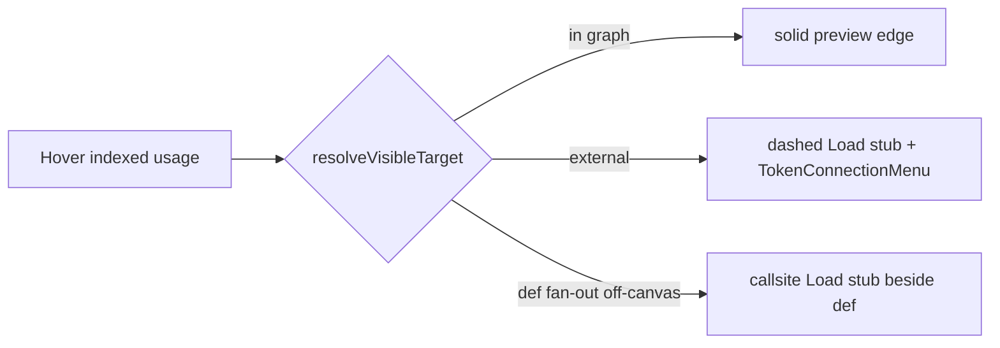

# Preview edges — modes supplement

Normative detail for **input modifiers and visual states**: legend kind
toggles, the modifier-key stack, pin lock, CSS root classes, where hover can
start, and off-graph handling. Parent: [preview-edges.md](preview-edges.md).
Split from [interactions supplement](preview-edges.interactions.supplement.md)
2026-07-17.

---

## Legend kind filters (normative)

Each `ConnectionLegend` row toggles exactly one `ConnectionKind` in `visibleEdgeKinds`.

| Legend label | Affects | Does **not** affect |
| ------------ | ------- | ------------------- |
| Usage | Indexed + local def→usage preview, transitive decay wires | Binding, typesetting, control flow, structural |
| Binding | Initializer→binding preview wires | Usage fan-out, typesetting, control flow, structural |
| Typesetting | Sig-type→param def preview wires (provenance hop 2) | Usage, Binding, control flow, structural |
| Control flow | `switch`/`if` branch fan-out wires | Usage, Binding, typesetting, structural |
| Inheritance | Persistent `extends` structural wires | Preview wires of any kind |
| Implementation | Persistent `implements` structural wires | Preview wires |
| Composition | Persistent `composition` structural wires | Preview wires |
| Module import | Persistent `imports` structural wires (toggle-gated) | Preview wires |

**Common confusion:** Usage preview wires are **function blue** (`--edge-usage`). Typesetting wires (sig-type → param def) use **type teal** (`--edge-typesetting`) — they are not Usage, Binding, or Inheritance. Toggling Inheritance off MUST leave usage/typesetting wires visible unless those kinds are also off. Implementation: `structuralTypesForVisibleKinds` for structural only; preview gating checks `usage`, `binding`, `typesetting`, and `branch` separately.

Default on: usage, binding, typesetting, control flow, inheritance, implementation, composition. Default off: module import.

---

## Modifier stack (normative)

| Input | Effect |
| ----- | ------ |
| Hover | Dwell → preview edges (cold/warm timing) |
| Ctrl | Instant preview; dim syntax/keywords; shimmer indexed tokens |
| Click token / wire | Pin one trace (**replaces** existing pins) |
| Shift+click token | **Accumulate** pin — add trace; merged lit + wires; toggle off if already pinned |
| Esc / empty canvas | Clear all pins |
| Expand class/member header during pin | Pin + wires **stay**; anchors retarget via `revealRevision` |

---

## Pin lock

While `pinnedTraces.length > 0`, the **pinned trace(s) stay lit** (context bar, pinned endpoints, pinned wires after hover ends). **Foreign token hover** still runs the normal dwell → `beginTrace` preview (chip-on, wires, lit chain) but does **not** change the pin until the user **clicks** the new token.

| Action | Unpinned trace | Pinned trace |
| ------ | -------------- | ------------ |
| Hover other token | Switch after dwell | **Ephemeral preview** (pin unchanged) |
| Leave hovered token | endTrace | Clear hover edges only; pinned wires stay |
| Pass-over CSS on dim tokens | Stays `--faint` | Stays `--faint` until dwell fires |
| Expand member | Live retarget wires | Live retarget wires |
| Click other token | Pin | **Replace** pin set (single trace) |
| Shift+click other token | Pin | **Accumulate** — add trace; prior pins stay lit; toggle off if duplicate |
| Empty canvas / Esc | endTrace | clearTokenInfo (all pins) |

**Effective trace lit:** `mergeTraceLit(computeTraceLit(pinned…), computeTraceLit(hover…))` when hover key differs from pin. **`previewEdges`** exposed to the overlay is `pinnedPreviewEdges + hoverPreviewEdges` in parallel while both are active.

---

## Visual modes (CSS root classes)

Applied on graph pane wrapper (`GraphFlowCanvas`):

| Mode | Lit path | Surround (syntax, chrome) | Indexed chips off path | Node header |
| ---- | -------- | --------------------------- | ---------------------- | ----------- |
| Idle | — | normal | resting semantic ink | card background |
| Trace active | focus curve + `token-chip-on` | `--faint-*` / dim rows, **no bg wash** | **resting semantic ink** | no tint |
| Ctrl + trace | shimmer on every indexed chip | `--faint-ctrl` (wins syntax) | shimmer + resting ink | no tint |
| Pinned | merged lit + `token-chip-source` | per merged lit | resting ink; foreign preview on dwell | no tint |

**Active chips (`token-chip-on`):** semantic tint fill (`--token-surface-*` — `color-mix(in srgb, …)` of `--token-edge-*` into white / `--background`), **no inset ring**; idle `:hover` and `:focus-visible` on `.cursor-pointer` chips use the same fill (object identity across the gesture). Pinned source (`token-chip-source`) keeps semantic ink on hover/focus while a foreign hover preview runs; ephemeral preview endpoints use the same semantic fill, not brand.

**Local-def siblings** (signature param chip + in-body param def sharing one `localDefId`): every sibling in the trace gets `token-chip-on` + a socket; only the hovered/pinned host keeps full semantic ink/fill. Others get `token-chip-endpoint-sibling` — same chip-on shell and dot ring, desaturated via `--muted-foreground` / `--muted` mixes.

**Sockets (`FlowAnchor`):** pop on endpoints only (`token-chip-on`); crisp semantic ring via `currentColor` — no brightness bloom or blur. Sibling endpoints use `flow-anchor-endpoint-sibling` (grey dot, same ring geometry).

**Load stub chips (`LoadStubAnchor`):** off-canvas dashed-wire endpoints use the `connector-chip--load` shell — **not** `InteractiveListRow` / `floatingPanelClass` (its `overflow-hidden` clips the socket). Normative contract:

| Requirement | Detail |
| ----------- | ------ |
| Host attrs | `data-load-edge-id="{edgeId}"`, `data-load-socket="right"`, `data-symbol-name`, `data-token-kind` |
| Socket | `FlowAnchor` on the socket side (`right` when `data-load-socket="right"`); MUST stay visible (`flow-anchor-on`) |
| Position | `loadStubPanePosition` + `subscribeWireTicks` — **`position: fixed`** viewport coords, recomputed each wire rAF. Horizontal: flush left of `.react-flow__node` (no pane-margin clamp). Vertical: clamped to graph pane screen bounds. Portal: `document.body`. |
| Wire resolve | `previewEdgeDom.updateWireGeometry` queries host by `data-load-edge-id`, measures socket via `resolvePreviewAnchor` |
| Height | `--connector-chip-load-stub-height` (`connector-chip--load-stub`, default `var(--control-height-md)`) — room for swatch + Load badge + socket; neutral `--card` fill (not `--token-surface-*`) |

Anchor rules for ordinary wires: handle ids are **per-node**; path coords are overlay-local. See [preview-edges.md](preview-edges.md) + `resolvePreviewAnchor.ts`.

---

## Trace hosts (where hover starts)

**Click pin** opens docked `TokenContextBar` (not a floating popover). Plain click replaces the pin set with one trace; **Shift+click** adds a trace to the accumulated set without clearing earlier pins (Shift+click an already-pinned token toggles it off). **Wire click opens the data inspector** for that wire (not a pin/jump action — jump-to-endpoint lives exclusively in `TokenConnectionMenuPanel` now, reached by right-clicking either endpoint token). Ctrl does not pin — it only accelerates hover reveal and dims syntax (`graph-ctrl-preview`).

---

## Out of graph

Off-graph targets draw a **dashed Load stub** (locality signal) and open **TokenConnectionMenu** for the load/jump action. The floating Load pill was removed; the menu is the sole load **action** surface.
