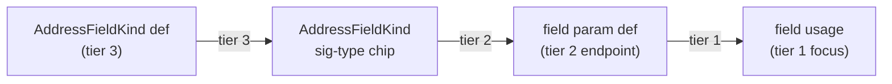

# Preview edges — trace strength & provenance cascade

Normative supplement to [preview-edges.md](preview-edges.md) and [connection-taxonomy.md](connection-taxonomy.md). Defines **how strongly** each wire and endpoint reads when a single hover/pin summons multiple related connections at once.

Parent interaction rules (direction, dwell, pin lock): [preview-edges.interactions.supplement.md](preview-edges.interactions.supplement.md).

---

## Problem statement (motivating scenario)

Given a method such as:

```ts
extractFieldValue(field: AddressFieldKind): string | null {
  const value = extractFieldValue(result, field);
  switch (field) { /* … */ }
}
```

When the user hovers a **body usage** of `field` (e.g. the argument in `extractFieldValue(result, field)`):

1. They expect a **primary** wire from the param definition (`field` in the signature) to that usage — this works today.
2. They also expect the **type annotation** (`AddressFieldKind` after `:`) to light up with a **weaker** wire back to the param slot, and `AddressFieldKind` itself to show a **still weaker** wire to its definition (on-canvas node or dashed Load stub).
3. Today the type annotation does **not** join the trace when hovering a param usage; `AddressFieldKind` appears inert unless hovered directly.
4. When hovering the **param definition** instead, all in-body usages fan out at **full** usage blue — visually equal to the direct path — with no decayed type chain behind the param.
5. **Call-graph transitive** wires (A calls B calls C) already use hop decay (`preview-wire--hop2` / `--hop3`), but **provenance** hops (usage → param → type → type def) and **sibling** usages do not.

This supplement closes that gap without changing edge **kind** (usage / binding / branch / transitive) or on-demand philosophy.

---

## UX contract — trace strength tiers

**Trace strength** is an independent visual dimension from connection **kind**. Kind picks hue and dash pattern; strength picks opacity (and endpoint emphasis).

| Tier | Name | Wire opacity (path) | Glow opacity | Endpoint chip | When |
| ---- | ---- | ------------------- | ------------ | ------------- | ---- |
| **1** | **Focus** | 100% (no hop class) | full | `token-chip-on` + semantic ink | Hovered/pinned token; direct 1-hop wire summoned by that token |
| **2** | **Provenance** | ~42% (`preview-wire--hop2`) | ~6% | `token-chip-endpoint-sibling` + grey socket | One step backward in the provenance chain (see below) |
| **3** | **Origin** | ~22% (`preview-wire--hop3`) | ~4% | `token-chip-endpoint-sibling` + grey socket | Two steps backward, or off-graph Load stub at the chain tail |

**Normative scale:** tier 1 = full, tier 2 ≈ ½ perceived strength, tier 3 ≈ ¼ — reuse existing CSS classes; do **not** add per-edge hex opacity in JS.

**Kind overrides strength hue, not tier:**

| Kind | Hue | Strength tiers apply? |
| ---- | --- | --------------------- |
| Usage | `--edge-usage` | Yes |
| Binding | `--edge-binding` | Yes (initializer→binding stays tier 1 on binding hover) |
| Control flow (`branch`) | `--edge-control-flow` | **No** — branch fan-out stays tier 1; kind color already separates it from usage |
| Transitive (call-graph) | `--edge-usage` | Yes — existing `hop: 2|3` on `PreviewEdgeSpec` (unchanged) |

**Lit vs wire:** Tier-2/3 endpoints MUST receive `token-chip-lit` + `token-chip-endpoint-sibling` (grey socket) unless they are the hovered/pinned host. Tier-1 endpoints receive full `token-chip-on`.

---

## Provenance chain — param / local usage

When the hovered token is a **param or local usage** (`data-local-target-id` set) whose canonical definition is a **signature param chip** or in-body `const` binding:



### Actions

| # | Trigger | System Response | Strength |
| --- | ------- | --------------- | -------- |
| 1 | Hover/pin **body usage** of indexed param `field` | Usage wire param def → this usage | tier 1 |
| 1b | Same trace | **No** sig-type → param wire (signature provenance is hover-only on param/type chips) | — |
| 2 | Hover/pin **param def** `field` in signature | Fan-out param def → **each** in-body usage | tier 1 each |
| 2b | Same trace | sig-type → param def | tier 2 |
| 2c | Same trace | type def → sig-type (or Load stub) | tier 3 |
| 3 | Hover/pin **sig-type** `AddressFieldKind` only | Existing `buildSignatureTypeUsageEdges` wire (def → chip or Load stub) | tier 1 only — no forward cascade to param usages |
| 4 | Hover/pin **local** `const x = …` usage | Usage wire binding def → usage (tier 1); binding wire initializer → binding when applicable (tier 1 binding kind) — **no** sig-type chain (locals have no signature type) |

### Data

| Field | Value |
| ----- | ----- |
| Direction (usage segment) | param/local def → usage (unchanged) |
| Direction (type segment) | type definition → sig-type chip → param def (type flows into signature slot) |
| Connection kind | **Usage** for all provenance segments (same legend toggle as today) |
| Builder | `buildParamTypeCascadeEdges` merged in **`buildParamDefPreviewEdges` only** (signature param chip hover) |
| Type lookup | `MemberSignature` / `param.type` + `primaryIndexedSymbolInType` → sig-type `traceKey` |
| Load menu | **Primary hover only** opens `TokenConnectionMenu` — cascaded tier-3 Load stubs do not spawn a second menu (same rule as [member-access cascade](preview-edges.interactions.supplement.md) § Member-access cascade) |
| Sibling usages | When hovering **one** body usage, other usages of the same binding get **tier-2** wires (≈½ opacity) and grey sibling endpoint styling — not tier-1 |

### Distinction from existing patterns

| Pattern | Relationship | Sibling wires? | Strength |
| ------- | ------------ | -------------- | -------- |
| **Shared-dependency** (taxonomy §8) | Same def, unrelated call sites | No — lit only | n/a |
| **Member-access cascade** | Property → receiver leftward | Receiver's own tier-1 usage wire | Receiver = tier 1 |
| **Call-graph transitive** (taxonomy §2) | A calls B calls C | Yes, separate edges | hop 2/3 on call graph |
| **Provenance cascade** (this doc) | usage → param → type → type def | No sibling usage wires on single-usage hover | tier 2/3 on signature chain |

---

## Sibling endpoints (signature param hosts)

The signature **param name chip** and any **in-body usages** share one `localDefId` but are not wired to each other (existing rule). Under provenance cascade:

| Host hovered | Param name chip | Body usage chip |
| ------------ | --------------- | --------------- |
| Body usage (tier 1) | tier 2 endpoint when param def hovered | tier 1 focus |
| Param def (tier 1 fan-out source) | tier 1 focus | tier 1 usage endpoints |

The sig-type chip is **not** a `localDefId` sibling of the param name — it is a separate indexed symbol linked only via provenance wires.

---

## Engineering notes

### `PreviewEdgeSpec` field

Reuse `hop?: 2 | 3` on provenance segments (maps to `preview-wire--hop2` / `--hop3` via `previewWireClasses`). **Do not** conflate with `connectionKind: "transitive"` — call-graph transitive keeps that kind label for legend bucketing; provenance hops are still `connectionKind: "usage"` with `hop` set.

Optional explicit `traceStrength?: 1 | 2 | 3` MAY be added later for clarity; v1 maps `traceStrength 2 → hop 2`, `3 → hop 3`, omit field for tier 1.

### Resolution — `AddressFieldKind` / module-level types

Indexed types in the same file as an on-canvas class (e.g. `export type AddressFieldKind = …` above a service class) resolve to **`external`** in `resolveVisibleTarget` because they are not graph nodes. Expected behavior:

1. Direct sig-type hover → dashed Load stub + menu row (already specified in [token-interactions.md](token-interactions.md)).
2. Cascaded tier-3 stub → same Load target when provenance chain is active.
3. **Load** via `/api/focus` on the type's file MUST mount a class node for the type alias (`nodeKind: "type"` in `graphToFlow.ts`) so a subsequent hover resolves `mode: "graph"` instead of stub.

**Known gap (v1):** if Load succeeds but the type alias node is not yet focused/visible, the tier-3 wire may remain a stub until the node mounts — `useLoadTraceRebuild` SHOULD rebuild edges after merge (existing pin/hover rebuild path).

### Files

| File | Change |
| ---- | ------ |
| `paramTypeCascadeEdges.ts` (new) | Build tier 2/3 edges from param usage/def + signature type |
| `codeLineTraceEdges.ts` | Merge cascade on local/param usage path |
| `paramDefPreviewEdges.ts` | Merge cascade on param-def fan-out path |
| `computeTraceLit.ts` | Apply tier-2/3 endpoint sets for sig-type + param def hosts |
| `previewWireClasses` / `preview-wires.css` | No new classes if `hop` mapping suffices |

---

## Acceptance Criteria

- [ ] Given `field: AddressFieldKind` and a body usage of `field`, when the usage is hovered past dwell, then one tier-1 usage wire (param def → usage), one tier-2 wire (sig-type → param def), and one tier-3 wire (type def → sig-type or Load stub) are drawn.
- [ ] Given the same trace, when rendered, then tier-2/3 wires are visibly weaker than tier-1 (reuse `preview-wire--hop2` / `--hop3`).
- [ ] Given tier-2 sig-type endpoint, when lit, then chip uses `token-chip-endpoint-sibling` and socket uses `flow-anchor-endpoint-sibling`.
- [ ] Given hover on body usage only, when trace is active, then other usages of `field` do **not** receive usage wires (counts/menu unchanged).
- [ ] Given hover on param def `field`, when trace is active, then every in-body usage has a tier-1 wire and the type chain appears at tier 2/3 behind the param.
- [ ] Given direct hover on sig-type `AddressFieldKind`, when trace fires, then behavior is unchanged (tier-1 only) — no reverse fan-out to param usages.
- [ ] Given cascaded tier-3 Load stub, when user has not hovered the type chip directly, then `TokenConnectionMenu` does not open (menu only on primary hover or explicit sig-type hover).
- [ ] Given Load on `AddressFieldKind` from stub/menu, when merge completes, then type alias node is on canvas and a re-hover resolves a solid tier-1 (or tier-3 in cascade) graph wire instead of stub only.
- [ ] Given `switch (field)` in the same method, when `field` usage is hovered, then control-flow branch wires remain tier-1 `--edge-control-flow` green — not decayed to usage strength.
- [ ] Given call-graph transitive edges for the same trace, when both transitive and provenance hops are present, then each edge uses its own `hop` / kind — no double-decay.

## References

- Interactions (fan-out table): [preview-edges.interactions.supplement.md](preview-edges.interactions.supplement.md)
- Endpoint sibling styling: [interaction-emphasis.md](interaction-emphasis.md)
- Opacity tokens: [docs/design/tokens.md](../../design/tokens.md)
- Per-kind AC (transitive vs provenance): [connection-taxonomy.acceptance-criteria.md](connection-taxonomy.acceptance-criteria.md) §2, §11
