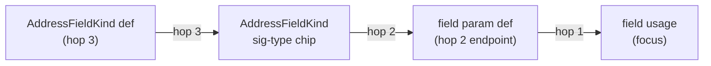

# Preview edges — trace strength & provenance cascade

Normative supplement to [preview-edges.md](preview-edges.md) and [connection-taxonomy.md](connection-taxonomy.md). Defines **how strongly** each wire and endpoint reads when a single hover/pin summons multiple related connections at once.

Parent interaction rules (direction, dwell, pin lock): [preview-edges.interactions.supplement.md](preview-edges.interactions.supplement.md).

**Terminology:** **hop** / **graph distance** = steps from the focus token (`PreviewEdgeSpec.hop` omitted at distance 1, else `2…RELATIVE_MAX_DEPTH`). Opacity comes from `tracePathOpacity(depth)`.

---

## Problem statement (motivating scenario)

Given a method such as:

```ts
extractFieldValue(field: AddressFieldKind): string | null {
  const value = extractFieldValue(result, field);
  switch (field) { /* … */ }
}
```

When the user hovers a **body usage** of `field` (e.g. the argument in `extractFieldValue(result, field)`):

1. They expect a **primary** wire from the param definition (`field` in the signature) to that usage — this works today.
2. They also expect the **type annotation** (`AddressFieldKind` after `:`) to light up with a **weaker** wire back to the param slot, and `AddressFieldKind` itself to show a **still weaker** wire to its definition (on-canvas node or dashed Load stub).
3. **Resolved:** body-usage hover includes the type annotation — hop-2 **Typesetting** wire (sig-type → param def) and hop-3 Usage wire (type def → sig-type or Load stub).
4. **Resolved:** param-def hover fans out hop-1 usage wires and shows the decayed type chain at hop 2/3 behind the param.
5. **Resolved:** provenance segments use `hop: 2|3|…` and `tracePathOpacity(depth)`; call-graph transitive keeps separate `connectionKind: "transitive"` bucketing.

This supplement defines trace **strength by graph distance** and adds **Typesetting** as the hop-2 connection kind for sig-type → param def (see [connection-taxonomy.md](connection-taxonomy.md) §11). On-demand philosophy unchanged.

---

## UX contract — strength by graph distance

**Trace strength** is an independent visual dimension from connection **kind**. Kind picks hue and dash pattern; strength picks opacity (and endpoint emphasis).

| Distance | Label (informal) | Wire path opacity | Glow opacity | Endpoint chip | When |
| -------- | ---------------- | ----------------- | ------------ | ------------- | ---- |
| **1** | Focus | `tracePathOpacity(1)` → 100% | `traceGlowOpacity(1)` (~16%) | `token-chip-on` + semantic ink | Hovered/pinned token; direct wire (`hop` omitted) |
| **2** | Provenance | `tracePathOpacity(2)` (~83% at maxDepth 5) | `traceGlowOpacity(2)` | `trace-depth-faded` + semantic ink | One step from focus (`hop: 2`) |
| **3** | Origin | `tracePathOpacity(3)` (~64%) | `traceGlowOpacity(3)` | `trace-depth-faded` + semantic ink | Two steps from focus (`hop: 3`) |
| **N** | Distant | `tracePathOpacity(N)` → floor `--trace-depth-min-opacity` | scales with path | `trace-depth-faded` | N steps (up to `RELATIVE_MAX_DEPTH`) |

**Normative scale:** one continuous power curve in `tracePathOpacity(depth, maxDepth)` — same function for **wires**, **socket dots**, **token chips**, and **lit code lines** (`traceLitApply.ts`, `previewEdgeDom.ts`). Walk reach is capped separately upstream (`TRACE_DEPTH_UP` / `TRACE_DEPTH_DOWN` in `lexicalGraph.ts`). Non-lit syntax stays `--faint` (binary off-curve).

**Kind overrides strength hue, not distance decay (one exemption):**

| Kind | Hue | Hop decay applies? |
| ---- | --- | ------------------ |
| Usage | `--edge-usage` | Yes |
| Binding | `--edge-binding` | Yes (initializer→binding at distance 1 on binding hover) |
| Typesetting | `--edge-typesetting` | Yes — sig-type→param def at hop 2 in param cascade; **rounded orthogonal** path |
| Control flow (`branch`) | `--edge-control-flow` | **No** — branch fan-out stays at distance 1; kind color separates it |
| Transitive (call-graph) | `--edge-usage` | Yes — `hop: 2|3|…` on `PreviewEdgeSpec` (unchanged) |

**Lit vs wire:** Distance-faded endpoints receive `token-chip-lit` + `trace-depth-faded` with **full semantic ink** at reduced inline opacity — not grey wash. Sockets use the same semantic color at matching opacity.

---

## Brightness curve (normative)

```
focus token = distance 1
     │
     ├─► child walk  (RELATIVE_MAX_DEPTH / TRACE_DEPTH_DOWN)
     └─► parent walk (BACKWARD_LEXICAL_MAX_DEPTH / TRACE_DEPTH_UP)
     │
     ▼
every lit wire / chip / socket / code line gets distance d ∈ [1, maxDepth]
     │
     ▼
brightness(d) = tracePathOpacity(d, maxDepth)   // single curve, all surfaces
```

| Surface | Distance source | Application |
| ------- | ----------------- | ----------- |
| Wires | `PreviewEdgeSpec.hop` → `depthFromHop` | `traceWireOpacity` inline on path + glow |
| Token chips & sockets | `TraceLitState.traceDepth` per key | `traceLitApply.applyDepth` |
| Lit code lines | `TraceLitState.litLineDepth` | same `applyDepth` on `.code-line` |
| Load stub chip | `edge.hop` | inline opacity on stub host |
| Non-lit syntax | — | `--faint-*` (not on curve) |

**Session:** trace strength applies while `traceTokenKey` is set (`isTraceSessionActive`). Pointer leaving a card MUST NOT clear the curve.

**Wire hit-zone hover:** stroke-width only (`preview-edge-line-hover`) — opacity stays on the distance curve.

### Constants (`traceDepth.ts`)

| Constant | Role |
| -------- | ---- |
| `TRACE_DEPTH_CURVE` | Power exponent (lower = flatter fade) |
| `TRACE_DEPTH_MIN_OPACITY` | Floor at `maxDepth` |
| `TRACE_GLOW_*_RATIO` | Glow halo = path × ratio |

---

## Provenance chain — param / local usage

When the hovered token is a **param or local usage** (`data-local-target-id` set) whose canonical definition is a **signature param chip** or in-body `const` binding:



### Actions

| # | Trigger | System Response | Hop |
| --- | ------- | --------------- | --- |
| 1 | Hover/pin **body usage** of indexed param `field` | Usage wire param def → this usage | 1 |
| 1b | Same trace | sig-type → param def; type def → sig-type (or Load stub) when type is indexed | 2 / 3 |
| 2 | Hover/pin **param def** `field` in signature | Fan-out param def → **each** in-body usage | 1 each |
| 2b | Same trace | sig-type → param def | 2 |
| 2c | Same trace | type def → sig-type (or Load stub) | 3 |
| 3 | Hover/pin **sig-type** (header or inline signature line) | Type def → sig-type (or Load stub) | 1 / 3 |
| 3b | Same trace | **Typesetting** sig-type → co-located param def on the **same surface** | 2 |
| 3c | Same trace | Chained usage wires param def → in-body usages/bindings | 3 |
| 4 | Hover/pin **local** `const x = …` usage | Usage wire binding def → usage (hop 1); binding wire when applicable — **no** sig-type chain | 1 |

### Dual signature surfaces (header vs body line)

Indexed params render twice when a method body is expanded:

| Surface | DOM | Example trace keys |
| ------- | --- | ------------------ |
| **Header input/return tags** | `MemberSignatureTags` in the member row header | `…::sig-param::result`, `…::sig-type::GeocoderSearchResult` |
| **Inline signature line** | `CodeLine` tokens on the source signature row | `…::{line}::{token}::result`, same for the type token |

Provenance wires MUST stay on the surface the user hovered:

- Header sig-type hover → hop-2 typesetting to the **header** `result` chip, then chained wires into the body.
- Inline sig-type hover → same chain anchored on the **body signature line** chips.

Implementation: `findParamDefCoLocated` / `findParamTypeChipCoLocated` in `paramTypeAnchors.ts`; `preferOriginEl: true` on `traceSigTypeEdges` (`traceEdgesForOrigin.ts`).

### Relative walk depth knobs

Tunable in `client/src/lib/lexicalGraph.ts`:

| Export | Default | Meaning |
| ------ | ------- | ------- |
| `TRACE_DEPTH_DOWN` / `RELATIVE_MAX_DEPTH` | 5 | Max hops downstream from a def |
| `TRACE_DEPTH_UP` / `BACKWARD_LEXICAL_MAX_DEPTH` | 5 | Max hops upstream from a usage |
| `RELATIVE_FAN_OUT_CAP` | 24 | Max wires per relative walk |

**Unified depth → opacity:** `traceDepth.ts` maps graph distance to `PreviewEdgeSpec.hop` and `tracePathOpacity` / `traceGlowOpacity` / `traceWireOpacity`. Increasing `RELATIVE_MAX_DEPTH` extends both walk reach and the fade curve — no per-hop CSS classes.

**Lexical graph edge kinds** (`buildLexicalGraph`):

| Kind | Meaning | Same-line policy |
| ---- | ------- | ---------------- |
| `usage` | usage site → def | always emitted |
| `binding-init` | initializer → binding def | always from RHS to `const`/`let` slot |
| `member-access` | receiver → property | cross-line only |

### Data

| Field | Value |
| ----- | ----- |
| Direction (usage segment) | param/local def → usage |
| Direction (type segment) | type definition → sig-type chip → param def |
| Connection kind | **Typesetting** at hop 2 (sig-type → param def); **Usage** at hop 3 (type def → sig-type) |
| Builder | `buildParamTypeCascadeEdges` in `buildParamDefPreviewEdges` and `codeLineTraceEdges` |
| Load menu | **Primary hover only** — cascaded hop-3 Load stubs do not spawn a second menu |
| Sibling usages | Single-usage hover: other usages of same binding get **hop-2** wires and grey sibling styling — not hop-1 |

### Distinction from existing patterns

| Pattern | Relationship | Sibling wires? | Hop decay |
| ------- | ------------ | -------------- | --------- |
| **Shared-dependency** (taxonomy §8) | Same def, unrelated call sites | No — lit only | n/a |
| **Member-access cascade** | Property → receiver leftward | Receiver's hop-1 usage wire | Receiver = distance 1 |
| **Call-graph transitive** (taxonomy §2) | A calls B calls C | Yes, separate edges | hop on call graph |
| **Provenance cascade** (this doc) | usage → param → type → type def | No sibling usage wires on single-usage hover | hop 2/3 on signature chain |

---

## Sibling endpoints (signature param hosts)

| Host hovered | Param name chip | Body usage chip |
| ------------ | --------------- | --------------- |
| Body usage (hop 1) | hop 2 endpoint when param def hovered | hop 1 focus |
| Param def (hop 1 fan-out) | hop 1 focus | hop 1 usage endpoints |

The sig-type chip is **not** a `localDefId` sibling of the param name — linked only via provenance wires.

---

## Engineering notes

### `PreviewEdgeSpec.hop`

Graph distance from focus; **omitted at distance 1**. Opacity from `traceDepth.ts` — not CSS hop classes. Hop-2 sig-type→param uses `connectionKind: "typesetting"`; hop-3 type-def→sig-type stays `connectionKind: "usage"`. Do **not** conflate with `connectionKind: "transitive"`.

`TraceLitState.traceDepth` stores numeric distance per token key; `litLineDepth` for line context fade. Endpoints at `depth >= 2` get `token-chip-endpoint-sibling` grey styling.

### Resolution — module-level types

1. Direct sig-type hover → dashed Load stub + menu row.
2. Cascaded hop-3 stub → same Load target when provenance chain is active.
3. **Load** via `/api/focus` MUST mount a type-alias node so re-hover resolves `mode: "graph"`.

**Known gap (v1):** hop-3 wire may remain a stub until node mounts — `useLoadTraceRebuild` SHOULD rebuild after merge.

### Files

| File | Role |
| ---- | ---- |
| `lexicalGraph.ts` | Adjacency graph; `walkLexical*` |
| `lexicalWalkPreviewEdges.ts` | `LexicalWalkHop[]` → `PreviewEdgeSpec[]` with `hop` |
| `paramTypeCascadeEdges.ts` | Hop 2/3 edges from param usage/def + signature type |
| `traceDepth.ts` | `tracePathOpacity`, `traceGlowOpacity`, `traceWireOpacity` |
| `wireHoverBoost.ts` | Session + pointer strength (rAF) |
| `traceLitApply.ts` | Chip/socket inline opacity |
| `previewEdgeDom.ts` | Per-frame wire opacity |

---

## Acceptance Criteria

- [x] Given body usage of `field: AddressFieldKind`, when hovered past dwell, then hop-1 usage wire, hop-2 Typesetting wire, and hop-3 Usage wire (or Load stub) are drawn.
- [ ] Given the same trace, when rendered, then hop ≥ 2 wires/chips are visibly weaker than hop 1 (`tracePathOpacity` decay).
- [ ] Given hop ≥ 2 sig-type endpoint, when lit, then chip uses `trace-depth-faded` with semantic ink at hop-reduced inline opacity.
- [ ] Given pin or dwell trace active, when pointer leaves the class card, then hop-1 wires and lit chips stay at trace baseline.
- [ ] Given pointer on one token, when rendered, then wires touching that token are emphasized and other trace wires use backdrop opacity.
- [ ] Given pointer on one token, when another lit endpoint is visible, then that endpoint stays at trace baseline strength.
- [ ] Given trace session with no pointer on chip/wire, when rendered, then no wire backdrop layer applies.
- [ ] Given hover on body usage only, when trace is active, then other usages of `field` do **not** receive usage wires.
- [ ] Given hover on param def `field`, when trace is active, then every in-body usage has a hop-1 wire and type chain at hop 2/3 behind the param.
- [ ] Given direct hover on sig-type in header or inline signature line, when trace fires, then hop-2 typesetting connects to co-located param and hop-3 wires continue into the body.
- [ ] Given cascaded hop-3 Load stub, when user has not hovered the type chip directly, then `TokenConnectionMenu` does not open.
- [ ] Given Load on type from stub/menu, when merge completes, then type node is on canvas and re-hover resolves solid graph wire.
- [ ] Given `switch (field)` in the same method, when `field` usage is hovered, then control-flow branch wires stay `--edge-control-flow` green — no hop decay.
- [ ] Given transitive and provenance hops in the same trace, when rendered, then each edge uses its own `hop` / kind — no double-decay.

## References

- Interactions: [preview-edges.interactions.supplement.md](preview-edges.interactions.supplement.md)
- Pointer emphasis: [interaction-emphasis.md](interaction-emphasis.md)
- Strength-stack pattern: [visual-strength-stacks.md](../../agent-playbook/core/visual-strength-stacks.md)
- Refactor plan: [trace-strength-refactor-plan.md](../../project/trace-strength-refactor-plan.md)
- Opacity tokens: [docs/design/tokens.md](../../design/tokens.md)
- Per-kind AC: [connection-taxonomy.acceptance-criteria.md](connection-taxonomy.acceptance-criteria.md) §2, §11
